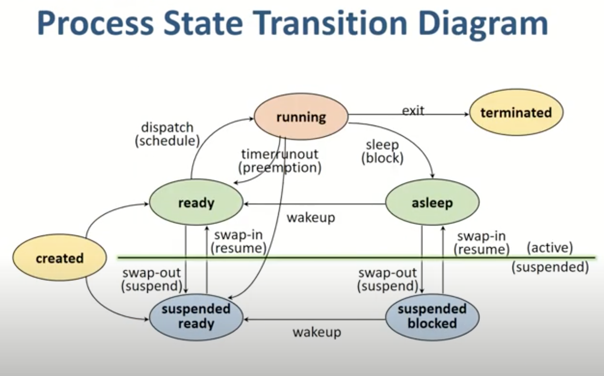

[TOC]

# Chapter3. 컴퓨터 시스템의 동작 원리

## 1. 컴퓨터 시스템의 구조

- 컨트롤러: 각 하드웨어 장치를 제어하는 작은 CPU
- 커널: 운영체제 중 항상 메모리에 올라가 있는 핵심적인 부분

## 2. CPU 연산과 I/O 연산

- 로컬 버퍼: 컨트롤러가 가지고 있는, 입출력 데이터 임시 저장을 위한 작은 메모리
  - 디스크, 키보드 등에서 데이터를 읽어오는 경우 **컨트롤러**가 로컬버퍼에 데이터를 임시로 저장한다.
  - 로컬버퍼에 임시 저장이 완료되면 컨트롤러는 인터럽트를 발생시켜 CPU가 알게 한다.
  - CPU는 명령 하나를 수행할 때마다 인터럽트가 발생했는지 확인하고 인터럽트 발생시 인터럽트 처리를 먼저 한다.

## 3. 인터럽트의 일반적 기능

인터럽트에는 하드웨어 인터럽트와 소프트웨어 인터럽트가 있고, 둘 다 CPU 옆에 있는 인터럽트 라인에 신호를 보내 인터럽트가 발생했음을 알리는 방식이다.

운영체제는 인터럽트 종류별로 **인터럽트 벡터**를 가지고 있어서, 인터럽트 발생 시 해당 인터럽트 처리루틴의 코드를 찾아간다.

- 하드웨어 인터럽트
  - 컨트롤러가 CPU의 인터럽트 라인을 세팅, 통상적으로 인터럽트는 하드웨어 인터럽트를 의미(입출력 등 발생시)
- 소프트웨어 인터럽트
  - 소프트웨어가 CPU의 인터럽트 라인을 세팅, 트랩이라고 불림. exception과 system call로 나눠 부름.
  - exception: 비정상적인 작업 시도 혹은 권한이 없는 작업 시도시 발생
  - system call: 운영체제 커널에 있는 코드를 사용자 프로그램에서 실행하고자 할 때 발생

## 4. 인터럽트 핸들링

인터럽트 핸들링이란 인터럽트가 발생한 경우에 처리해야 할 일의 절차를 의미한다.

프로그램 A에서 인터럽트 발생 시 PCB에 A의 현재 상태를 저장한다.

- PCB(Process Control Block)
  - 운영체제에서 현재 실행되는 프로그램들을 관리하기 위한 자료구조
  - 각 프로그램마다 하나씩 존재하며, 프로그램이 실행 중이던 정보(코드의 메모리 주소, 레지스터값, 하드웨어 상태 등)를 저장
  - 인터럽트 처리가 끝난 후 원래 진행 중이던 프로그램의 상태를 PCB로부터  CPU상에 복원하여 다시 실행한다.

:bulb:오늘 날 운영체제는 인터럽트에 의해서만 CPU를 점유하는 방식을 통해 컴퓨터 시스템 자원을 체계적이고 효율적으로 관리할 수 있다.

## 5. 입출력 구조

- 동기식 입출력 - 작업이 완료된 후에야 프로그램이 후속 작업을 수행한다.
  - CPU 연산이 입출력 연산보다 훨씬 빠르기 때문에 입출력 연산을 기다렸다가 CPU 연산을 시작하면 자원의 낭비가 심해진다.
  - 자원 낭비를 관리하기 위해 운영체제는 입출력 중인 프로그램에게는 CPU를 할당하지 않고(봉쇄 상태) 곧바로 명령 수행 가능한 프로그램에 CPU를 할당한다.
  - 입출력 중인 프로그램 사이에서는 동기화(입출력 순서대로 처리)를 위해 장치별로 큐를 두어 요청한 순서대로(선입선출) 처리할 수 있도록 한다.

- 비동기식 입출력 - CPU의 제어권이 입출력을 요청한 프로세스에게 곧바로 다시 주어짐. 입출력 연산이 완료되는 것과 무관하게 처리 가능한 작업부터 처리.

일반적으로 동기식 입출력을 사용하는데, 자원의 낭비를 막기 위해 위의 설명처럼 입출력 요청시 해당 프로그램을 봉쇄하는 방법을 사용한다.

## 6. DMA

DMA(Direct Memory Access)

원칙적으로 메모리는 CPU에 의해서만 접근할 수 있는 장치이고, CPU외의 장치가 메모리의 데이터에 접근하기 위해서는 CPU에게 인터럽트를 발생시켜 CPU가 이를 대행하는 식으로만 가능하다.

CPU가 과한 인터럽트를 당하는 것을 막기 위해서 CPU가 아님에도 메모리 접근이 가능한 장치를 두며, 이를 DMA라고 한다.

## 7. 저장장치의 구조

- 주기억 장치
  - RAM, 휘발성
- 보조기억 장치
  - 마그네틱 디스크(하드디스크), 플래시 메모리, CD 등 비휘발성
  - 전원이 나가도 유지해야 할 정보를 저장하는 **파일시스템 용**, 메모리의 연장 공간인 **스왑 영역**의 두 가지 용도를 가진다.
  - 메모리 부족을 해결하기 위해 운영체제가 당장 불필요한 부분은 메모리에서 스왑 영역으로 내려놓는다.

## 8. 저장장치의 계층 구조

상위( 접근속도 up, 용량 down)

---

- 레지스터
- 캐시 메모리
- 메인 메모리

---

- 마그네틱 디스크
- 광디스크
- 마그네틱 테이프

---

하위

저장장치는 위와 같이 상위로 갈수록 속도는 빨라지지만 용량은 작아진다. 하지만 당장 필요한 정보만 저장하는 캐싱 기법으로 상위 저장장치를 하위 저장장치와 비슷한 용량을 가진 것처럼 사용할 수 있다.

## 9. 하드웨어의 보안

다중 프로그래밍 환경에서 발생하는 문제들에 대한 보안 기법

- 커널모드와 사용자 모드
  - 중요한 정보에 접근해 위험한 상황을 초래할 수 있는 연산은 커널모드에서만 실행
  - 일반적인 연산만 사용자모드에서 실행
  - 사용자 프로그램 내에서 자체적으로 중요한 정보에 접근하는 연산을 수행하는 경우가 있을 수 있음 -> 하드웨어적인 지원이 필요 -> mode bit
  - mode bit : 0 
    - 커널모드로서 모든 명령 수행 가능
  - mode bit : 1
    - 사용자모드로서 제한된 명령만 수행 가능

:bulb: 모든 **입출력 명령은 특권명령**으로 규정한다.

특권명령으로 규정함으로써 **사용자 프로그램이 직접 입출력하는 것을 차단**한다.

입출력이 필요한 경우에는 인터럽트(시스템 콜)를 통해 운영체제에 요청하여 모드비트를 0으로 세팅하여야만 인터럽트 처리루틴으로 이동하여 입출력 처리를 할 수 있다.

## 10. 메모리 보안

2개의 레지스터를 사용해서 프로그램이 접근하려는 메모리 부분이 합법적인지 체크하여 메모리를 보호한다.

- 기준 레지스터
  - 프로그램이 수행되는 동안 접근 가능한 가장 작은 주소를 보관
- 한계 레지스터
  - 프로그램이 접근할 수 있는 메모리의 범위를 보관

범위를 벗어나는 접근은 예외상황 소프트웨어 인터럽트를 발생시킴

## 11. CPU 보호

특정 프로그램이 CPU의 사용을 독점하는 것을 막기 위해 타이머를 사용

=> 정해진 시간이 지나면 인터럽트를 발생시키고, 운영체제가 CPU 제어권을 획득

## 12. 시스템 콜을 이용한 입출력 수행

사용자 프로그램은 입출력 명령을 직접 수행할 수 없으므로 운영체제에게 시스템 콜이라는 서비스 대행 요청을 하여 입출력을 수행한다.

# Chapter4. 프로그램의 구조와 실행

## 1. 프로그램의 구조와 인터럽트

프로그램의 주소 영역은 3 가지로 구분된다.

- 코드 영역: 작성한 프로그램 함수들의 코드가 CPU에서 수행할 수 있는 기계어 명령 형태로 변환되어 저장
- 데이터 영역: 전역 변수등 프로그램이 사용하는 데이터를 저장
- 스택 영역: 함수가 호출될 때 호출된 함수의 수행을 마치고 복귀할 주소 및 데이터를 임시 저장

인터럽트가 발생하면 CPU는 기존에 하던 작업을 스택에 둔 채로 인터럽트 처리루틴으로 넘어가 새로운 함수를 실행한다.  

- 일반적으로 프로그램 내에서 발생되는 함수호출에 필요한 복귀 주소는 **각 프로그램의 스택 영역**에 보관한다.

- 하지만 인터럽트때문에 CPU를 빼앗긴 위치는 운영체제가 관리하는 **프로세스 제어 블록**(어느 부분까지 실행되었었는지 저장)에 저장된다.

## 2. 컴퓨터 시스템의 작동 개요

### 프로그램 카운터(PC)

- CPU가 수행해야할 메모리 주소를 담고있는 레지스터
- CPU는 프로그램 카운터가 가리키는 메모리 위치의 명령어를 처리한다.

- 커널 모드(kernel mode) : 프로그램 카운터가 운영체제가 존재하는 메모리를 가리키는 경우. 즉, 운영체제 코드를 수행중인 경우

- 사용자 모드(user mode) : 위와 반대

### CPU가 수행하는 명령

- 일반명령
  - 모든 프로그램이 수행 가능, 메모리에서 자료를 읽어와 CPU에서 연산
- 특권명령
  - 입출력 장치, 타이머 등 각종 장치에서 접근하는 명령으로, 운영체제만이 수행 가능(3장)
- 모드 비트(3장)

운영체제만이 수행 가능한 특권명령을 사용자 프로그램이 실행하려고 하는 경우 운영체제에 특권명령 대행을 요청하는 것을 **시스템 콜**이라고 한다.

시스템 콜을 하면 사용자 영역이 아닌 커널 영역에서 코드를 처리한다.

### CPU가 인터럽트를 확인하는 방법

- CPU는 프로그램 카운터가 가리키는 메모리 위치의 명령만 확인하므로 주변 장치의 상태를 모른다. 그래서 매번 명령을 수행한 직후 인터럽트 라인을 체크한다.

## 3. 프로그램의 실행

### 프로그램 실행이란?

- 디스크에 존재하던 실행 파일이 메모리에 적재됨
- 프로그램이 CPU를 할당받고 명령을 수행하는 상태

*실행파일이 적재될 때, 실행파일 전체가 메모리에 한꺼번에 올라가기보다는 일부분만 메모리에 올리고 나머지는 디스크의 특정 영역에 내려가 있다.

 

4.1에서 살펴본 바와 같이 프로세스의 주소 공간은 코드, 데이터, 스택으로 구성되며, 이러한 주소 공간을 **가상 메모리(7장)** 또는 논리적 메모리라고 부른다.

운영체제 역시 하나의 프로그램으로, **운영체제 커널 역시 코드, 데이터, 스택으로 구성된 주소 공간**을 가진다.

### 커널

**데이터 영역**

- 시스템 내 모든 자원을 관리하기 위한 자료구조를 각각 유지하고 있는 영역
- 프로세스 : 현재 수행중이 프로그램
- PCB : 각 프로세스의 상태, CPU의 사용정보, 메모리 사용 정보등을 유지하기 위한 자료구조
- PCB를 관리하기 위한 큐(chapter5.5)

**스택 영역**

- 일반 프로그램의 스택 영역과 동일하게 함수 호출 복귀 주소를 저장하기 위한 용도
- (차이점 📌) 사용자 프로그램 스택과 달리, 프로세스마다 별도의 스택을 두어 관리한다.
- (정리) 프로그램이 자기자신 내의 코드 실행에서는 자신의 스택을 사용하고, 시스템 콜이나 인터럽트 시에는 커널 스택을 사용한다.

## 4. 사용자 프로그램이 사용하는 함수

프로그램은 결국 함수의 집합이라고 할 수 있으며 **사용자 프로그램이 사용하는 함수는 3가지**가 있다.

1. 사용자 정의 함수

   사용자가 직접 작성한 함수

   

2. 라이브러리 함수

   사용자가 직접 작성하지는 않았지만 누군가 작성하여 사용하게된 함수

   

3. 커널 함수

   운영체제 커널에 정의된 함수

## 5. 인터럽트

CPU는 매 명령어 수행 후에 인터럽트 라인 체크를 통해 인터럽트를 확인

### 인터럽트 처리 중 인터럽트가 발생 한 경우

- 원칙적으로는 이러한 상황이 발생하는 것을 허용하지 않는다.
  - 데이터의 일관성이 유지 되지 않는 문제
  - 이중으로 동일한 데이터를 바꾸려는 경우 원하는 동작이 되지 않음.
- 하지만 현재 인터럽트보다 우선순위가 높은 인터럽트 발생시 우선순위가 높은 것 먼저 처리한다.

## 6. 시스템 콜

시스템 콜이란 사용자 프로그램이 특권명령을 수행해야할 경우 사용자 프로그램이 직접 명령을 내릴 수 없기 때문에 OS에게 요청하는 것을 의미한다.

## 7. 프로세스의 두 가지 실행 상태

어떠한 사용자 프로그램이 실행 되는 것은 **사용자 모드에서의 실행 상태**라고 하며 시스템 콜이 들어와서 커널에서 실행될 경우 **커널 모드에서의 실행 상태**라고 한다. 

# chapter5. 프로세스 관리

**프로세스(process)**: 실행 중인 프로그램을 말함. 디스크에 실행파일 형태로 존재하던 프로그램이 **메모리에 올라가서 실행되기 시작하면 프로세스**가 된다.

**프로세스의 문맥(context)**: 프로세스의 주소 공간(코드, 데이터, 스택 상태)을 비롯해 레지스터에 어떤 값을 가지고 있었는지와, 시스템 콜 등을 통해 커널에서 수행한 일의 상태, 그 프로세스에 관해 커널이 관리하고 있는 각종 정보 등을 포함

- PCB(Process Control Block)에 저장
- PCB는 프로그램이 중단된 지점부터 다시 시작하기 위해 필요

## 2. 프로세스의 상태

1. 시작(new)

   프로세스가 시작되어 그 프로세스를 위한 각종 자료구조는 생성되었지만 아직 **메모리 획득을 승인받지 못한 상태**

2. 실행(running)

   **프로세스가 CPU를 보유, 기계어 명령을 실행**하고 있는 상태. CPU는 일반적으로 하나이므로 컴퓨터 내에서 여러 프로세스가 동시에 수행된다 해도 실제로 **실행 상태에 있는 프로세스는 매 시점 하나**뿐이다.

3. 준비(ready)

   프로세스가 CPU만 보유하면 당장 명령을 수행할 수 있지만 **CPU를 할당받지 못한 상태**를 가리킨다.

4. 봉쇄(blocked, wait, sleep)

   CPU를 할당받더라도 당장 명령을 실행할 수 없는 프로세스 상태

   ex) 프로세스가 요청한 입출력 작업이 진행 중인 경우

5. 중지(suspended, stopped) <= 메모리 보유 x

   외부적인 이유로 프로세스의 수행이 정지된 상태

   (중기 스케줄러에 의해 디스크로 스왑 아웃된 프로세스의 상태)

   - 중지 준비(suspended ready), 중지 봉쇄(suspended block)의 두 가지로 세분화 할 수 있다.
   - 각각 준비 상태에서 디스크로 **스왑 아웃된 경우**와 봉쇄 상태에서 디스크로 **스왑 아웃된 경우**이다.

6. 완료(terminated)

   프로세스가 종료되었으나 운영체제가 그 프로세스와 관련된 자료구조를 완전히 정리하지 못한 상태

**문맥 교환(context switch)**: CPU 제어권을 다른 프로세스로 이양하는 과정을 말함

ex) 실행 중인 프로세스가 입출력 요청 등으로 봉쇄 상태로 바뀌는 경우 등

**CPU 디스패치(dispatch)**: 준비 상태의 프로세스들 중에서 CPU를 할당받을 프로세스를 선택한 후 실제로 CPU의 제어권을 넘겨받는 과정

### 입출력을 요청한 프로세스의 상태 변화

- 프로세스가 실행 상태에 있을 때, 입출력 요청 등이 오면 인터럽트가 발생 => 실행 중이던 프로그램은 봉쇄 상태에 들어가고 CPU 스케줄러가 적절한 프로세스를 선정해 CPU를 할당한다.
- 입출력 요청 프로세스는 입출력 요청 큐에서 자기 차례가 와서 응답을 받고 나면 CPU에게 입출력 완료 인터럽트를 발생시킨다.
- CPU는 인터럽트 처리 루틴에 따라 동작한다. (입출력 완료 프로세스의 상태를 준비 상태로 변경하는 등)
- 인터럽트 처리가 끝나면 문맥 교환이 일어난다.

## 3. 프로세스 제어블록(PCB)

Process Control Block

운영체제가 시스템 내의 프로세스들을 관리하기 위해 **프로세스마다 유지하는 정보들을 담는 커널 내의 자료구조**를 뜻한다.

**PCB의 구성 요소**(필요하면 읽기)

- 프로세스의 상태(process state)
  - CPU를 할당해도 되는지(준비 상태인지?) 여부
- 프로그램 카운터(Program Counter, PC)의 값
  - 다음에 수행할 명령의 위치(프로세스 내에서 다음 코드의 위치)
- CPU 레지스터의 값(CPU register)
  - CPU 연산을 위한 현 시점의 레지스터 저장값
- CPU 스케줄링 정보(CPU scheduling information)
  - 프로세스의 CPU 스케줄링을 위해 필요한 정보
- 메모리 관련 정보(memory management information)
  - 프로세스의 메모리 할당을 위해 필요한 정보
- 자원 사용 정보(accounting information)
  - 사용자에게 자원 사용 요금을 계산해 청구하는 등의 용도로 사용
- 입출력 상태 정보(I/O status information)
  - 프로세스가 오픈한 파일 정보 등 프로세스의 입출력 관련 상태 정보

## 4. 문맥 교환

하나의 사용자 프로세스로부터 다른 사용자 프로세스로 CPU의 제어권이 이양되는 과정

과정이 책 or 기존 정리본에 나와있음. 궁금하면 읽어보기!

## 5. 프로세스를 스케줄링하기 위한 큐

큐는 PCB를 연결 리스트 형태로 관리하고 포인터를 사용해 순서를 정한다. 이러한 큐는 커널의 데이터 영역에 존재하며, 따라서 각 프로세스가 CPU를 기다리는지, 입출력을 기다리는지 등의 정보를 커널이 총체적으로 관리하게 된다.

**준비 큐(ready queue)**: 준비 상태에 있는 프로세스들을 줄 세우기 위한 큐

**장치 큐(device queue)**: 장치에 따라 여러 큐가 있다.

ex) 디스크 입출력 큐, 키보드 입출력 큐

**작업 큐(job queue)**

준비 큐와 장치 큐를 포괄하는 개념, 준비 큐는 준비 상태, 장치 큐는 봉쇄 상태에 있다.

**공유 데이터 큐**: 공유 데이터에 여러 프로세스가 접근할 수 없고, 하나의 프로세스가 공유 데이터에 대한 접근을 완전히 마치고 나면 다른 프로세스가 접근할 수 있다.

## 6. 스케줄러

어떤 프로세스에게 자원을 할당할지를 결정하는 운영체제 커널의 **코드**를 지칭한다.

**장기 스케줄러(작업 스케줄러, long term scheduler, job scheduler)**

- 어떤 프로세스를 준비 큐에 진입시킬지 결정하는 역할
- 시작 상태의 프로세스들 중 **어떠한 프로세스를 준비 큐에 삽입할 것인지** 결정하는 역할!
- 메모리에 동시에 올라와 있는 프로세스의 수(degree of multiprogramming)를 조절
- 현대의 시분할 시스템에서는 **장기 스케줄러보다는 중기 스케줄러가 주로 사용**된다.
- 가끔 호출되기 때문에 느려도 허용

**단기 스케줄러(CPU 스케줄러, short term scheduler)**

- 준비 상태의 프로세스들 중에서 어떤 프로세스를 다음번에 실행 상태로 만들 것인지 결정

- 준비 큐에 있는 여러 프로세스들 중 어떠한 프로세스에게 CPU를 할당할 것인가를 단기 스케줄러가 결정

  ex) 타이머 인터럽트가 발생하면 단기 스케줄러가 호출됨

- 빈번하므로 속도가 빠름

**중기 스케줄러(medium term scheduler)** <- 중요

- 너무 많은 프로세스에게 메모리를 할당해 시스템의 성능이 저하되는 경우 이를 해결하기 위해 메모리에 적재된 프로세스의 수를 동적으로 조절하기 위해 추가된 스케줄러
- 메모리에 올라와 있는 프로세스 중 일부를 선정해 이들로부터 메모리를 통째로 빼앗아 그 내용을 디스크의 스왑 영역에 저장(스왑 아웃, swap out)
- 프로세스당 보유 메모리양이 지나치게 적어진 경우 일부 프로세스를 메모리에서 디스크로 스왑 아웃시키는 역할!
- 중지 상태를 발생시킴

## 7. 프로세스의 생성

최초의 프로세스는 운영체제가 생성한다. 나머지 프로세스는 이 프로세스로부터 복제되어 나온다. 따라서 프로세스간에는 부모-자식 관계가 있으며, 일반적으로 생각하는 실제 부모자식 관계와는 달리 자식 프로세스가 모두 종료된 후에야 부모 프로세스가 종료될 수 있다.

## 8. 프로세스간의 협력

프로세스는 각자 자신만의 독립적인 주소 공간을 가지고 수행되며, 프로세스가 다른 프로세스의 주소 공간을 참조하는 것은 **원칙적으로 허용되지 않는다.**

=> 부모 프로세스와 자식 프로세스는 자원을 서로 획득하기 위해 경쟁적인 관계에 있게 됨

그러나 협력 시 처리 속도 향상 등의 긍정적인 측면이 있기 때문에 **프로세스 간 협력 메커니즘이 존재**한다. 이를 IPC(Inter-Process Communication)이라고 부르며, 메시지 전달 방식과 공유 메모리 방식이 있다.

- 메시지 전달 방식
  - 공유 데이터 사용 x, 메시지를 주고받으며 통신
  - 메시지 전달은 주소 공간이 달라 직접할수는 없으며, 커널이 그 역할을 한다.
  - 메시지를 주고받는 연산은 **특권명령**이다. 
- 공유 메모리 방식
  - 프로세스들이 주소 공간의 일부를 공유한다.
  - 프로세스 A와 B가 일부 동일한 물리적 메모리를 가지게 되고, 데이터의 동기화 문제가 있을 수 있으므로 프로세스들끼리 메모리 접근에 대한 규칙을 정해야 한다.