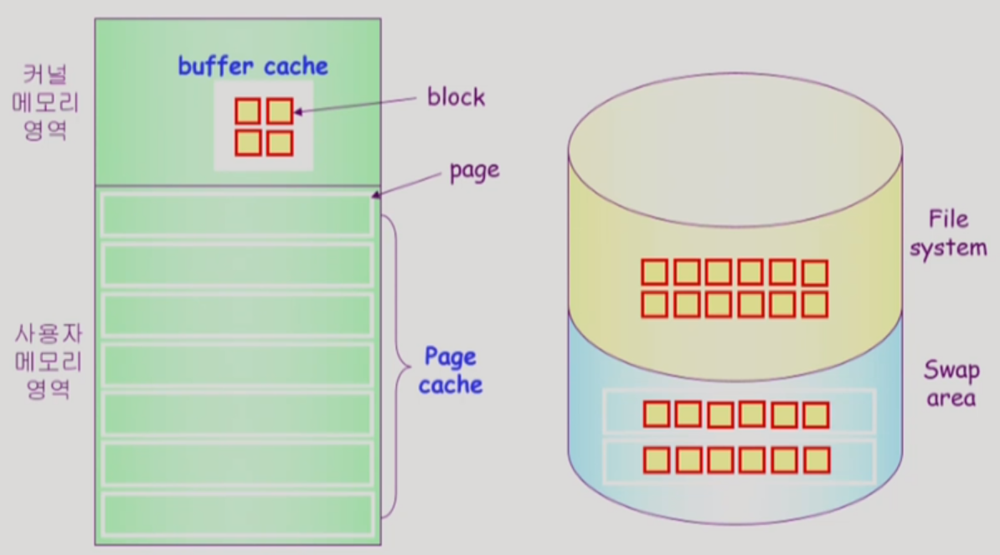

[TOC]

## 1. [파일 시스템 #1](https://core.ewha.ac.kr/publicview/C0101020140516150939191200?vmode=f)

### File and File System

#### File

- "A named collection of related information"
- 일반적으로 비활성의 보조 기억 장치에 저장
- 운영체제는 다양한 저장장치를 file이라는 동일한 논리적 단위로 볼 수 있게 해줌
- `Operation`
  - create, read, write, reposition(lseek), delete, open, close 등

#### File attribute(혹은 파일의 metadata)

- 파일 자체의 내용이 아니라 파일을 관리하기 위한 각종 정보들(속성 누르면 있는 것들)
  - 파일의 이름, 유형, 저장된 위치, 파일 사이즈
  - 접근권한(읽기/쓰기/실행), 시간(생성,변경,사용), 소유자 등

#### File system

- 운영체제에서 파일을 관리하는 부분
- 파일 및 파일의 메타데이터, 디렉토리 정보등을 관리
- 파일의 저장 방법 결정
- 파일 보호 등

------

### Directory and Logical Disk

#### Directory

- 파일의 메타데이터 중 일부를 보관하고 있는 일종의 특별한 파일
- 그 디렉토리에 속한 파일 이름 및 파일 attribute
- operation
  - search for a file, create a file, delete a file
  - list a directory, rename a file, traverse the file system

#### Partition(=Logical Disk)

- 하나의 (물리적)디스크 안에 여러 파티션을 두는게 일반적
- 여러개의 물리적인 디스크를 하나의 파티션으로 구성하기도 함
- (물리적)디스크를 파티션으로 구성한 뒤 각각의 파티션에 `file system`을 깔거나 `swapping`등 다른 용도로 사용 할 수 있음

------

### open( )

- open( "/a/b/c") : 해당 디렉토리(or 파일)의 메타데이터를 논리 메모리에 올리는 것

  - 디스크로부터 파일 c의 메타데이터를 메모리로 가지고 옴
  - 이를 위하여 directory path를 search
    - open `/` -> search `a` -> read `a` -> search `b` -> read `b`  -> search `c` -> open `c` 

  - directory path의 search에 너무 많은 시간 소요
    - open을 read/write와 별도로 두는 이유
    - 한번 open한 파일은 read/write시 directory search 불필요
  - open file table
    - 현재 open된 파일들의 메타데이터 보관소(in memory)
    - 디스크의 메타데이터보다 몇가지 정보 추가
      - open한 프로세스 수
      - file offset: 파일 어느 위치에 접근중인지 표시(별도의 테이블 필요)
  - file descriptor(file handle, file control block)
    - open file table에 대한 위치 정보(프로세스 별)

------

### File Protection

- 각 파일에 대하 누구에게 어떤 유형의 접근(read/write/execution)을 허락할 것인가?

- Accecc Control 방법

  - `Access control Matrix`

    

    - 하지만 행렬을 그냥 만들면 시간, 메모리 낭비가 심함, 그래서 아래 2가지 연결 리스트 방법으로 개선
    - `Access control list` : 파일 기준 ;파일별로 누구에게 어떤 접근 권한이 있는지 표시
    - `Capability` : 사용자 기준; 사용자별로 자신이 접근 권한을 가진 파일 및 해당 권한 표시
    - 그래도, 위 방법은 소모가 커서 실제로는 아래 grouping 방법을 가장 많이 사용함

  - `Grouping`

    - 전체 user를 owner, group, public의 세 그룹으로 구분

    - 각 파일에 대해서 세 그룹의 접근 권한(rwx)을 3비트씩으로 표시

    - (예) UNIX

      

  - `Password`

    - 파일마다 password를 두는 방법(디렉토리 파일에 두는 방법도 가능)
    - 모든 접근 권한에 대해 하나의 password: all-or-nothig
    - 접근 권한별 password: 암기문제, 관리문제가 생김

------

### File System의 Mounting

- 다른 파티션에 있는 파일에 접근해야 하는 경우 `Mounting` 사용
- 특정 파티션의 파일을 또 다른 파티션의 루트로 사용

------

### Access Methods

시스템이 제공하는 파일 정보의 접근 방식

1. 순차접근(sequential access)
   - 카세트 테이프를 사용하는 방식처럼 접근
   - 읽거나 쓰면 offset은 자동적으로 증가
   - A,B,C 순서로 되어 있을 때 A본다음 C 보려면 반드시 B를 거쳐야 함
2. 직접 접근(direct access, random access)
   - LP 레코드판과 같이 접근하도록 함
   - 파일을 구성하는 레코드를 임의의 순서로 접근 할 수 있음
   - A -> C 바로 접근 가능

## 2. [파일 시스템 구현 #1](https://core.ewha.ac.kr/publicview/C0101020140520134614002164?vmode=f)

### Allocation of File Data in Disk

임의의 크기의 파일은 동일 크기의 블럭으로 관리하는 방법 3가지

#### Contiguous Allocation

하나의 파일이 디스크상에 연속되어 저장되는 파일

- 장점
  - Fast I/O 가능
    - 한번의 seek/rotation으로 많은 바이트 transfer
    - realtime file용으로, 또는 이미 run 중이던 process의 swapping용
  - Direction access(random access) 가능(start + idx 로 바로 접근 가능)
- 단점 
  - 외부조각이 발생할 수 있음(블럭들의 크기가 균일하지 않아서 중간중간 빈 부분이 생김)
  - file grow가 어려움(파일의 크기를 키우는 것에 제약이 있음)
    - 파일 생성시 얼마나 큰 hole을 할당할 것인가?
    - grow 가능 vs 낭비
    - 파일 크기가 더 커질것을 대비해서 빈공간을 너무 많이 두면 낭비가 됨(내부조각 생김) , 적게 두면 파일이 커졌을 때 문제가 생김

#### Linked Allocation

불연속적으로 빈 위치면 아무데나 들어갈 수 있게 배치하되, 연결리스트로 다음 블럭 위치 저장

- 장점
  - 외부조각이 발생하지 않음
- 단점
  - 직접 접근 불가
  - Reliability 문제
    - 한 sector가 고장나 pointer가 유실되면 많은 부분을 잃음
  - Pointer를 위한 공간이 block의 일부가 되어 공간 효율성을 떨어뜨림
    - 512bytes/sector, 4byte/pointer
- 변형
  - file-allocation table(FAT) 파일 시스템
    - 포인터를 별도의 위치에 보관하여 reliability와 공간 효율성 문제 해결

#### Indexed Allocation

인덱스 블록을 확인하면 특정 블록에 직접 접근 가능

- 장점
  - 외부조각이 생기지 않음
  - 직접 접근 가능
- 단점
  - small file의 경우 공간 낭비(실제로 많은 file들이 small) ; 인덱스 블록, 실제 파일이 담긴 블록 최소 2개 필요
  - 파일이 너무 크다면 인덱스블록이 한개로 커버가 안됨
    - Liked scheme : 인덱스 블록의 마지막은 다음 인덱스 블록의 위치를 가리키게 함
    - multi level index : 2단계 테이블 쓰듯이 두번 거치게 하는 것(하지만 공간낭비 생김)

------

### UNIX 파일시스템의 구조

- `Boot block` : 부팅에 필요한 정보(bootstrap loader) ; 어떤 운영체제든 항상 맨 앞에 있음(약속임)
- `Super block` : 파일 시스템에 관한 총체적인 정보를 담고 있다. 
  - 빈블록, 사용중인 블록 정보 포함
- `Inode` : 파일 이름을 제외한 파일의 모든 메타 데이터를 저장
  - 앞선 설명에서는 디렉토리가 메타데이터를 가지고 있다고 했지만, 전체를 다 갖고 있지 않고
  - 나머지 메타데이터는 Inode가 가지고 있음(소유주, 위치 정보 등등)
  - `Indexed Allocation`을 사용함 : Inode 크기가 정해져 있음
    - 파일이 작은 경우 `direct block`로 한번에 위치 정보에 접근
    - 파일이 큰경우 single, double, triple indirect등으로 한번, 두번, 세번 넘어가야 위치 정보 확인
    - 파일은 대부분 direct로 갈만큼 작음, 하지만 큰것도 있어서 예외로 1,2,3을 둠 그래서 빠름!
- `Data block` : 파일의 실제 내용을 보관
  - directory file에 file의 이름과 inode 번호를 가지고 있음

------

### FAT File System

MS DOS에서 처음 사용, 파일의 이름을 비롯한 모든 메타데이터 정보를 directory가 가지고 있음

- `FAT` : 연결 리스트 구조, data block의 사이즈와 동일한 크기를 가지고 있으며, 해당 블록의 다음블록을 저장하고 있음
  - data block에 다음 연결정보를 가지고 있는게 아니라 FAT에 저장되어 있어서 효율적이며, `직접 접근`이 가능
  - FAT만 보면서 다음 block 주소만 찾아가면되서, 실제 block 내용을 살필 필요 없음
- `Reliability` 문제 해결 : FAT은 중요한 정보라 복사본 2,3개 갖고 있음; 유실되도 복구 가능
- `공간 효율성` 문제 해결 : 포인터가 data block이 아니라 FAT에 있기 떄문에, 실제 data block은 512bytes/sector 전부 사용 가능

------

### Free-Space Management

미할당된 블록을 어떻게 관리할 것인지?

1. `Bit map or bit vector`
      - data block의 크기만큼 비트맵을 구성하여, 사용중이면 1 미사용중이면 0으로 표시
      - 단점 : 부가적인 공간을 필요로 함(근데 그렇게 크지 않아서 괜츈)
      - 장점 : 연속적인 n개의 free block을 찾는데 효과적(가능하다면 연속적 공간에 넣는게 좋으니까)
2. `Linked list`
      - 모든 free block 들을 링크로 연결(free list)
      - 장점 : free block의 시작 위치만 알면되서 공간 낭비가 없음
      - 단점 : 연속적 가용공간을 찾는게 어렵다
3. `Grouping`
      - 연결 리스트 방법의 변형
      - 첫번째 free block이 n개의 pointer를 가짐
      - n-1 pointer는 free data block을 가리킴
      - 마지막 pointer가 가리키는  block은 또 다시 n pointer를 가짐
      - 장점 : 연결리스트만 쓰는것보다는 연속적인 빈블록 찾기 좋지만, 썩 좋지는 않음
4. `Counting`
      - 프로그램들이 종종 여러개의 연속적은 block을 할당하고 반납한다는 성질에 착안
      - first free block, # of contiguous free blocks)을 유지
      - 빈블록의 위치, 거기부터 몇개까지 비어있는 지 정보를 가지고 있음

------

### Directory Implementation

#### 구현

1. `Linear list`
   - <file name, file의 meta data>의 리스트
   - 장점 : 구현이 간단
   - 단점 : 디렉토리 내에 파일이 있는지 찾기 위해서는 linear search 필요 (시간 너무 듬)

2. `Hash Table`
   - linear + hashing
   - hash table은 file name을 이 파일의 linear list의 위치로 바꾸어줌
   - 검색 시간을 줄임
   - Collision 발생 가능 : 서로 다른 파일에 대해서 이름이 동일하게 되는 것

#### 메타데이터 보관

- 디렉토리 내에 직접 보관
- 디렉토리에는 포인터를 두고 다른 곳에 보관
  - inode, fat 등

#### 파일이름이 긴 경우

- <file name, file의 metadata> 의 list에서 각 entry는 일반적으로 고정 크기
- file name이 고정 크기의 entry 길이보다 길어지는 경우 entry의 마지막 부분에 이름의 뒷부분이 위치한 곳의 포인터를 두는 방법
- 이름의 나머지 부분은 동일한 directory file의 일부에 존재

------

### VFS and NFS

`Virtual File System(VFS)`

- 서로 다른 다양한 file system에 대해 동일한 시스템 콜 인터페이스(API)를 통해서 접근할수 있게 하는 OS의 layer

`Netword File System(NFS)`

- 분산 시스템에서는 네트워크를 통해 파일이 공유될 수 있음
- NFS는 분산 환경에서의 대표적인 파일 공유 방법임

## 3. [파일 시스템 구현 #2](https://core.ewha.ac.kr/publicview/C0101020140523142954456205?vmode=f)

### Page Cache and Buffer Cache

- `Page Cache`
  - Virtual memory의 paging system에서 사용하는 page frame을 caching 관점에서 설명하는 용어
  - Memory-Mapped I/O를 쓰는 경우 file의 I/O에서도 page cache 사용
  - 클락 알고리즘 사용
  - 보통 4Kb
- `Memory-Mapped I/O`
  - file의 일부를 가상 메모리에 맵핑 시킴
  - 매핑 시킨 영역에 대한 메모리 접근 연산은 파일의 입출력을 수행하게 함(운영체제 통하지 않고 바로 메모리 접근으로 입출력 가능)
- `Buffer Cache`
  - 파일 시스템을 통한 입출력 연산은 메모리의 특정 영역인 버퍼 캐시 사용
  - 파일 사용의 locaity 활용
    - 한번 읽어온 블록에 대한 후속 요청 시 버퍼 캐시에서 즉시 전달
  - 모든 프로세스가 공용으로 사용
  - 교체 알고리즘 필요(LRU, LFU 등)
  - 과거에는 블록당 512byte
- `Unified Buffer Cache`
  - 최근 OS에서는 기존의 버퍼캐시가 페이지 캐시에 통합됨

------

### 프로그램의 실행

#### Memory-Mapped I/O 에서의 실행

- 프로세스 B에서 데이터 파일이 필요한 경우 맵핑을 통해 프로세스 B의 데이터 영역에 보관하고, 물리 메모리에 맵핑함. 
- 이후 사용에서는 운영체제 접근 필요 없이 직접 프로세스의 물리 메모리에 접근 하여 실행 가능. 
- 다른 프로세스 A에서 동일한 데이터 파일을 요청한 경우, 운영체제 도움 없이 바로 물리 메모리에 적재된 데이터 파일을 맵핑해서 사용
- 스와핑 될때는 실행파일에 직접 저장되어 내려감
- `장점` 
  - 일단 메모리에 올라온 데이터 파일은 시스템 콜하지 않고 사용 가능(운영체제 도움 없이 메모리 접근으로 )간편
  - 캐시에 올라온 데이터를 자신의 주소공간으로 카피할 필요없이 바로 매모리 접근으로 사용
- `단점` 
  - 일관성 문제 발생 : 여러 프로세스에서 동일한 데이터 파일을 맵핑하면 중간에 데이터가 바뀔 수 있음

