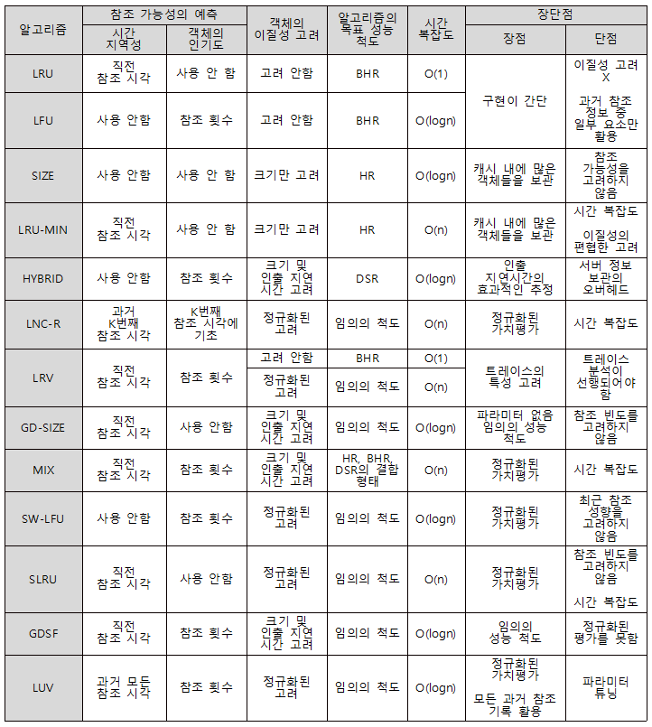

# Chapter 10. 웹 캐싱

# 💗 문제

## 1. 웹캐시가 일관성을 유지하는 기법은 무엇인가요 ?

## 2. 웹캐시는 어떤 방식으로 협력하나요 ?

## 3. 웹캐시의 사전인출 기법에는 뭐가 있나요 ?

# 💗 요약

이번 Chapter에서는 웹 캐싱에 대한 내용이다. 웹 캐시 교체 알고리즘이 주된 내용이지만 사실 이 내용이 면접에 나올 것 같지는 않다. 

## 1. 웹캐싱

웹캐싱이란 웹 사용자에 의해 빈번히 요청되는 데이터를 사용자와 지리적으로 가까운 웹캐시 서버에 보관해 빠른 서비스를 가능하게 하는 기법이다. 웹 캐싱은 웹서버 또는 웹 사용자 뿐 아니라 웹캐싱만을 전담하는 프록시 서버까지 포함하여 서버, 클라이언트 외에 별도의 캐시 서버를 만들어 활용되고 있다. 

## 2. 웹캐시의 교체 알고리즘

 캐시 서버는 물리적인 한계가 있기 때문에 클라이언트에게 필요한 모든 내용을 저장할 수 없다. 

그렇기 때문에 클라이언트에게 필요한 것이 무엇인지를 계산하는 교체 알고리즘이 매우 중요하다. 

하지만 웹 캐시는 운영체제에서 사용되는 페이지 기법과 달리 파일마다 크기와 거리에 따라 필요한 비용이 달라지는데 이를 **이질형 캐시**라고 한다.

### ※ 교체 알고리즘의 성능 척도

 교체 알고리즘은 오래 전부터 상당히 많은 연구가 되었고 많은 알고리즘들이 세상에 나와있다. 그렇다면 어떤 알고리즘이 더 좋은 성능을 가졌을까 ? 이를 비교하기 위한 기준이 있다. 

1. 캐시 적중률(HR)

   사용자가 원하는 캐시를 얼마나 적중 시켰는가.

2. 바이트적중률(BHR)

   사용자가 원하는 캐시를 적중 시켰을 때 이 캐시의 크기가 얼마나 큰가.

3. 지연감소율(DSR)

   사용자가 원하는 캐시를 적중 시켰을 때 사용자가 기다려야하는 시간을 얼마나 감소시켰는가.

4. 비용절감률(CSR)

   인출(캐시 서버에서 자료를 가져가는 것)의 비용을 얼마나 감소시켰는가. (캐시의 크기나 지연 시간에 따라 바이트적중률, 지연감소율로 나눌 수 있다.)

하지만 모든 알고리즘들이 장단점이 있어 이를 비교한 표는 아래와 같다.

## 3. 웹캐시의 일관성 유지 기법

웹캐시는 근원지 서버에서 요청한 데이터가 변경될 수 있으므로 사용자에게 유효한 정보를 전달하기 위해 일관성 유지 기법이 필요하다. 웹캐시는 다른 곳에서 사용되는 캐시 기법들과 달리 일관성이 유지되지 않더라도 엄청나게 큰 문제를 야기하지는 않기 때문에 약한 일관성 유지 기법을 사용한다.

일관성 유지 기법에는 아래의 3가지 방법이 있다.

1. polling-every-time(강한 일관성)

   요청이 있을 때마다 객체의 변경 여부를 확인

2. invalidation(강한 일관성)

   근원지 서버에 변경이 있을경우 근원지 서버와 연결된 모든 캐시 서버에게 내용을 전달

3. adaptive TTL(약한 일관성)

   최종 변경 시각과 최종 확인 시각을 고려하여 변경되었을 가능성이 있을 경우 근원지 서버에 요청을 전달

   

## 4. 웹캐시의 공유 및 협력 기법

근접한 웹캐시가 각각 같은 정보를 가지고 있을 경우는 매우 비효율적이기 때문에 웹 캐시는 서로 공유와 협력한다. 이에 사용되는 기법은 아래와 같다.

1. ICP(Internet Cache Protocol)

   ICP는 동료 프록시 캐시 서버들 사이에서 웹 객체의 검색 및 전송을 지원하기 위한 프로토콜로 사용자가 요청한 웹 객체를 요구 했을 때 해당 프록시 캐시 서버에 그 내용이 없을 경우 동료 프록시 캐시 서버에 요청한다.

   

2. CARP(Cache Array Routing Protocol)

   공유 웹캐시들에 동일한 웹객체들이 중복 저장되는 것을 막기 위해 URL 공간을 분할해 각각의 캐시는 자신에게 배정되는 객체들만을 캐싱하게 한다.

3.  디렉토리 기반 프로토콜(Directory based protocol)	

   공유 웹캐시에 저장된 객체들의 위치 정보를 디렉토리에 유지함으로써 ICP 프로토콜의 멀티캐스트 부담을 없애고자 한다. 하지만 디렉토리 유지 관리에 부담이 생길 수 있기 때문에 공유 프락시 자체 또는 별도의 디렉토리 서버에 구현하며 여러 개를 두기도 한다.

## 5. 웹캐시의 사전인출 기법

사전인출 기법이란 웹 서비스의 응답 지연시간을 줄이기 위한 방법의 일환이다. 이 방법은 두개로 나뉜다.

1. 예측 사전인출 기법(Predictive Prefetching)

   웹 페이지들 간의 관계 그래프 등을 구성해 하나의 웹 페이지가 참조되었을 때 새로운 웹페이지가 참조될 확률을 예측하고 이 확률을 기반으로 사전인출 수행

2. 대화식 사전인출 기법(Interactive Prefetching)

   HTML 문서에 대한 요청을 했을 때 웹캐시는 캐싱하고 있던 HTML 문서를 미리 파싱해 그 문서에 포함되거나 연결된 웹 객체를 미리 받아와서 곧바로 전달

​	※  유효성의 사전확인 기법

​		캐싱된 객체의 유효성을 미리 확인해두었다가 사용자가 해당 객체를 요청할 시 유효성 검사를 하지 않고 곧바로 보내주는 방법

​		

## 6. 동적 웹 객체의 캐싱 기법

하지만 현재 주류를 이루는 동적 웹에서는 캐시 서버를 사용하기가 어렵기 때문에 주로 웹서버 내부에서 빠른 처리를 위해 웹서버 전위에 설치하는 역방향 프록시 캐시 또는 웹서버 가속기 중 일부에서 활용되고 있는 실정이다.

