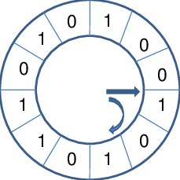

# 8장 가상메모리

>  프로그램이 CPU에서 실행되려면 실행에 당장 필요한 부분이 메모리에 올라와 있어야 한다.
>
> 시분할 환경에서는 여러 프로그램이 메모리 공간을 조금씩 나누어 사용하기 때문에, 운영체제는 어떤 프로그램에게 어느 정도의 메모리를 할당할지 결정해야 하는 문제에 당면한다.

*아래 내용 필독!

**=> 운영체제는 보통 몇몇 프로그램들에 집중적으로 메모리를 할당한 후, 시간이 흐르면 이들로부터 메모리를 회수해서 다른 프로그램들에게 다시 집중적으로 메모리를 할당하는 방식을 채택한다.**

이는 프로세스의 빠른 수행을 위해 프로그램마다 최소한 확보해야 하는 메모리의 크기가 존재하기 때문에 채택한 방식이다.

프로그램을 실행할 때 해당 프로세스의 주소 공간 전체가 메모리에 올라와 있어야 하는 것은 아니므로, 운영체제는 당장 CPU에서 수행할 부분만 메모리에 올리고, 그렇지 않은 부분은 디스크의 스왑 영역에 내려놓게 된다. 

이렇게 **디스크의 스왑 영역이 메모리의 연장 공간 역할**을 하게 되면, 프로그램은 물리적 메모리 크기에 대한 제약을 생각할 필요가 없어지고, 운영체제는 한발 더 나아가 **프로그램이 물리적 메모리를 고려할 필요 없이 자기 자신만이 메모리를 사용하는 것처럼 가정**해 프로그램하는 것을 지원한다. 

이렇게 되면 프로그램은 0번지부터 시작하는 자기 자신만의 메모리 주소 공간을 가정할 수 있고, 이러한 메모리 공간을 **가상메모리(virtual memory)**라고 부른다.

---

**정리: 가상 메모리의 정의**

시분할 시스템에서 프로그램들이 수행될 때 메모리를 나눠 가지게 되는데, 디스크의 스왑 공간을 이용하면 메모리의 제한을 걱정할 필요가 없어지고(요구 페이징), 이를 이용하여 마치 각각의 프로그램이 온전히 하나의 메모리를 차지하여 수행되는 것처럼 만들어주는 역할을 운영체제가 하게 되고, 이를 가상 메모리라고 부른다.

---


## 1. 요구 페이징(demand paging)

요구 페이징은 프로그램 실행 시 CPU의 요청이 들어온, 당장 사용될 페이지만을 메모리에 올리는 방식을 말한다.

### 기대 효과

- 메모리 사용량 감소
- 프로세스 전체를 메모리에 올리지 않아 입출력 오버헤드가 줄어듦
- 빠른 응답 시간
- 시스템이 더 많은 프로세스를 수용할 수 있음

프로세스의 일부 페이지만 메모리에 올라와 있고 나머지 페이지는 디스크의 스왑 공간에 존재할 때, 어떤 페이지가 메모리에 존재하고 어떤 페이지가 존재하지 않는지 구별하기 위한 방안이 필요하며, 요구 페이징에서는 **유효-무효 비트(valid-invalid bit)**를 두어 각 페이지가 메모리에 존재하는지 여부를 표시한다. (페이지 테이블에 유효-무효 비트 구성)

페이지가 메모리에 적재되어 있으면 유효, 메모리에 없거나 해당 페이지가 속한 주소 영역을 프로세스가 사용하지 않는 경우에는 무효 비트를 가지게 된다. CPU가 참조하려는 페이지가 무효로 세팅되어 있는 경우를 **페이지 부재(page fault)**가 일어났다고 말한다.


#### 1) 요구 페이징의 페이지 부재 처리

페이지 부재가 일어나면 페이지 부재 처리 과정을 거쳐야 한다.

1. 주소 변환 담당 하드웨어인 MMU가 페이지 부재 트랩(page fault trap)을 발생
2. CPU의 제어권이 커널모드로 전환됨
3. 운영체제의 페이지 부재 처리루틴(page fault handler)이 호출되어 페이지 부재 처리
   1. 해당 페이지에 대한 접근이 적법한지 체크
      - 사용하지 않는 주소 영역에 속한 페이지에 접근 or 접근 권한 위반(protection violation)을 한 경우 해당 프로세스 종료
      - 접근 권한 위반의 예) 읽기전용 페이지에 쓰기 접근 시도
   2. 적법하다면 물리적 메모리의 비어 있는 프레임에 해당 페이지를 읽어온다.
      - 비어 있는 프레임이 없다면 기존 메모리의 페이지 중 하나를 디스크로 쫓아내고, 이를 스왑 아웃(swap out) 시킨다고 한다. 
   3. 위의 과정은 오랜 시간이 소요되므로, 페이지 부재를 발생시킨 프로세스는 CPU를 빼앗기고 봉쇄상태가 된다. => 프로세스 제어블록에 현재 상태 기록
   4. 입출력이 완료되면 인터럽트가 발생하여 페이지 테이블에서 해당 페이지의 유효-무효 비트를 유효로 설정하고, 봉쇄되었던 프로세스를 준비 큐로 이동시킨다

#### 2) 요구 페이징의 성능

페이지 부재의 발생 빈도는 요구 페이징 기법 성능에 가장 큰 영향을 미친다. 요청된 페이지를 디스크로부터 메모리로 읽어오는 막대한 오버헤드가 발생하기 때문이다.

요구 페이징의 성능은 다음과 같이 **요청한 페이지를 참조하는 데 걸리는  유효 접근 시간**으로 측정한다.

- 유효 접근시간(effective access time)

  ```
  유효 접근시간
  = (1-P) x 메모리 접근시간                   // 페이지 부재가 일어나지 않는 비율 x 메모리 접근시간
  + P x (페이지 부재 발생 처리 오버헤드         // 페이지 부재가 일어나는 비율 x 나머지
  + 메모리에 빈 프레임이 없는 경우 스왑 아웃 오버헤드
  + 요청된 페이지의 스왑 인 오버헤드
  + 프로세스의 재시작 오버헤드)
  ```

  ```
  P는 페이지 부재 발생 비율로, 0 <= P <= 1 의 값이다.
  0인 경우 부재가 일어나지 않은 경우이고, 1인 경우 모든 참조 요청에서 페이지 부재가 발생한 경우이다.
  ```

유효 접근시간이 짧을수록 요구 페이징 기법의 성능은 향상된다.


## 2. 페이지 교체

페이지 부재가 발생하였는데 물리적 메모리에 빈 프레임이 존재하지 않는 경우 메모리에 올라와 있는 페이지 중 하나를 디스크로 쫓아내 메모리에 빈 공간을 확보하는 작업이 필요하다. 이를 페이지 교체(page replacement)라고 한다.


교체 알고리즘(replacement algorithm)은 어떤 프레임의 페이지를 쫓아낼 것인지 결정하는 알고리즘으로, 페이지 부재율을 최소화하는 것이 목표이다. 그러므로 가까운 미래에 참조될 가능성이 가장 적은 페이지를 선택해서 내쫓는 것이 성능을 향상시킬 수 있는 방안이다.

페이지 교체 알고리즘의 성능은 주어진 페이지 참조열(page reference string)에 대해 페이지 부재율을 계산함으로써 평가할 수 있으며, 여러 알고리즘이 존재한다.

1) 빌레디의 최적 알고리즘

가장 먼 미래에 참조될 페이지를 선정하여 스왑 아웃한다. 이는 실시간으로 이루어질 수 없는 알고리즘으로, 모든 페이지 교체 알고리즘의 상한선이라고 할 수 있다.


2) 선입선출 알고리즘

선입 선출 알고리즘은 말 그대로 가장 먼저 올라온 페이지를 우선적으로 내쫓는 알고리즘으로, 먼저 들어온 페이지가 계속해서 많은 참조가 이루어지는 경우 비효율적이다. 메모리 공간이 늘어나도 페이지 부재가 오히려 늘어나는 FIFO의 이상 현상(FIFO anomaly)가 발생할 수 있다. 


3) LRU 알고리즘(Least Recently Used)

시간지역성(최근에 참조된 페이지가 가까운 미래에 다시 참조될 가능성이 높은 성질)을 활용해서 가장 오래전에 참조가 이루어진 페이지를 쫓아낸다. 


4) LFU 알고리즘(Least Frequently Used)

LFU 알고리즘은 페이지의 참조 횟수로 교체시킬 페이지를 결정한다. 과거에 참조 횟수가 가장 적었던 페이지를 쫓아내고 그 자리에 새로 참조될 페이지를 적재한다. 성능 향상을 위해 참조 횟수가 가장 적었던 페이지 중 상대적으로 더 오래전에 참조된 페이지를 쫓아내도록 구현하는 것이 효율적이다.

Incache-LFU : 페이지가 물리적 메모리에 올라온 이후부터 참조 횟수를 카운트

Perfect-LFU : 메모리에 올라와 있는지 여부와 상관없이 과거 총 참조 횟수를 카운트


5) 클럭 알고리즘

LRU와 LFU는 소프트웨어적으로 페이지의 참조 시각 및 참조 횟수를 유지하고 비교해야 하므로 알고리즘 운영에 시간적인 오버헤드가 발생한다. 클럭 알고리즘(clock algorithm)은 하드웨어적인 지원을 통해 이와 같은 알고리즘의 운영 오버헤드를 줄인 방식이다.

LRU를 근사시킨 알고리즘으로, 최근에 참조되지 않은 페이지를 교체 대상으로 선정은 하지만, 그 대상의 참조 시점이 가장 오래되었다는 것은 보장하지 못한다. 하지만 알고리즘이 하드웨어적인 지원으로 동작하기 때문에 LRU에 비해 페이지의 관리가 훨씬 빠르고 효율적이다.



참조가 되면 1이다. 시계바늘이 도는 동안 1인 페이지를 만나면 0으로 바꾸고, 0인 페이지를 만나면 교체 대상이 된다. 시계바늘이 한 바퀴 도는 동안에 다시 참조되지 않으면(아직 0이면) 교체되게 된다. 231page 참조

**대부분의 시스템에서 페이지 교체 알고리즘으로 클럭 알고리즘을 사용한다.**


## 3. 페이지 프레임의 할당

프로세스 여러 개가 동시에 수행될 때 각 프로세스에 얼마만큼의 메모리 공간을 할당할지 결정해야 한다. 균등 할당도 하나의 방법이지만 시스템 성능 향상을 위해서는 더 효율적인 메모리 할당 방법이 필요하다.

1) 균등할당(equal allocation)

- 모든 프로세스에게 페이지 프레임을 균일하게 할당

2) 비례할당(proportional allocation)

- 프로세스의 크기를 고려한 균등할당 방식

3) 우선순위 할당(priority allocation)

- 당장 CPU에서 실행될 프로세스와 그렇지 않은 프로세스를 구분하여 전자 쪽에 더 많은 페이지 프레임을 할당하는 방식

프로세스에 할당되는 페이지 프레임의 수는 다음과 같은 경우를 고려해서 결정해야 한다.

- 프로세스가 최소한으로 필요로 하는 페이지 프레임의 수
- 반복문을 실행 중인 프로세스의 경우, 반복문을 구성하는 페이지들을 메모리에 모두 올려놓는 것이 유리하다. (페이지 부재를 막기 위함)
- 시간에 따라 프로세스에게 최소한으로 필요한 메모리의 양이 달라짐을 고려


## 4. 전역교체와 지역교체

교체할 페이지를 선정할 때, 교체 대상이 될 프레임의 범위를 어떻게 정할지에 따라 교체 방법을 전역교체(global replacement)와 지역교체(local replacement)로 구분할 수 있다. 

**전역교체**

모든 페이지 프레임이 교체 대상이 될 수 있는 방법

- 프로세스마다 메모리를 할당하는 것이 아니라 전체 메모리를 각 프로세스가 공유해서 사용하고 교체 알고리즘에 근거해서 할당되는 메모리 양이 가변적으로 변하는 방법
- LRU, LFU, 클럭 등의 알고리즘을 물리적 ㅔㅁ모리 내에 존재하는 전체 페이지 프레임들을 대상으로 적용하는 경우

**지역교체**

현재 수행중인 프로세스에게 할당된 프레임 내에서만 교체 대상을 선정하는 방법

- 프로세스마다 페이지 프레임을 미리 할당한다.
- LRU, LFU 등의 알고리즘을 프로세스별로 독자적으로 운영할 때에는 지역교체 방법이다.


## 5. 스레싱

프로세스가 원활하게 수행되기 위해서는 일정 수준 이상의 페이지 프레임을 할당받아야 한다. 최소한의 페이지 프레임을 할당받지 못할 경우 성능상의 심각한 문제가 발생할 수 있다.

**스레싱**

집중적으로 참조되는 페이지들의 집합을 메모리에 한꺼번에 적재하지 못하여 페이지 부재율이 크게 상승해 CPU 이용률이 급격히 떨어지는 것을 말한다.


**다중 프로그래밍 정도(Multi-Programming Degree: MPD)**

메모리에 동시에 올라가 있는 프로세스의 수


**스레싱 발생 시나리오**

CPU 이용률이 낮을 경우 준비 큐가 비어있는 경우가 많다는 뜻이고, 이 경우 운영체제는 메모리에 올라와 있는 프로세스의 수가 적다고 판단하여 MPD를 높이게 된다. 그런데 MPD가 과도하게 높아지면 각 프로세스에 할당되는 메모리의 양이 지나치게 감소하게 되고, 페이지 부재가 빈번히 발생하게 된다.

페이지 부재는 디스크 입출력을 수반하므로 다른 프로세스에게 CPU가 잠시 이양된다. 이때 다른 프로세스 역시 할당받은 메모리 양이 지나치게 적으면 페이지 부재가 발생하고, 또 다른 프로세스에게 CPU가 할당된다. 준비 큐에 있는 모든 프로세스에게 CPU가 한 차례씩 할당되었는데도 모든 프로세스가 다 페이지 부재를 발생시키게 되면 CPU는 아무도 사용하지 않고 페이지 부재 처리만 하는 상황이 벌어진다.

운영체제는 이러한 상황에서 CPU 이용률이 낮은 이유가 메모리에 올라온 프로세스가 적기 때문이라고 판단하여 더 많은 프로세스를 메모리에 올리게 되고, 프로세스당 할당된 프레임의 수가 더욱 감소하여 페이지 부재가 더 빈번히 발생하게 된다.

**프로세스들은 서로 페이지를 교체하며 스왑 인, 스왑 아웃을 지속적으로 발생시키고, CPU는 대부분의 시간에 일을 하지 않게 된다.**


즉, 특정 한계치를 넘지 않는 범위에서 MPD를 조절하는 것이 중요하다. 이렇게 MPD를 적절히 조절해 CPU 이용률을 높이는 동시에 스레싱 발생을 방지하는 방법에는 워킹셋 알고리즘과 페이지 부재 빈도 알고리즘이 있다.


### 1) 워킹셋 알고리즘(working-set algorithm)

**지역성 집합(locality set)**

프로세스에서 일정 시간 동안 특정 주소 영역을 집중적으로 참조하는 경우, 이렇게 집중적으로 참조되는 페이지들의 집합을 지역성 집합이라 한다.


**워킹셋 알고리즘**은 **지역성 집합이 메모리에 동시에 올라갈 수 있도록 보장하는 메모리 관리 알고리즘**을 말한다. 

워킹셋은 프로세스가 원활히 수행되기 위해 한꺼번에 메모리에 올라와 있어야 하는 페이지들의 집합을 뜻하며, 프로세스의 워킹셋을 구성하는 페이지들이 한꺼번에 메모리에 올라갈 수 있는 경우에만 그 프로세스에게 메모리를 할당한다. 그렇지 않은 경우에는 프로세스에게 할당된 페이지 프레임들을 모두 반납시킨 후 그 프로세스의 주소 공간 전체를 디스크로 스왑 아웃시킨다.

---

**궁금하면 읽어보기**(238p)

워킹셋 알고리즘은 워킹셋 윈도우(크기 = delta)를 사용하여 [t-delta, t] 사이에 참조된 서로 다른 페이지들의 집합을 워킹셋으로 정의한다. 특정 시점에 워킹셋에 포함되어 있지 않은 페이지들은 메모리에서 쫓아내게 되고, 만약 메모리에 올라와 있는 프로세스들의 워킹셋 크기의 합이 프레임의 수보다 클 경우 일부 프로세스를 스왑 아웃시켜서 남은 프로세스의 워킹셋이 메모리에 모두 올라가는 것을 보장한다. 반면, 프로세스들의 워킹셋을 모두 할당한 후에도 프레임이 남는 경우에는 스왑 아웃되었던 프로세스들 다시 메모리에 올려서 워킹셋을 할당하여 MPD를 증가시킨다.

=> CPU 이용률은 높게, MPD는 적절히 조절하여 스레싱 방지

---


### 2) 페이지 부재 빈도 알고리즘(page-fault frequency scheme)

어떤 프로세스의 **페이지 부재율**이 시스템에서 미리 정해놓은 **상한값을 넘게 되면** 이 프로세스에 할당된 프레임의 수가 부족하다고 판단하여 이 **프로세스에게 프레임을 추가로 할당**하는 알고리즘

반면 프로세스의 **페이지 부재율이 하한값 이하로 떨어지면** 이 프로세스에게 필요 이상으로 많은 프레임이 할당된 것으로 간주해 **할당된 프레임의 수를 줄인다.**

만약 상한값을 넘은 경우에 추가로 할당할 빈 프레임이 없으면 일부 프로세스를 스왑 아웃시켜 메모리에 올라가 있는 프로세스의 수를 조절한다. 만약 모든 프로세스에 필요한 프레임을 다 할당한 후에도 프레임이 남는 경우 스왑 아웃시켰던 프로세스에게 프레임을 할당하여 MPD를 높인다.