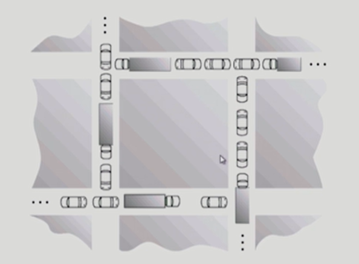
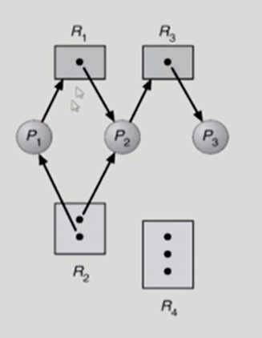
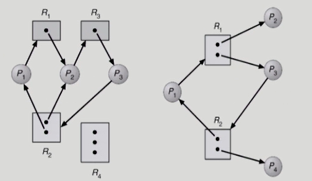
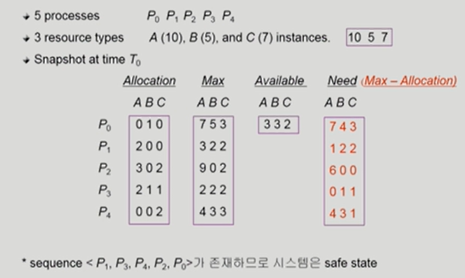

# 📙 Chapter 16. 교착상태 (deadlock)

[toc]

## 1. 교착 상태

- **교착상태 : 일련의 프로세스들이 서로가 가진 자원을 기다리며 block된 상태**
  - 시스템에 2개의 tape drive가 있다
  - 프로세스 P1과 P2가 각각 하나의 tape drive를 보유한 채 다른 하나를 기다리고 있는 상태
- 자원 : 하드웨어, 소프트웨어 등을  포함하는 개념 (I/O, CPU cycle, memory space, semaphore 등)
  - 프로세스의 자원 요청 상태 : 요청, 획득, 반납

:bulb:Deadlock Example

​	프로세스0 은 A라는 자원을 획득한 후 B를 획득하려고 하고,

​	프로세스1 은 B라는 자원을 획득한 후 A를 획득하려고 한다.

​	이때 0번과 1번이 각각 첫 번째 자원을 획득한 후에는 서로가 서로의 자원을 내놓으라고 하게 되고, 둘 중 하나는 자신의 자원을 포기해야 한다 => 데드락 상황!

- 교착상태 발생의 4 가지 조건

  - Mutual exclusion (상호 배제) : 매 순간 하나의 프로세스만이 자원을 사용할 수 있음

    - 공유해서는 안되는 자원의 경우 반드시 필요한 조건

  - No preemption (비선점) : 프로세스는 자원을 스스로 내어놓을 뿐 강제로 빼앗기지 않음

  - Hold and wait (보유 대기): 자원을 가진 프로세스가 다른 자원을 기다릴 때 보유 자원을 놓지 않고 계속 가지고 있음

  - Circular wait (순환 대기) : 자원을 기다리는 프로세스 간에 사이클이 형성

    - 프로세스 P0, P1, .... Pn이 있을 때 (P0은 P1의 자원을 기다리고 P1은 P2의 자원을 기다리고.....)

    

- `자원할당 그래프`를 통해 교착상태 발생여부를 파악할 수 있다

  - 원 : 프로세스
  - 사각형 : 자원
  - 사각형 안의 점 : 자원의 instance 갯수
  - 자원에서 프로세스로 가는 화살표 : 해당 자원이 속해 있는 프로세스
  - 프로세스에서 자원으로 가는 화살표 : 이 프로세스가 해당 자원을 요청했으나 아직 획득하지 못한 상태
  
  
  
  **그림 해설1**
  
  P1은 2번 자원을 가지고 있으면서 1번 자원을 기다리고 있는데, 1번 자원은 P2가 가지고 있다. P2는 2번 자원을 가지고 있으면서 3번 자원을 기다리는데, 3번 자원은 P3가 가지고 있다.
  
  이 그래프가 데드락인지 아닌지는 그래프에 cycle이 있는지 유무로 갈린다. (위 그림은 cycle이 없음)

- 그래프에 cycle이 없으면 교착상태가 아니다
- 그래프에 cycle이 있으면 
  - 자원당 인스턴스가 하나밖에 없으면 교착상태이다 
  - 자원당 여러개의 인스턴스가 있다면 교착상태일 수도 있다 (여분의 자원이 더 있는 상태라면 교착상태에 연루되지 않아서 교착 상태가 아닐 수도 있다)

**그림 해설2**

왼쪽 상황은 사이클이 두 개 있으므로 자원을 확인해봐야 한다. => R2 자원을 P1과 P2가 가지고 있으면서 P3가 또 R2 자원을 요청하고 있으므로 데드락이다.

**그림 해설3**

오른쪽 상황은 사이클이 하나 있으므로 자원을 확인해봐야 한다. => P1은 R1을, P3은 R2를 요청하고 있으므로 데드락처럼 보이지만 P2, P4가 데드락에 연루되어 있지 않아 자원을 사용하고 반납을 하면 P1과 P3도 자원을 획득할 수 있으므로 데드락이 아니다.

## 2. 교착상태의 처리방법

- `Deadlock prevention` : 자원할당시 교착상태의 4가지 필요 조건 중 어느 하나가 만족되지 않도록 하여 미연에 방지

  - 교착상태를 막을 수 있지만 자원에 대한 이용률이 낮아지고 **비효율적**
  - 보유대기 상황이 발생하지 않도록 자원이 필요할 경우 보유 자원을 모두 내려놓고 다시 요청하도록 함
  - 선점 방식으로 자원을 뺏아올 수 있도록
  - 모든 자원 유형에 대한 할당 순서를 정하여 정해진 순서대로만 자원 할당

  

- `Deadlock Avoidance` : 자원 요청에 대한 부가적인 정보를 이용해서 교착상태의 가능성이 없는 경우에만 자원을 할당

  - 최악의 상황을 가정, 아주 안전하게 가자

  - 시스템 state가 원래 state로 돌아올 수 있는 경우에만 자원 할당

  - 2가지 경우의 avoidance 알고리즘

    1. Single instance per resource type : 자원할당 그래프 알고리즘 사용

       - cycle이 생기지 않는 경우만 요청 자원을 할당한다

       - 프로세스 P가 자원 R을 미래에 요청할 수도 있음을 뜻함 (점선으로 표시)
       - 프로세스가 해당 자원 요청 시 실선으로 바뀜 
       - 자원이 반납되면 다시 점선으로 바뀜

       

    2. Multiple instances per resource type : 뱅커스 알고리즘 사용

       - 모든 프로세스는 자원의 최대 사용량을 미리 명시

       - 기본 개념 : 자원 요청 시 safe 상태를 유지할 경우에만 할당

       - 총 요청 자원의 수가 가용 자원의 수보다 적은 프로세스를 선택 (그런 프로세스가 없으면 unsafe상태)

       - 그런 프로세스가 있으면 그 프로세스에게 자원을 할당

       - 할당받은 프로세스가 종료되면 모든 자원을 반납

       - 모든 프로세스가 종료될 때까지 이러한 과정 반복

         

         항상 최대 요청을 가정하고, 프로세스의 최대 요청이 가용 자원 이하여야 요청을 받아들임. 처음에 P0 요청은 받아들이지 않고, P1 요청은 받아들임. 어떤 프로세스가 종료되어 가용 자원(available)이 새로운 프로세스의 Need보다 커질 때에만 새로운 프로세스의 요청을 받아들인다.

- `Deadlock detection and recovery` : Deadlock 발생은 허용하되 그에 대한 detection 루틴을 두어 deadlock 발생 시 recover

  - 사용방법은 deadlock avoidance와 유사
  - 데드락일 경우의 recovery
    - Process termination : 교착상태에 연루된 프로세스들을 모두 죽임
    - Resource preemption : 비용을 최소화할 victim을 선정하여 하나씩 자원을 뺏음

  (추가 설명은 7장-교착상태 파일 확인)

- **`Deadlock Ignorance` : Deadlock을 시스템이 책임지지 않고 사용자가 해결하게 하는 방법**

  - UNIX를 포함한 대부분의 OS가 채택하고 있으며 교착상태에 대한 가장 소극적인 처리방법
  - 교착상태가 빈번히 발생하지 않기 때문에 별도의 장치를 마련하지 않음

