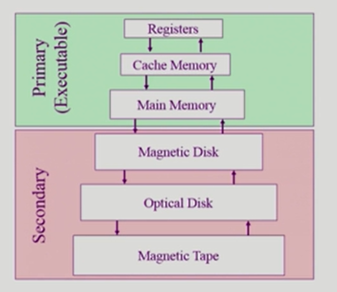

# 📙 Chapter 3. 컴퓨터 시스템의 동작 원리

[toc]

## 1. 컴퓨터 시스템의 구조

>  컴퓨터 내부장치(CPU, 메모리) + 컴퓨터 외부장치(입출력 장치 - 디스크, 키보드, 마우스, 모니터, 네트워크 장치)

- 컨트롤러
  - 각 하드웨어 장치마다 제어하는 작은 CPU
    - 메모리 컨트롤러
    - 디스크 컨트롤러
  
- 커널
  - 운영체제 중 항상 메모리에 올라가 있는 부분 (운영체제 중 핵심적인 부분)

## 2. CPU 연산과 I/O 연산

- 컴퓨터에서 연산을 한다는 것 = CPU가 동작한다는 것
  - `메인 CPU` : 컴퓨터 내에서 수행되는 연산 담당
  - `입출력 컨트롤러` : 입출력 I/O 담당

- 로컬 버퍼
  - 컨트롤러가 각 하드웨어의 입출력 데이터를 임시로 저장하기 위해 가지고 있는 작은 메모리
  
  

### ⭐인터럽트 프로세스

- 인터럽트 : 컨트롤러들이 CPU의 서비스가 필요할 때 이를 통보하는 방법 

1. 하드웨어 장치에서 데이터를 읽어오는 경우, 일단 컨트롤러가 데이터를 로컬버퍼에 저장한다.
2. 컨트롤러는 로컬버퍼에 읽어오는 작업이 끝났는 지를 계속 체크하는 것이아니라, 작업이 끝나면 인터럽트를 발생시켜 CPU에 보고한다.
3. CPU는 명령 하나를 수행할 때마다 인터럽트가 발생했는 지 확인한다. 인터럽트 발생 시, 운영체제 커널에서 인터럽트 처리루틴대로 처리한다.

## 3. 인터럽트의 일반적 기능

> CPU에 알려줘야 하는 이벤트 발생 시 컨트롤러가 발생시키는 동작

- 인터럽트 라인에 신호를 보내 인터럽트 발생을 알리는 동작은 하드웨어와 소프트웨어 동일

- `인터럽트` : 하드웨어 인터럽트

  - 컨트롤러가 CPU의 인터럽트 라인을 세팅

  

- `트랩` : 소프트웨어 인터럽트

  - 소프트웨어가 CPU의 인터럽트 라인을 세팅

  1. exception (예외상황)

  	- 비정상적인 작업을 시도할 때 (사용자 프로그램이 0으로 나누는 등)
  	- 권한이 없는 작업을 시도할 때 (메모리 영역 바깥에 접근하려는 등)
  2. System Call
     - 사용자 프로그램이 운영체제 내부에 정의된 코드를 실행하고 싶을 때 **운영체제에 서비스를 요청하는 방법**
     - 예를 들어 사용자 프로그램 작성 중 키보드 입출력 등의 작업이 필요한 경우 이미 존재하는 커널의 코드를 호출해서 처리한다

## ⭐ 4. 인터럽트 핸들링

> 인터럽트가 발생한 경우에 처리해야 할 일의 절차

- `PCB (Process Control Block)`
  - 운영체제에서 현재 실행되는 **프로그램들을 관리하기 위한 자료구조**
  - 각 프로그램마다 하나씩 존재하며, 프로그램이 실행 중이던 정보(코드의 메모리 주소, 레지스터값, 하드웨어 상태 등)를 저장
  - 인터럽트 처리가 끝난 후 원래 진행 중이던 프로그램의 상태를 PCB로부터  CPU상에 복원하여 다시 실행한다.

:bulb:오늘 날 운영체제는 **인터럽트에 의해서만 CPU를 점유하는 방식**을 통해 컴퓨터 시스템 자원을 체계적이고 효율적으로 관리할 수 있다.

## 5. 입출력 구조

> 입출력(I/O) : 컴퓨터 시스템이 컴퓨터 외부의 입출력 장치들과 데이터를 주고 받는 것

**입출력 방식**

- `동기식 입출력` : 어떤 프로그램이 입출력 요청을 했을 때 **입출력 작업이 완료된 후 그 프로그램이 후속작업을 수행**할 수 있는 방식 (일반적으로 사용되는 방식)
  - CPU 연산이 입출력 연산보다 빠르기 때문에 입출력 연산을 기다렸다가 CPU 연산을 시작하면 자원의 낭비가 심해진다.
  - 이를 관리하기 위해 운영체제는 프로그램을 몇 가지 상태로 나누고 **입출력 중인 프로그램을 봉쇄상태로 전환**시킨다.
  - 봉쇄 상태의 프로그램에게는 CPU를 할당하지 않고, **곧바로 명령수행 가능한 프로그램에만 CPU를 할당**한다.
  - 입출력 요청의 동기화를 위해 장치별로 큐를 두어 **요청한 순서대로 처리**할 수 있도록 한다.
- `비동기식 입출력` : CPU의 제어권을 입출력 연산을 호출한 그 프로그램에게 곧바로 다시 부여하는 방식 

## 6. DMA

> Direct Memory Access

- CPU 이외에 메모리 접근이 가능한 장치
  - 모든 메모리 접근 연산이 CPU에 의해서만 이루어질 경우 입출력 장치에서 메모리 접근을 할 때마다 인터럽트를 거쳐가야 하기 때문에 CPU효율성이 떨어지게 되기 때문에 DMA를 사용
- 일종의 컨트롤러
- CPU가 메모리 접근 요청에 의해 자주 인터럽트 되는 것을 막아주기 위한 장치
- byte 단위가 아니라 block이라는 큰 단위로 정보를 메모리로 읽어옴

## ⭐ 7. 저장장치의 구조

- 주기억 장치 (메모리)
  - RAM
    - 휘발성 : 전원이 나가면 저장되었던 내용이 모두 사라져버림
  
- 보조기억장치
  - 마그네틱 디스크, 플래시 메모리, CD 등
  
  1. 파일시스템용 (비휘발성)
  2. 스왑용
     - 프로그램에 당장 필요하지 않은 부분을 저장해두는 용도

## ⭐ 8. 저장장치의 계층 구조

상위( 접근속도 up, 용량 down)

---

- 레지스터
- 캐시 메모리
- 메인 메모리

---

- 마그네틱 디스크
- 광디스크
- 마그네틱 테이프

---

하위

## 9.하드웨어(디스크)의 보안

다중 프로그래밍 환경에서 발생하는 문제들에 대한 보안 기법

- 커널모드와 사용자 모드
  - 커널모드 : 중요한 정보에 접근해 위험한 상황을 초래할 수 있는 연산
  - 사용자모드 : 일반적인 연산
  - 사용자 프로그램 내에서 자체적으로 중요한 정보에 접근하는 연산을 수행하는 경우가 있을 수 있음 -> `mode bit`
    - `mode bit : 0 `  -  커널모드로서 모든 명령 수행 가능
    - `mode bit : 1` - 사용자모드로서 제한된 명령만 수행 가능

:bulb: 모든 입출력 명령은 특권명령으로 규정한다.

특권명령으로 규정함으로써 사용자 프로그램이 직접 입출력하는 것을 차단한다.

입출력이 필요한 경우에는 인터럽트(시스템 콜)를 통해 운영체제에 요청하여 모드비트를 0으로 세팅하여야만 인터럽트 처리루틴으로 이동하여 입출력 처리를 할 수 있다.

## 10. 메모리의 보안

ex) 메모리 주소를 잘못 참조하여 커널이 위치한 영역을 참조하려는 시도인 경우

특히 인터럽트 벡터와 인터럽트 처리루틴이 있는 곳은 각별한 보안이 필요하다.

### 기준 레지스터와 한계 레지스터

- 기준 레지스터 : 프로그램이 수행되는 동안 **그 프로그램이 합법적으로 접근할 수 있는 메모리상의 가장 작은 주소를 보관**
- 한계 레지스터 : 프로그램이 **기준 레지스터값부터 접근할 수 있는 메모리의 범위를 보관**

-> 만약 사용자 프로그램이 기준 레지스터  + 한계 레지스터 값 사이의 주소 영역 밖으로 접근하려고 한다면 exception 인터럽트가 발생하여 운영체제가 직접 해당 프로그램을 강제로 종료시키게 된다.

:exclamation: 단, 이 경우는 하나의 프로그램이 메모리의 한 영역에 연속적으로 위치하는 경우만 가능하다.

:question: 페이징 등 다른 메모리 관리 기법은 7장에서 다룬다.

## 11. CPU 보호

### 타이머

- CPU가 하나의 프로그램에 의해 독점되는 것을 막기위한 하드웨어
- 정해진 시간이 지나면 인터럽트를 발생시켜 운영체제가 CPU의 제어권을 획득할 수 있도록 하는 역할을 수행한다.

- 로드 타이머 : 타이머의 값을 세팅하는 명령
- 시분할 시스템에서 현재 시간을 계산하기 위해서도 사용됨

