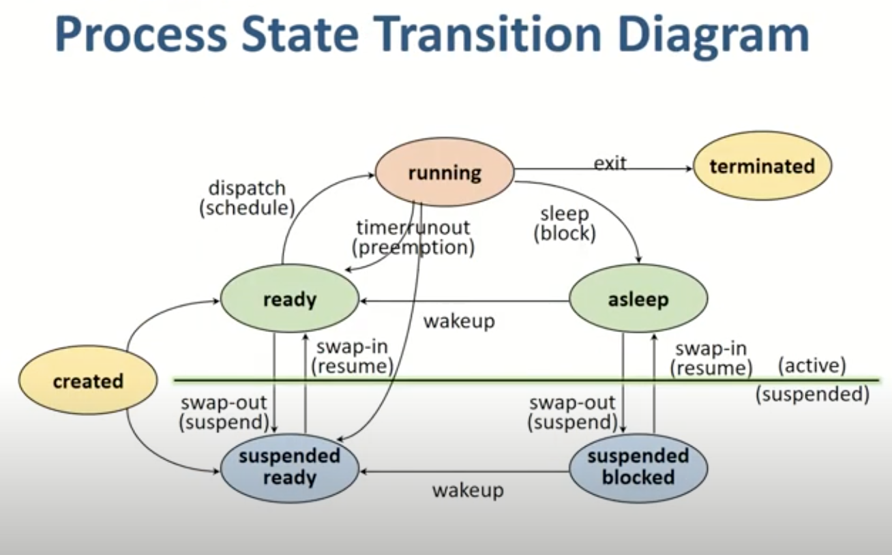

[TOC]

# Chapter5. 프로세스 관리

**프로세스(process)**: 실행 중인 프로그램을 말함. 디스크에 실행파일 형태로 존재하던 프로그램이 **메모리에 올라가서 실행되기 시작하면 프로세스**가 된다.

**프로세스의 문맥(context)**: 프로세스의 주소 공간(코드, 데이터, 스택 상태)을 비롯해 레지스터에 어떤 값을 가지고 있었는지와, 시스템 콜 등을 통해 커널에서 수행한 일의 상태, 그 프로세스에 관해 커널이 관리하고 있는 각종 정보 등을 포함

- PCB(Process Control Block)에 저장
- PCB는 프로그램이 중단된 지점부터 다시 시작하기 위해 필요

## 2. 프로세스의 상태

1. 시작(new)

   프로세스가 시작되어 그 프로세스를 위한 각종 자료구조는 생성되었지만 아직 **메모리 획득을 승인받지 못한 상태**

2. 실행(running)

   **프로세스가 CPU를 보유, 기계어 명령을 실행**하고 있는 상태. CPU는 일반적으로 하나이므로 컴퓨터 내에서 여러 프로세스가 동시에 수행된다 해도 실제로 **실행 상태에 있는 프로세스는 매 시점 하나**뿐이다.

3. 준비(ready)

   프로세스가 CPU만 보유하면 당장 명령을 수행할 수 있지만 **CPU를 할당받지 못한 상태**를 가리킨다.

4. 봉쇄(blocked, wait, sleep)

   CPU를 할당받더라도 당장 명령을 실행할 수 없는 프로세스 상태

   ex) 프로세스가 요청한 입출력 작업이 진행 중인 경우

5. 중지(suspended, stopped) <= 메모리 보유 x

   외부적인 이유로 프로세스의 수행이 정지된 상태

   (중기 스케줄러에 의해 디스크로 스왑 아웃된 프로세스의 상태)

   - 중지 준비(suspended ready), 중지 봉쇄(suspended block)의 두 가지로 세분화 할 수 있다.
   - 각각 준비 상태에서 디스크로 **스왑 아웃된 경우**와 봉쇄 상태에서 디스크로 **스왑 아웃된 경우**이다.

6. 완료(terminated)

   프로세스가 종료되었으나 운영체제가 그 프로세스와 관련된 자료구조를 완전히 정리하지 못한 상태

**문맥 교환(context switch)**: CPU 제어권을 다른 프로세스로 이양하는 과정을 말함

ex) 실행 중인 프로세스가 입출력 요청 등으로 봉쇄 상태로 바뀌는 경우 등

**CPU 디스패치(dispatch)**: 준비 상태의 프로세스들 중에서 CPU를 할당받을 프로세스를 선택한 후 실제로 CPU의 제어권을 넘겨받는 과정

### 입출력을 요청한 프로세스의 상태 변화

- 프로세스가 실행 상태에 있을 때, 입출력 요청 등이 오면 인터럽트가 발생 => 실행 중이던 프로그램은 봉쇄 상태에 들어가고 CPU 스케줄러가 적절한 프로세스를 선정해 CPU를 할당한다.
- 입출력 요청 프로세스는 입출력 요청 큐에서 자기 차례가 와서 응답을 받고 나면 CPU에게 입출력 완료 인터럽트를 발생시킨다.
- CPU는 인터럽트 처리 루틴에 따라 동작한다. (입출력 완료 프로세스의 상태를 준비 상태로 변경하는 등)
- 인터럽트 처리가 끝나면 문맥 교환이 일어난다.

## 3. 프로세스 제어블록(PCB)

Process Control Block

운영체제가 시스템 내의 프로세스들을 관리하기 위해 **프로세스마다 유지하는 정보들을 담는 커널 내의 자료구조**를 뜻한다.

**PCB의 구성 요소**(필요하면 읽기)

- 프로세스의 상태(process state)
  - CPU를 할당해도 되는지(준비 상태인지?) 여부
- 프로그램 카운터(Program Counter, PC)의 값
  - 다음에 수행할 명령의 위치(프로세스 내에서 다음 코드의 위치)
- CPU 레지스터의 값(CPU register)
  - CPU 연산을 위한 현 시점의 레지스터 저장값
- CPU 스케줄링 정보(CPU scheduling information)
  - 프로세스의 CPU 스케줄링을 위해 필요한 정보
- 메모리 관련 정보(memory management information)
  - 프로세스의 메모리 할당을 위해 필요한 정보
- 자원 사용 정보(accounting information)
  - 사용자에게 자원 사용 요금을 계산해 청구하는 등의 용도로 사용
- 입출력 상태 정보(I/O status information)
  - 프로세스가 오픈한 파일 정보 등 프로세스의 입출력 관련 상태 정보

## 4. 문맥 교환

하나의 사용자 프로세스로부터 다른 사용자 프로세스로 CPU의 제어권이 이양되는 과정

과정이 책 or 기존 정리본에 나와있음. 궁금하면 읽어보기!

## 5. 프로세스를 스케줄링하기 위한 큐

큐는 PCB를 연결 리스트 형태로 관리하고 포인터를 사용해 순서를 정한다. 이러한 큐는 커널의 데이터 영역에 존재하며, 따라서 각 프로세스가 CPU를 기다리는지, 입출력을 기다리는지 등의 정보를 커널이 총체적으로 관리하게 된다.

**준비 큐(ready queue)**: 준비 상태에 있는 프로세스들을 줄 세우기 위한 큐

**장치 큐(device queue)**: 장치에 따라 여러 큐가 있다.

ex) 디스크 입출력 큐, 키보드 입출력 큐

**작업 큐(job queue)**

준비 큐와 장치 큐를 포괄하는 개념, 준비 큐는 준비 상태, 장치 큐는 봉쇄 상태에 있다.

**공유 데이터 큐**: 공유 데이터에 여러 프로세스가 접근할 수 없고, 하나의 프로세스가 공유 데이터에 대한 접근을 완전히 마치고 나면 다른 프로세스가 접근할 수 있다.

## 6. 스케줄러

어떤 프로세스에게 자원을 할당할지를 결정하는 운영체제 커널의 **코드**를 지칭한다.

**장기 스케줄러(작업 스케줄러, long term scheduler, job scheduler)**

- 어떤 프로세스를 준비 큐에 진입시킬지 결정하는 역할
- 시작 상태의 프로세스들 중 **어떠한 프로세스를 준비 큐에 삽입할 것인지** 결정하는 역할!
- 메모리에 동시에 올라와 있는 프로세스의 수(degree of multiprogramming)를 조절
- 현대의 시분할 시스템에서는 **장기 스케줄러보다는 중기 스케줄러가 주로 사용**된다.
- 가끔 호출되기 때문에 느려도 허용

**단기 스케줄러(CPU 스케줄러, short term scheduler)**

- 준비 상태의 프로세스들 중에서 어떤 프로세스를 다음번에 실행 상태로 만들 것인지 결정

- 준비 큐에 있는 여러 프로세스들 중 어떠한 프로세스에게 CPU를 할당할 것인가를 단기 스케줄러가 결정

  ex) 타이머 인터럽트가 발생하면 단기 스케줄러가 호출됨

- 빈번하므로 속도가 빠름

**중기 스케줄러(medium term scheduler)** <- 중요

- 너무 많은 프로세스에게 메모리를 할당해 시스템의 성능이 저하되는 경우 이를 해결하기 위해 메모리에 적재된 프로세스의 수를 동적으로 조절하기 위해 추가된 스케줄러
- 메모리에 올라와 있는 프로세스 중 일부를 선정해 이들로부터 메모리를 통째로 빼앗아 그 내용을 디스크의 스왑 영역에 저장(스왑 아웃, swap out)
- 프로세스당 보유 메모리양이 지나치게 적어진 경우 일부 프로세스를 메모리에서 디스크로 스왑 아웃시키는 역할!
- 중지 상태를 발생시킴

## 7. 프로세스의 생성

최초의 프로세스는 운영체제가 생성한다. 나머지 프로세스는 이 프로세스로부터 복제되어 나온다. 따라서 프로세스간에는 부모-자식 관계가 있으며, 일반적으로 생각하는 실제 부모자식 관계와는 달리 자식 프로세스가 모두 종료된 후에야 부모 프로세스가 종료될 수 있다.

## 8. 프로세스간의 협력

프로세스는 각자 자신만의 독립적인 주소 공간을 가지고 수행되며, 프로세스가 다른 프로세스의 주소 공간을 참조하는 것은 **원칙적으로 허용되지 않는다.**

=> 부모 프로세스와 자식 프로세스는 자원을 서로 획득하기 위해 경쟁적인 관계에 있게 됨

그러나 협력 시 처리 속도 향상 등의 긍정적인 측면이 있기 때문에 **프로세스 간 협력 메커니즘이 존재**한다. 이를 IPC(Inter-Process Communication)이라고 부르며, 메시지 전달 방식과 공유 메모리 방식이 있다.

- 메시지 전달 방식
  - 공유 데이터 사용 x, 메시지를 주고받으며 통신
  - 메시지 전달은 주소 공간이 달라 직접할수는 없으며, 커널이 그 역할을 한다.
  - 메시지를 주고받는 연산은 **특권명령**이다. 
- 공유 메모리 방식
  - 프로세스들이 주소 공간의 일부를 공유한다.
  - 프로세스 A와 B가 일부 동일한 물리적 메모리를 가지게 되고, 데이터의 동기화 문제가 있을 수 있으므로 프로세스들끼리 메모리 접근에 대한 규칙을 정해야 한다.