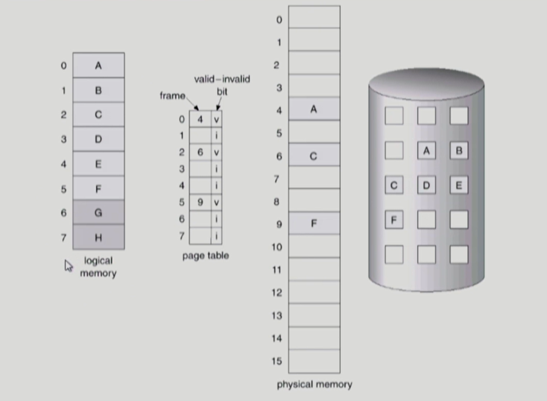
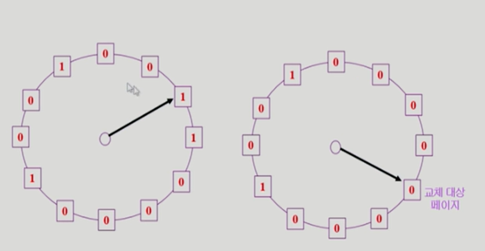
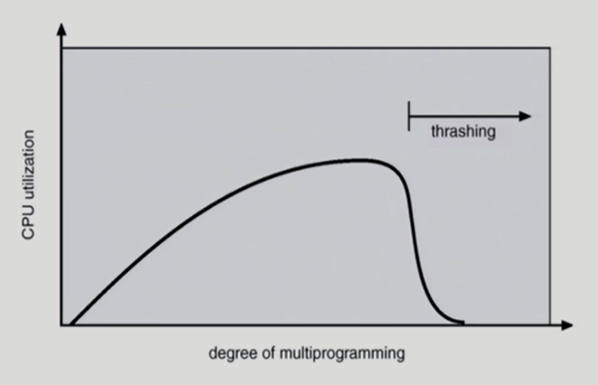
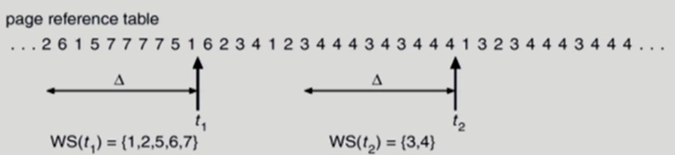
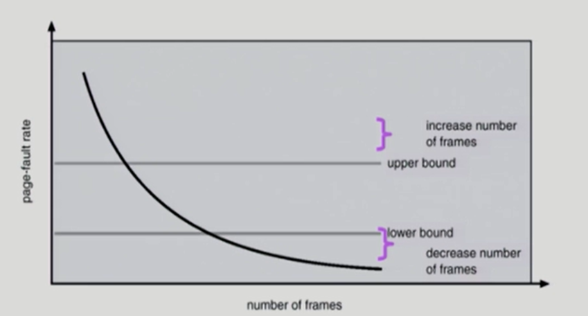

# 📙 Chapter8. 가상메모리

[toc]

## 1. 개요 

   - 프로그램 실행을 위해서 프로그램에 필요한 부분이 메모리에 올라와 있어야 함, 그 프로세스의 주소 공간 전체가 메모리에 올라와 있어야 하는 것은 아님. 

   - **따라서 운영체제는 CPU에서 당장 수행해야 할 부분만을 메모리에 올려놓고 그렇지 않은 부분은 디스크의 스왑 영역에 내려놓았다가 다시 필요해지면 메모리에 올라간 부분과 교체하는 방식 사용**

   - 이렇게 되면 프로그램은 0번지부터 시작하는 자기 자신만의 메모리 주소 공간을 가정할 수 있고, 이러한 메모리 공간을 **가상메모리(virtual memory)**라고 부른다.

     ---

     **정리: 가상 메모리의 정의**

     시분할 시스템에서 프로그램들이 수행될 때 메모리를 나눠 가지게 되는데, 디스크의 스왑 공간을 이용하면 메모리의 제한을 걱정할 필요가 없어지고(요구 페이징), 이를 이용하여 마치 각각의 프로그램이 온전히 하나의 메모리를 차지하여 수행되는 것처럼 만들어주는 역할을 운영체제가 하게 되고, 이를 가상 메모리라고 부른다.

     ---

     

## ⭐2. 요구 페이징

- 요구 페이징은 프로그램 실행 시 CPU의 요청이 들어온, 당장 사용될 페이지만을 메모리에 올리는 방식

  ### 기대 효과

  - 메모리 사용량 감소
  - 프로세스 전체를 메모리에 올리지 않아 입출력 오버헤드 감소
  - 빠른 응답 시간
  - 시스템이 더 많은 프로세스를 수용할 수 있음

- **유효 - 무효 비트** : 특정 프로세스를 구성하는 페이지 중 어떤 페이지가 메모리에 존재하고 어떤 페이지가 존재하지 않는지를 판별하기 위한 방식 

  - 프로세스 실행 전 : 모든 페이지가 무효값
  - 프로세스 실행 중 : 메모리에 적재된 페이지의 값 유효, 해당 페이지가 스왑영역으로 갈 경우 무효값
  - **페이지 부재 (page fault)** : 유효-무효 비트가 무효로 세팅되어 있는 경우 - 페이지가 현재 메모리에 없는 경우 or 그 페이지가 속한 주소 영역을 프로세스가 사용하지 않는 경우

#### 1) 요구 페이징의 페이지 부재 처리

페이지 부재가 일어나면 페이지 부재 처리 과정을 거쳐야 한다.

1. 주소 변환 담당 하드웨어인 MMU가 페이지 부재 트랩(page fault trap)을 발생
2. CPU의 제어권이 커널모드로 전환됨
3. 운영체제의 페이지 부재 처리루틴(page fault handler)이 호출되어 페이지 부재 처리
   1. 해당 페이지에 대한 접근이 적법한지 체크
      - 사용하지 않는 주소 영역에 속한 페이지에 접근 or 접근 권한 위반(protection violation)을 한 경우 해당 프로세스 종료
   2. 적법하다면 물리적 메모리의 비어 있는 프레임에 해당 페이지를 읽어온다.
      - 비어 있는 프레임이 없다면 기존 메모리의 페이지 중 하나를 디스크로 쫓아내고, 이를 스왑 아웃(swap out) 시킨다고 한다. 
   4. 입출력이 완료되면 인터럽트가 발생하여 페이지 테이블에서 해당 페이지의 유효-무효 비트를 유효로 설정하고, 봉쇄되었던 프로세스를 준비 큐로 이동시킨다

#### 2) 요구 페이징의 성능

페이지 부재의 발생 빈도는 요구 페이징 기법 성능에 가장 큰 영향을 미친다. 요청된 페이지를 디스크로부터 메모리로 읽어오는 막대한 오버헤드가 발생하기 때문이다.

요구 페이징의 성능은 **요청한 페이지를 참조하는 데 걸리는  유효 접근 시간**으로 측정한다.

유효 접근시간이 짧을수록 요구 페이징 기법의 성능은 향상된다.

## ⭐ 3. 페이지 교체 (Page Replacement)

- 어떤 페이지를 쫓아낼지 결정하여 victim이 결정되면 디스크로 쫓아내는 작업 
- 교체 알고리즘 : 어떤 페이지를 쫓아낼지 결정하는 알고리즘, 페이지 부재율을 최소화하는 것이 목표이므로 미래에 참조될 가능성이 가장 적은 페이지를 선택해서 내쫓아야한다

### 3.1 최적 페이지 교체 (Optimal Algorithm)

- 빌레디의 최적 알고리즘 : 가장 먼 미래에 참조될 페이지를 선정하여 쫓아내는 방식
- 오프라인 알고리즘 : 미래에 어떤 페이지가 어떤 순서로 참조될지 미리 알고 있다는 전제가 필요, 따라서 온라인으로 사용 불가 

### 3.2 선입선출 알고리즘 (First In First Out)

   - 메모리에 가장 먼저 올라온 페이지를 가장 먼저 내쫓음
   - 페이지의 향후 참조 가능성을 고려하지 않기 때문에 비효율적
   - FIFO 이상 현상 (FIFO Anomaly) : 메모리를 증가시켰음에도 오히려 페이지 부재율이 높아지는 현상 (미래의 참조 가능성을 고려하지 않기 때문에 발생)

### 3.3 LRU 알고리즘 (Least Recently Used)

   - 페이지 교체 시 가장 오래전에 참조된 페이지를 쫓아낸다, 즉 마지막 참조 시점이 가장 오래된 페이지를 교체한다

     

### 3.4 LFU 알고리즘 (Least Frequently Used)

   - 페이지의 참조 횟수로 교체시킬 페이지를 결정, 즉 과거의 참조횟수가 가장 적었던 페이지를 쫓아낸다

### 3.5 LRU 알고리즘 vs LFU 알고리즘

|                         |        LRU 알고리즘         |                LFU 알고리즘                |
| :---------------------: | :-------------------------: | :----------------------------------------: |
|        참조기록         | 직전에 참조된 시점만을 반영 | 오랜 시간 동안의 참조 기록 반영 (오버헤드) |
|          구현           |         비교적 쉬움         |                비교적 복잡                 |
|       시간복잡도        |            O(1)             |            O(log n) (heap 구조)            |
| 시간에 따른 페이지 변화 |            반영             |                 반영 불가                  |

 

### ⭐3.6 클럭 알고리즘 (clock algorithm)

  - LRU 알고리즘을 근사시킨 방법으로 NUR (Not Used Recently) 혹은 NRU (Not Recently Used) 알고리즘으로도 불림

  - 대부분의 시스템에서 채택된 알고리즘

  - 페이지 프레임들의 참조비트를 순차적으로 조사, 참조비트는 각 프레임마다 하나씩 존재하며 그 프레임 내의 페이지가 참조될 때 하드웨어에 의해 자동세팅됨

    - 참조비트 1 : 최근 사용된 페이지
    - 참조비트 0 : 최근 사용되지 않은 페이지
    - 시곗바늘이 한바퀴 도는 동안 다시 참조되지 않은 페이지를 교체

  - 시곗바늘 한 바퀴 도는 데 소요되는 시간만큼 페이지를 메모리에 유지시켜 둠으로써 페이지 부재율을 줄이도록 설계되었기 때문에 2차 기회 알고리즘 (second chance algorithm)이라고도 부름

   

## 4. 페이지 프레임의 할당

프로세스 여러 개가 동시에 수행될 때 각 프로세스에 얼마만큼의 메모리 공간을 할당할지 결정해야 한다. 균등 할당도 하나의 방법이지만 시스템 성능 향상을 위해서는 더 효율적인 메모리 할당 방법이 필요하다.

1) 균등할당(equal allocation) : 모든 프로세스에게 페이지 프레임을 균일하게 할당

2) 비례할당(proportional allocation) : 프로세스의 크기를 고려한 균등할당 방식

3) 우선순위 할당(priority allocation) : 당장 CPU에서 실행될 프로세스와 그렇지 않은 프로세스를 구분하여 전자 쪽에 더 많은 페이지 프레임을 할당하는 방식

프로세스에 할당되는 페이지 프레임의 수는 다음과 같은 경우를 고려해서 결정해야 한다.

- 프로세스가 최소한으로 필요로 하는 페이지 프레임의 수
- 반복문을 실행 중인 프로세스의 경우, 반복문을 구성하는 페이지들을 메모리에 모두 올려놓는 것이 유리하다. (페이지 부재를 막기 위함)
- 시간에 따라 프로세스에게 최소한으로 필요한 메모리의 양이 달라짐을 고려

## 5. 전역교체와 지역교체

교체할 페이지를 선정할 때, 교체 대상이 될 프레임의 범위를 어떻게 정할지에 따라 교체 방법을 전역교체(global replacement)와 지역교체(local replacement)로 구분할 수 있다. 

**전역교체**

모든 페이지 프레임이 교체 대상이 될 수 있는 방법

- 프로세스마다 메모리를 할당하는 것이 아니라 전체 메모리를 각 프로세스가 공유해서 사용하고 교체 알고리즘에 근거해서 할당되는 메모리 양이 가변적으로 변하는 방법
- LRU, LFU, 클럭 등의 알고리즘을 물리적 메모리 내에 존재하는 전체 페이지 프레임들을 대상으로 적용하는 경우

**지역교체**

현재 수행중인 프로세스에게 할당된 프레임 내에서만 교체 대상을 선정하는 방법

- 프로세스마다 페이지 프레임을 미리 할당한다.
- LRU, LFU 등의 알고리즘을 프로세스별로 독자적으로 운영할 때에는 지역교체 방법이다.

## 6. 스레싱 (Thrashing)

- 스레싱 : 부재율이 크게 상승해 CPU 이용률이 급격히 떨어지는 현상
  - 프로세스의 원활한 수행에 필요한 최소한의 page frame 수를 할당받지 못한 경우 발생 
  - Page fault rate이 매우 높아짐
  - CPU utilization이 낮아짐 
- 따라서 MPD (다중 프로그래밍의 정도)를 적정히 조절하는 것이 중요하다

  - MPD가 너무 낮으면 CPU 이용률이 낮아서 준비 큐가 비는 경우가 발생
  - MPD가 너무 높으면 각 프로세스에 필요한 최소한의 page frame을 보장하지 못해 스레싱 발생

**다중 프로그래밍 정도(Multi-Programming Degree: MPD)**

- 메모리에 동시에 올라가 있는 프로세스의 수

즉, 특정 한계치를 넘지 않는 범위에서 MPD를 조절하는 것이 중요하다. 이렇게 MPD를 적절히 조절해 CPU 이용률을 높이는 동시에 스레싱 발생을 방지하는 방법에는 워킹셋 알고리즘과 페이지 부재 빈도 알고리즘이 있다.

### 1) 워킹셋 알고리즘(working-set algorithm)

**지역성 집합(locality set)**

프로세스에서 일정 시간 동안 특정 주소 영역을 집중적으로 참조하는 경우, 이렇게 집중적으로 참조되는 페이지들의 집합을 지역성 집합이라 한다.

**워킹셋 알고리즘**은 **지역성 집합이 메모리에 동시에 올라갈 수 있도록 보장하는 메모리 관리 알고리즘**을 말한다. 

워킹셋은 프로세스가 원활히 수행되기 위해 한꺼번에 메모리에 올라와 있어야 하는 페이지들의 집합을 뜻하며, 프로세스의 워킹셋을 구성하는 페이지들이 한꺼번에 메모리에 올라갈 수 있는 경우에만 그 프로세스에게 메모리를 할당한다. 그렇지 않은 경우에는 프로세스에게 할당된 페이지 프레임들을 모두 반납시킨 후 그 프로세스의 주소 공간 전체를 디스크로 스왑 아웃시킨다.

### 2) 페이지 부재 빈도 알고리즘(page-fault frequency scheme)

어떤 프로세스의 **페이지 부재율**이 시스템에서 미리 정해놓은 **상한값을 넘게 되면** 이 프로세스에 할당된 프레임의 수가 부족하다고 판단하여 이 **프로세스에게 프레임을 추가로 할당**하는 알고리즘

반면 프로세스의 **페이지 부재율이 하한값 이하로 떨어지면** 이 프로세스에게 필요 이상으로 많은 프레임이 할당된 것으로 간주해 **할당된 프레임의 수를 줄인다.**

만약 상한값을 넘은 경우에 추가로 할당할 빈 프레임이 없으면 일부 프로세스를 스왑 아웃시켜 메모리에 올라가 있는 프로세스의 수를 조절한다. 만약 모든 프로세스에 필요한 프레임을 다 할당한 후에도 프레임이 남는 경우 스왑 아웃시켰던 프로세스에게 프레임을 할당하여 MPD를 높인다.

