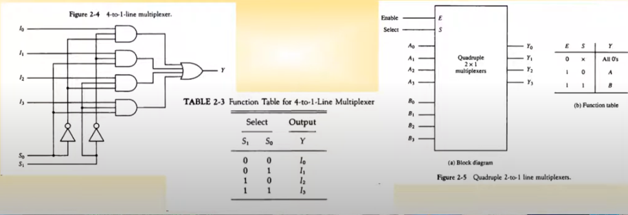

영상: [컴퓨터시스템구조 CSA 제2장 Part-1](https://youtu.be/KKkhZkVAJWQ?list=PLc8fQ-m7b1hD4jqccMlfQpWgDVdalXFbH)

## [제 2장 Part-1, 2](https://youtu.be/OMPluhHkGSg?list=PLc8fQ-m7b1hD4jqccMlfQpWgDVdalXFbH)

### 집적회로 (Integrated Circuits)

- 디지털 게이트를 구성하는 전자 부품을 포함하는 실리콘 반도체 칩

- 칩 내부에 게이트들이 연결되고, 외부로도 연결함

- 칩의 등록 번호로 구분함(DataBook을 통해 IC 칩의 정보를 확인 할 수 있음)

  

- 집적 규모에 따른 분류

  1. SSI - 소규모, 10개 이하의 게이트들로 구성
  2. MSI - 중규모, 10~200개의 게이트들로 디코더, 가산기, 레지스터 구현
  3. LSI - 대규모, 200~1000개의 게이트들로 프로세서나 메모리 칩과 같은 디지털 시스템 형성
  4. VLSI - 초대규모, 수천개 이상의 게이트 집적, 대형 메모리나 마이크로컴퓨터 칩 구성

  

- 디지털 논리군에 따른 분류

  - 속도에 따라 분류

  1. TTL (Transister-Transistor Logic) - 일반 로직 회로 부품
  2. ECL (Emitter-Coupled Logic) - 고속 논리 시스템용 부품(1 ~ 2ns 이하), 슈퍼 컴퓨터용

  - 반도체 웨이퍼 위에 어떤 식으로 게이트웨이 반도체를 집적시켰느냐에 따라 분류

  1. MOS (Motel Oxide Semiconductor) - 고밀도 집적회로용 부품

  2. CMOS (Complement Metal Oxide Semiconductor) - 고밀도 회로, 단순한 제조공정, 저전력 특성 (스마트폰 같이 전력에 예민한 곳에 사용)

     

## [제 2장 Part-3](https://youtu.be/HRtwaJUQ5hA?list=PLc8fQ-m7b1hD4jqccMlfQpWgDVdalXFbH)

### 디코더 (Decoders)

Input과 Output을 테이블로 작성할 때는 높은 비트대로 써야하는 것에 주의 (그냥 규칙임)

- N 비트의 이진 정보를 서로 다른 2^n개의 원소 정보로 출력 (2진수를 10진수에 해당하게 변환하여 사용)

  - 2개의 입력 -> 4가지 출력: 2*4 decoder

  - 3개의 입력 -> 8가지 출력: 2*8 decoder

    

- NAND 게이트로 이루어진 디코더(대부분의 디코더가 NAND 게이트 디코더임)

  - 보수화된 출력이 더 경제적임
  - 대부분의 출력신호가 1로 유지되고 내가 원하는 것만 0으로 바꾸는 형식
  - CMOS 회로의 영향으로 저전력 회로에 유리

  

- 인코더
  - 디코더와 반대 동작을 수행
  - 2^N의 입력에 대하여 N 이진 코드 출력
  - 한번에 하나의 입력만이 1의 값을 가질 수 있음

### 멀티플렉서 (Multiplexers)

- N개의 선택 입력에 따라 2^N개의 출력을 하나의 출력에 선택적으로 연결
- 다중 입력 중 하나를 선택하여 출력으로 연결 (옛날 전화국의 전화 연결처럼 여러 개 중 하나를 연결시켜주는 것)
- 네트워크 스위치의 기본 구조 요소
  - 아래의 예시는 4x1 MUX(Multiplex를 줄여서 말하는 것 )

## [제 2장 Part-4](https://youtu.be/G92HtFxC-6Q?list=PLc8fQ-m7b1hD4jqccMlfQpWgDVdalXFbH)

### 레지스터 (Registers)

- 구성

  - N 비트 레지스터 : N 비트의 이진 정보를 저장 (64비트 컴퓨터의 경우 16개의 4비트 레지스터로 만들어짐)
  - N개의 플립플롭(데이터 저장, 플립플롭의 이름은 출력의 이름과 같다.)과 조합 회로로 구성

- 기본 레지스터
  - 클럭펄스 타이밍에 입력값이 레지스터에 저장
  - 레지스터에 저장된 값은 항상 출력에서 참조 가능
  - Clear(기본적으로 다 됨), Clock(상향 모서리, 하향 모서리에서 비트 변환) 입력 제공
- 병렬로드 가능한 4비트 레지스터 
  - 4비트의 데이터를 동시에 입력 가능
  - Load, Clock 입력 제공

### 시프트 레지스터 (Shift Registers)

- 레지스터에 저장된 이진 정보를 단방향 / 양방향으로 이동 가능한 레지스터
- 각 FF들의 입력이 출력과 cascade로 연결
- 공통의 clock이 다음 상태로의 이동 제어
- Shifter라고도 함

- 병렬로드를 가지는 양방향 시프트 레지스터(General Register)

  - 병렬로드, 왼쪽/오른쪽 시프트(그림에서는 right가 아래, left가 위임), 병렬출력 기능

  - 동기화된 clock에 의하여 동작

  - 범용 레지스터를 지칭

    ​                                                                       

### 이진 카운터 (Binary Counters)

- 정해진 순서대로 상태 변이 수행(이 때문에 생각보다 많이 사용됨)

- Clock 또는 외부 입력에 따른 상태 변이

- 용도

  - 사건의 발생 횟수 카운트
  - 동작 순서 제어 타이밍 신호 발생에 적용

- 병렬입력을 가진 이진 카운터

  - 카운터의 초기값 설정 가능

  - 병렬 입력을 통하여 초기값 로드 가능

  - Load, Clear, Increment 기능

    

## [제 2장  Part-5](https://youtu.be/-mwBleM_7So?list=PLc8fQ-m7b1hD4jqccMlfQpWgDVdalXFbH)

### 메모리 장치 (Memory Unit)

- 정의
  - 정보의 입출력 기능을 가지는 저장 요소들의 집합
  - Word 단위로 정보를 저장
  - Word : 입출력에서 하나의 단위로 취급되는 비트의 그룹 (컴퓨터에서 한 번에 입출력할 수 있는 단위)
    - 16bit 컴퓨터 : 레지스터 / 메모리 버스의 크기가 16bit
    - 64bit 컴퓨터 : 레지스터 / 메모리 버스의 크기가 64bit
  - Byte: 워드의 기본 단위
  - RAM, ROM, HDD, SSD, USB 다 메모리 장치이다.
- RAM(Random Access Memory)
  - Word의 물리적인 위치에 관계없이 데이터 접근
  - **모든 데이터 위치에 대하여 동일한 접근 시간(RAM의 조건이다.)**
  - N 비트의 입출력 (Word 크기와 동일)
  - K개의 주소 라인으로 2^k개 Word 중 하나를 선택
  - 읽기/쓰기로 지정됨(R/W)

- ROM(Read Only Memory)
  - 정의
    - 한 번 저장된 데이터를 읽기만 가능
    - 1 word가 N 비트이고 M워드를 저장하는 N x M ROM
    - ROM에 저장된 M word를 접근할 수 있는 K 개의 주소 입력
  - 종류
    - Mask ROM : 석판화 방식(Lithography)으로 구워져 나오는 ROM
    - PROM(Programmable) : 한번만 프로그램 가능
    - EPROM(Erasable PROM) : UV에 의한 데이터 삭제(초기화) 및 재프로그래밍 가능
    - EEPROM(Electronical EPROM) : 전기 신호에 의한 데이터 삭제/초기화 및 재프로그래밍
  - ROM 기능을 하는 RAM
    - 전원을 끊어도 데이터를 저장하고 있다는 점을 이용한 것이다.
    - Flash-RAM : BIOS, USB memory, SD card
    - NV-RAM
      - Non-Volatile RAM
      - Battery Backup RAM

