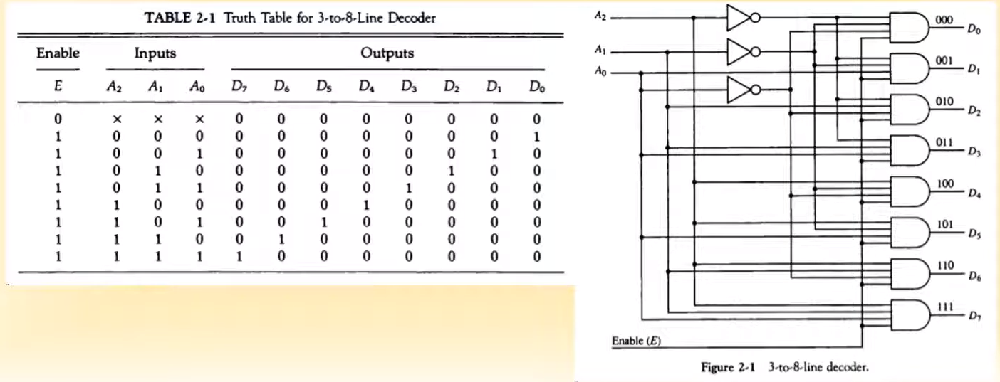
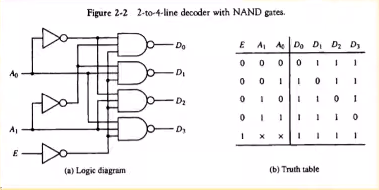
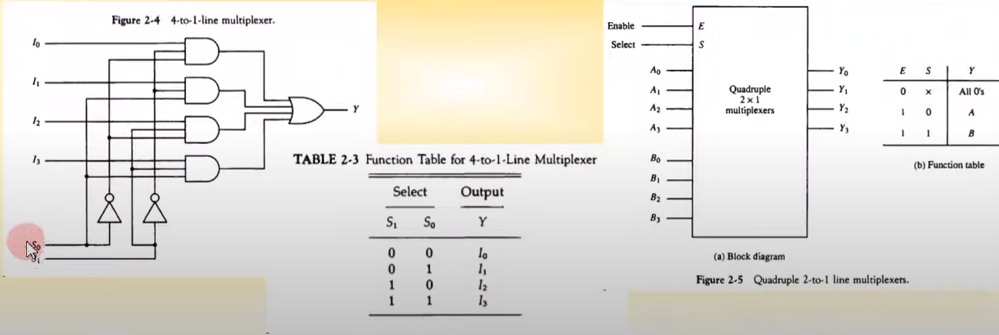
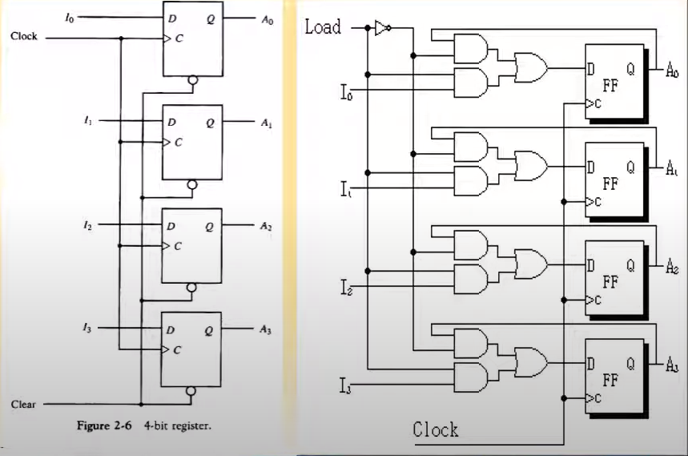
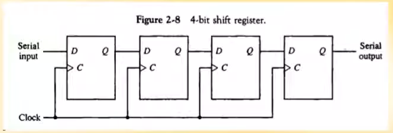
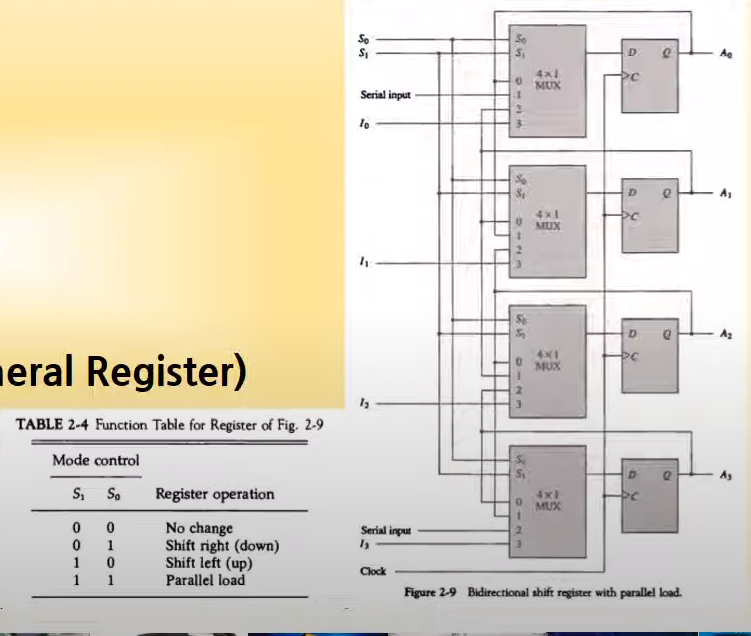
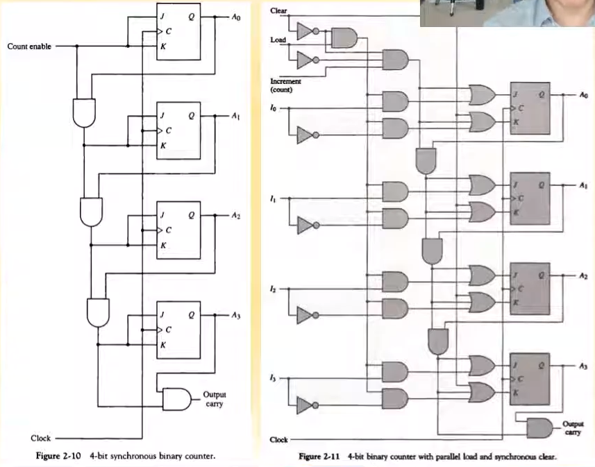

영상: [컴퓨터시스템구조 CSA 제2장 Part-1](https://youtu.be/KKkhZkVAJWQ?list=PLc8fQ-m7b1hD4jqccMlfQpWgDVdalXFbH)

## [제 2장 Part-1, 2](https://youtu.be/OMPluhHkGSg?list=PLc8fQ-m7b1hD4jqccMlfQpWgDVdalXFbH)

### 집적회로 (Integrated Circuits)

#### 정의

- 디지털 게이트를 구성하는 전자부품을 포함하는 실리콘 반도체 칩
- 칩 내부에 게이트들이 연결되고, 외부로도 연결
- 칩의 등록번호로 구분(dataBook을 통하여 정보 확인 가능)

#### 집적 규모에 따른 분류

- `SSI` : 소규모, 10개 이하의 게이트들로 구성
- `MSI` : 중규모, 10~200개의 게이트들로 디코더, 가산기, 레지스터 구현
- `LSI` : 대규모, 200~1000개의 게이트들로 프로세서나 메모리칮과 같은 디지털 시스템 형성
- `VLSI` : 초대규모, 수천개 이상의 게이트 집적, 대형 메모리나 마이크로 컴퓨터 칩 구성 -> 현재의 CPU들, 칩셋

#### 디지털 논리군

- `TTL` : Transister-Transistor Logic
  - 일반 로직 회로 부품(게이트 딜레이 1~2ms 이하)
- `ECL` : Emitter-Coupled Logic
  - 고속 논리 시스템용 부품(게이트 딜레이 1~2ns 이하), 슈퍼컴퓨터용, 엄청 비쌈
- `MOS` : Metal Oxide Semiconductor
  - 고밀도 집적회로용 부품(대중적), 항상 + 전력이 들어가야 해서 전력 소모가 많음, 대중적
- `CMOS` : Complement Metal Oxide Semiconductor
  - 고밀도 회로, 단순한 제조공정, 저전력 특성(바닥에 P형 반도체를 깔아두서 항상 전력이 들어갈 필요가 없음, MOS에 비해 최대 10배 전력 소모가 적음), 휴대폰 등에 많이 쓰임

## [제 2장 Part-3](https://youtu.be/HRtwaJUQ5hA?list=PLc8fQ-m7b1hD4jqccMlfQpWgDVdalXFbH)

### 디코더 (Decoders)

- N 비트의 이진 정보를 서로 다른 2^N개의 원소 정보로 출력
  - 2개의 입력 -> 4가지(2^2) 출력 : 2*4 decoder
  - 3개의 입력 -> 8가지(2^3) 출력 : 3*8 decoder
  - 여러개의 부품중에서 한개만 종료할 때(끌때) 자주 사용

- 큰숫자 -> 작은 숫자 순으로 씀, 규칙임!

- NAND 게이트로 이루어진 디코더
  - 보수화된 출력이 더 경제적임
  - 대부분의 출력신호가 1로 유지
  - CMOS 회로의 영향으로 저전력 회로에 유지

- 인코더
  - 디코더와 반대 동작 수행(인풋, 아웃풋 반전)
  - 2^N의 입력에 대하여 N 이진 코드 출력
  - 한번에 하나의 입력만이 1의 값을 가질 수 있음

### 멀티플렉서 (Multiplexers)

#### 정의

- 디코더랑 반대 개념

- N개의 선택 입력에 따라 2^N개의 출력을 하나의 출력에 선택적으로 연결
- 다중 입력 중 하나를 선택하여 출력으로 연결
- 네트워크 스위치(전화, LAN, WAN)의 기본 구조 요소
- 4-to-1 ~ : 4*1 MUX 라고도 함

## [제 2장 Part-4](https://youtu.be/G92HtFxC-6Q?list=PLc8fQ-m7b1hD4jqccMlfQpWgDVdalXFbH)

### 레지스터 (Registers)

- 레지스터의 구성
  - N비트 레지스터 : N비트의 이진 정보 저장
  - N개의 플립플롭과 조합 회로로 구성
- 기본 레지스터
  - 클럭펄스 타이밍에 입력값이 레지스터에 저장
  - 레지스터에 저장된 값은 항상 출력에서 참조 가능
  - Clear, Clock 입력 제공
- 병렬로드 가능한 4비트 레지스터(Load가 1일때만 저장 가능)
  - 4비트의 데이터를 동시에 입력 가능
  - Load, Clock 입력 제공

### 시프트 레지스터 (Shift Registers)

- 정의
  - 레지스터에 저장된 이진 정보를 단방향/양방향으로 이동 가능한 레지스터
  - 각 FF들의 입력과 출력과 cascade로 연결
  - 공통 clock이 다음 상태로의 이동 제어
  
  
- 병렬로드를 가지는 양방향 시트프 레지스터(General Register)
  - 병렬로드, 왼쪽/오른쪽 시프트, 병렬 출력 가능
  - 동기화된 clock에 의하여 동작
  - 범용 레지스터를 지칭
  
  

### 이진 카운터 (Binary Counters)

컴퓨터에서 많이 쓰임

- 이진 카운터
  - 정해진 순서대로 상태 변이 수행
  - Clock, 또는 외부 입력에 따른 상태 변이 용도
    - 사건의 발생 횟수 카운트
    - 동작 순서 제어 타이밍 신호 발생에 적용
  - ex) 애버랜드에 입장 바 돌리는걸 클럭으로 하면 카운트 됨
- 병렬 입력을 가진 이진 카운터
  - 카운터의 초기값 설정 가능
  - 병렬 입력을 통하여 초기값 로드
  - Load, Clear, Increment 기능

## [제 2장  Part-5](https://youtu.be/-mwBleM_7So?list=PLc8fQ-m7b1hD4jqccMlfQpWgDVdalXFbH)

### 메모리 장치 (Memory Unit)

- 정의
  - 정보의 입출력 기능을 가지는 저장 요소들의 집합
  - Word 단위로 정보를 저장
  - Word : 입출력에서 하나의 단위로 취급되는 비트의 그룹
    - 16bit 컴퓨터 : 레지스터/메모리 버스의 크기가 16bit(2byte)
    - 64bit 컴퓨터 : 레지스터/메모리 버스의 크기가 64bit(8byte)
  - Byte : 워드의 기본 단위
  - MB(10^6byte), GB(10^9byte), PB(10^12byte)
- RAM(random Acess Memory)
  - Word의 물리적인 위체 관계없이 데이터 접근
  - 모든 데이터 위치에 대하여 동일한 접근 시간
  - N 비트의 입력/출력(word크기와 동일)
  - K개의 주소 라인으로 2^k개 word중 하나를 선택
  - 읽기/쓰기 지정(R/W)

- ROM(Read Only Memory)
  - 한번 저장된 데이터를 읽기만 가능
  - 1word가 N비트이고 M워드를 저장하는 N*M ROM
  - ROM에 저장된 M word를 접근할 수있는 K개의 주소 입력(2^k=M)
- ROM의 종료
  - Mask Rom : 석판화(Lithography)방식으로 구워져 나오는 ROM (지울수도 바꿀수도 없음)
  - PROM : 한번만 프로그램 가능(공장에서 한번 프로그램 하고나면 mask rom이랑 같음)
  - EPROM : UV에 의한 데이터 삭제(ROM 초기화) 및 재프로그래밍 가능(지우는거 좀 느림)
  - EEPROM : 전기 신호에 의한 데이터 삭제/초기화 및 재 프로그래밍(지우는거 빠름!)
- ROM의 기능을 하는 RAM
  - Flash-RAM : BIOS, USB memory, SD card
  - NV-RAM
    - Non-Volatile RAM
    - Battery Backup RAM