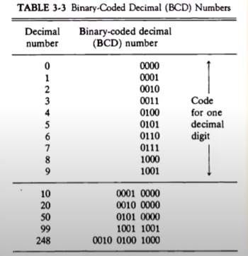

[컴퓨터시스템구조 CSA 제3장 Part-1](https://youtu.be/zhqTXXhHAQg?list=PLc8fQ-m7b1hD4jqccMlfQpWgDVdalXFbH)

## [제 3장 Part-1](https://youtu.be/zhqTXXhHAQg?list=PLc8fQ-m7b1hD4jqccMlfQpWgDVdalXFbH)

### 데이터의 종류 (Data Types) 

> 컴퓨터 개발의 원래 목적은 숫자 계산이었다. 따라서 숫자형 데이터가 가장 중요하다

#### 컴퓨터 레지스터에서 쓰이는 데이터의 종류

- 산술 연산용 숫자(Numeric)

- 데이터 처리용 영문자(Alpha) 

  - ASCII Code : 7bits (+1 parity bit)

    

  - EBCDIC Code  : 16bits, IBM internal code, Extended BCD 

  - UniCode : 16bits/32bits, 7bit의 아스키 코드를 확장시킨 개념

    

- 특수 목적용 기호(Special)

#### 진수와 진법

- radix : 진법의 기수에 해당 (10, 2, 8, 16 ...)

- 10진수

- 2진수

- 8진수 

- 16진수

- 2진화 8진수 (Octal)

  

- 2진화 16진수 (Hexadecimal)

  

- 2진화 10진수 (BCD)

  

#### Special Communication Data

- Morse Code
- Flag Signal (Red/White flags)

## [제 3장 Part-2](https://youtu.be/LsJ7KvKW8kY?list=PLc8fQ-m7b1hD4jqccMlfQpWgDVdalXFbH)

### 보수 (Complements)

- 정의 : 진법의 기수 r에 대응하는 역(reverse)값

  - (r-1)의 보수 체계
    - 9의 보수 : 99999 - 12389 = 87610
    - 1의 보수 : 1111111 - 0001111 = 1110000
  - r의 보수 체계
    - 10의 보수 : 100000 - 12389 = 87611
    - 2의 보수 : 1000000 - 0001111 = 1110001

- 뺄셈과 논리 계산에 사용 

- 컴퓨터는 모든 연산을 덧셈으로 바꿔서 한다, 이 때 보수 연산을 통해 원하는 값으로 바꾼다

  

### 고정 소수점 표현 (Fixed Point Representation)

- 고정소수점 : 소수점이 없는 수 = 정수

- 소수점의 위치를 결정하여 숫자를 표현하는 방식 

- 레지스터 비트에 소수점 위치를 표시

  

- 최우측(LSB)에 소수점 자리 위치

##### 정수의 표현 (-14)

- MSB로 부호 표현
- 양수는 MSB 0, 음수는 MSB 1
- 부호 절대값 표현(`signed magnitude`) 1 0001110
- 부호화된 1의 보수(`signed 1'`s complement`) 1 1110001
- 부호화된 2의 보수 (`signed 2'`s complement`) 1 1110010 : 대부분의 컴퓨터에서 사용

##### 산술 가산

​	

##### 산술 감산

##### overflow

- N 자리의 두 수를 더하여 N + 1 자리의 합이 발생하였을 때 발생
- 정해진 레지스터의 비트 수로 인한 문제 
  - 실제 상황에서는 발생하지 않으나 정해진 비트 수 내에서만 연산이 가능한 컴퓨터에서 발생
- 처리 방법 : 오버플로우 발생을 미리 확인하여 연산을 처리하지 않고 인터럽트 또는 에러 처리
  - 오버플로우 발생 확인 법 : MSB의 두 캐리 비트의 값이 서로 다르면 오버플로우

### 부동 소수점 표현 (Floating Point Representation)

- 실수

## [제 3장 Part-3](https://youtu.be/2mcFeoA3Vuk?list=PLc8fQ-m7b1hD4jqccMlfQpWgDVdalXFbH)

### 기타 이진 코드 (Other Binary Codes)

- 

### 에러 검출 코드 (Error Detection Codes)

-