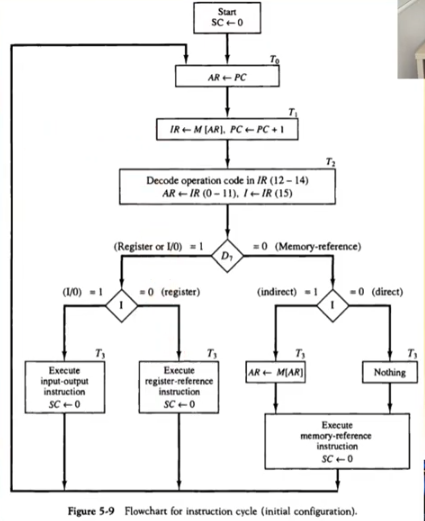

영상: [컴퓨터시스템구조 CSA-5 Part-1](https://youtu.be/uzgqj73wWGQ?list=PLc8fQ-m7b1hD4jqccMlfQpWgDVdalXFbH)

## [제 5장 Part-1](https://youtu.be/uzgqj73wWGQ?list=PLc8fQ-m7b1hD4jqccMlfQpWgDVdalXFbH)

### 기본 컴퓨터 (Basic Computer)

> 컴퓨터 구조에서 CPU는 컴퓨터와 같은 말이다. 
>
> CPU외의 다른 것들은 주변장치라고 한다. 컴퓨터는 CPU와 주변장치로 나뉜다. 

- DEC. Corp의 중형컴퓨터 PDP-11(70년대 이전까지 사용)을 지칭하던 것

  - 이후 VAX-11 등의 주요 minicomputer의 기본(1970-1980)

- 컴퓨터 구조 설계의 가장 기본적인 부분

- 현대의 CPU들에게도 동일하게 적용되는 설계 구조

  - bit수만 늘어났을 뿐 똑같은 구조이다.

    

### 명령어 코드 (Instruction Codes)

> 컴퓨터는 튜링머신(명령어를 저장하고 하나하나씩 꺼내서 실행하는 머신)이다.

- 컴퓨터의 동작
  - 레지스터 내에 저장된 데이터에 대한 마이크로 연산의 시퀀스에 의하여 정의
  - 범용 컴퓨터 시스템에서는 다양한 마이크로 연산 시퀀스를 정의
- 명령어 코드
  - 컴퓨터에게 어떤 특별한 동작을 수행할 것을 알리는 비트들의 집합
  - 연산 코드들로 구성

- 컴퓨터 명령어 (기계어 프로그래밍)

  - 컴퓨터에 대한 일련의 마이크로 연산을 기술
  - 이진 코드로 구성
  - 데이터와 함께 메모리에 저장
  - 메인 메모리에 보통 저장됨

- 프로그램 (여기서는 기계어를 말함. 앞으로도 기계어 프로그램)

  - 사용자가 원하는 연산과 피연산자가 처리되는 순서를 기술한 컴퓨터 명령어의 집합
  - 명령어 처리 과정을 제어

- 내장 프로그램

  - 제어 신호에 의하여 명령어의 이진 코드를 해석하여 실행
  - 명령어를 저장하여 실행하는 컴퓨터 구동 방식
  - **실제로 메인 메모리나 레지스터에 들어가 있는 명령어들의 집합이다.** (이와 반대되는 개념은 없다.)

  - 저장(내장) 프로그램 구조

    - 명령어의 집합으로 구성

    - 각 명령어는 명령어 포맷(Instruction format)에 따라서 정의

    - 프로그램 실행부분에 따라서 메모리의 다른 부분(Segment)에 저장됨

    - 명령어 실행 결과는 AC에 저장

      

      - 16비트의 명령어가 어떻게 구성되어있는지 보여줌

      - Opcode(명령어 코드)

      - Address(명령어 코드가 사용하는 주소 자료)

        - 실제로 가서 주소가 있으면 **직접 주소**
        - 실제로 갔을 때 없고 또 주소가 있으면 **간접 주소**
        - 맨 앞의 I code로 구분함

      - Main Memory

        - 메인 메모리에 전부 섞여서 들어가는 것이 아니고 나뉘어서 들어간다.

        - Code Segment : Instruction(Program) - 명령어 코드(프로그램)가 들어간다

        - Data Segment : Binary Operand - 데이터가 들어간다.

        - Stack Segment : 임시적으로 사용되는 메모리를 담는다.

        - Processor Register(Accumuloator or AC) : 프로그램의 결과물을 담는다.

          

          ※ 왜 4kb를 썼었을까 ?

          - 일단 70년대에는 충분했다...
          - Address의 값이 총 12비트여서 최대 2^12개의 주소를 가질 수 있어서 이게 4kb이다.
          - Address의 값이 크면 더 큰 Memory를 사용할 수 있다.
          - 32bit는 2^32인 4gb / 62bit는 2^64인....??

          

        - 간접 주소(Indirect Address) 시스템

          - 앞의 I 코드가 0

          - 많은 경우, 직접주소를 사용하여 데이터 지정

          - 필요한 경우, 간접주소로 데이터 지정 (하지만 굉장히 다양한 경우에서 사용된다.)

          - 아래의의 457인 16진수이다. 즉 457, 300은 12비트이다. 

            

            ※ 공학자 외엔 믿을 수 없다..

          
          
    

## [제 5장 Part-2](https://youtu.be/m5Yw8TdBnmQ?list=PLc8fQ-m7b1hD4jqccMlfQpWgDVdalXFbH)

### 컴퓨터 레지스터 (Computer Registers)

- 기본 컴퓨터의 레지스터

  - 기본 컴퓨터란 ?

    - DEC PDP-11 Mini Computer
    - 가상의 컴퓨터가 아닌 실제 제품
    - 1980년대 주력 메인프레임급
    - 최신의 CPU도 기본적으로 동일한 구조임

  - 기본 컴퓨터 레지스터 종류

    .png)

    .png)

    - OUTR, INPR
    -  7-80년대에 사용된 대부분의 주변장치가 8비트 통신이 기본이였기 때문에 이 또한 기본적으로 8비트였다.
      - 현재에도 마찬가지로 8비트 Register를 사용하고 있다.
    
    - IR, TR, DR, AC는 16비트로 되어 있는데 현재의 컴퓨터 구조도 16비트로 되어 있다. 64비트의 컴퓨터의 경우에도 16비트가 4개가 있는 경우이다. 따라서 명령어들도 이 16비트 구조로 이루어져 있어야하며 다른 16비트 구조의 명령어도 호환이 된다.

  - 버스

    - 레지스터와 레지스터 사이의 명령어가 통하도록 해주는 것
    - 종류
      - 내부 버스 - CPU 내부 레지스터간 연결
      - 외부 버스 - CPU 내부 레지스터 - 메모리 간 연결
      - 입출력 버스 - CPU와 주변장치(I/O)와 연결
  
    - 공통 버스 시스템

      - 내부 버스를 통칭

      - 내부 버스의 크기(Width)로 CPU 워드 크기 결정 

        (한 번에 내부 레지스터에서 또 다른 내부 레지스터로 몇 개의 bit를 전송할 수 있느냐 Intel은 기본적으로 32bit)

        - 16bit 컴퓨터 - 내부 버스/레지스터 크기가 16bit
        - 32bit 컴퓨터 - 내부 버스/레지스터 크기가 32bit
  
      -  전송 연결 통로

        - 레지스터 - 레지스터 데이터 전송 통로
        - 레지스터 - 메모리 데이터 전송 통로 (예외적 표현)
        - 한 순간에는 하나의 전송 신호만이 버스에 존재 가능
          - 2개 이상의 신호 발생시에는 버스 충돌 발생
          - 버스 제어기 필요 (장확한 타이밍에 MUX 제어 수행)
  
      - 구조

        - 레지스터 출력은 버스의 MUX 입력에 연결(한 번에 반드시 하나)
        - 각 레지스터에 MUX 입력번호가 설정됨
        - 레지스터 입력은 버스에 직접 연결(LD로 제어)
        - S2, S1, S0에 의하여 레지스터 출력 결정 (2의 경우 010, 즉 비트로)
  
      - 동작 (광속의 2/3의 속도라 기다려도 상관 없다.)

        - 모든 레지스터는 양방향 시프트 레지스터여서 병렬 연결이 가능하다.
        - DR <- AC, AC <- DR
        - M[AR] <- DR
        - AR <- PC
        - **바로 붙어있는 것이 아니라 MUX에 각각 붙어 있어서 연결을 제어한다고 보면 됨**
  
        

### 컴퓨터 명령어 (Computer Instructions)

- 종류

  - MRI 명령 (7가지)
  - RRI명령 (12가지)
  - IO명령 (6가지)

- 포맷

  - 7과 16(F)는RRI 명령어와 IO 명령을 나타내는 것이다.
  - RRI와 IO는 Address가 없기 때문에 따로 명확하게 구분할 필요가 있다.
  - RRI의 경우 Register Operation인 12비트에 1이 반드시 하나여야 한다.

  

​                                                        

​                                              ※ 공통 버스를 이해하면 CPU 내부 구조의 절반을 이해한 것과 다름이 없다고 한다. ㅎㅎ

## [제 5장 Part-3](https://youtu.be/d5GtCwS6KsM?list=PLc8fQ-m7b1hD4jqccMlfQpWgDVdalXFbH)

### 타이밍과 제어 (Timing and Control)

- D3T4의 예 (Decoder 3번,  Timing4 / 현재 CPU의 3대 구성요소 중 제어에 대한 이야기임)

- 3x8 Decoder 로 출력

- 4-bit SC (2^4로 순차적으로 타이밍 신호를 만들어 4x16 Decoder로 보냄)

- 두 개가 AND 게이트(그림에서는 나와 있지만 원래는 Control logic gates에 포함)를 통과하게 되면 SC로 넘어가 Clear 명령어를 실행하게 된다.

- .png)

  

  

## [제 5장 Part-4](https://youtu.be/0gRA-lHCuWM?list=PLc8fQ-m7b1hD4jqccMlfQpWgDVdalXFbH)

### 명령어 사이클 (Instruction Cycle)

- 명령어 사이클 단계

  1. 메모리에서 명령어 가져오기 (Fetch) - 메모리에서 버스를 거쳐 IR로 명령어를 받는 것

  2. 명령어 디코딩 - 명령어가 무엇인지 파악 (명령어 포맷을 사용)

  3. 유효주소(Effective Address) 계산 - 직접 주소인지 간접 주소인지 | 간접 주소이면 진짜 주소는 어디인지 계산

  4. 명령어 실행

- Fetch와 Decode(Fetch Cycle)

  - T0 : AR(주소를 사용해서 메모리에 있는 명령어를 가져올 수 있음) <- PC(Program Counter - 가져와야 할 명령어의 주소(Code Segment에 저장된)를 갖고 있음)
    (MUX 2 open, LD AR - AR의 LD 값을 1로 바꾼다)

  - T1 : IR <- M[AR], PC <- PC + 1 
    (AR에서 바로 Address가 나와서 Memory unit이 열려서 명령어가 나옴 MUX 7 open)
    (보통 바로 다음 메모리에 다음 명령어가 있기 때문에 PC + 1을 해줌)

  - T2 : D0 ~ D7 <- Decode IR(12-14), AR <- IR(0-11 주소비트, 데이터를 가져오기 위함), I <- IR(15)
    (MUX 5 open, LD AR)

    (그림에는 T2가 없음)
    (버스는 16비트지만 AR, IR은 12개의 선만 연결되어 있음, 회로에는 표시 안되어 있지만)

    (I 코드 플립플롭(직접 주소인지 간접 주소인지)도 표시 안되어 있음)

    

    ​																		# 앞에서 여러분들이 다뤘던 내용은 빙산의 일각일 뿐이였다는 것...(찡긋)

- 명령어의 종류 결정

  - MRI 명령어 여부

  - RRI 명령어 여부

  - IO 명령 결정

  - 명령 구성도 

    1. D7이 1이라면 IO 명령어 혹은 RRI 명령어 (맨 앞에 코드 번호로 정함)

       그 후 SC를 0으로 바꿔서 다시 Fetch로 돌아감

    2. D7이 0이라면 MRI 명령임

       그 후 I 코드를 확인해서 직접 주소인지 간접주소인지 확인해서 가져오고

       명령어 실행하고 SC를 0으로 바꾸어서 다시 Fetch로 돌아감

  

- 레지스터 참조 명령어의 종류와 동작

  - 명령어 코드 다음의 Register operation의 비트 개수에 따라 바뀌는 것
  - r은 AND 조건임 (D7 and NOT I and T3) 일 때 11번 비트가 1이라면 rB11 즉 CLA

  

  

### 메모리 참조 명령어 (Memory-Reference Instuctions)

- MRI는 무조건 T4에서 시작되고 명령어마다 다른 T에서 종료된다. 즉 명령어 마다 수행 시간이 다르다.
- 종류와 동작
  - AND
    - D0T4: DR <- M[AR]
    - D0T5: AC <- AC ^ DR, SC <- 0
  - ADD
    - D1T4: DR <- M[AR]
    - D1T5: AC <- AC + DR, E <- Cout, SC <- 0
  - LDA
    - D2T4: DR <- M[AR]
    - D2T5: AC <- DR, SC <- 0
  - STA
    - D3T4: M[AR] <- AC, SC <- 0
  - BUN
    - D4T4: PC <- AR, SC <- 0
  - 공통 버스에 AC가 연결이 안되어 있는 이유는 설계자가 그렇게 했으며 이유는 나중에 설명
    - 현재 동작도 이 BUS의 구조 때문에 이렇게 된 것이라고 보면 됨
  - BSA
    - 함수, 서브루틴의 구현에 사용
    - 간접 주소 사용의 전형적인 예
    - D5T4: M[AR] <- PC, AR <- AR + 1
    - D5T5: PC <- AR, SC <- 0
    - 규칙 : PC값을 통해 AR에 점프 값을 넣어줬을 때 이 점프 값의 메모리는 비워둬야함 (PC값을 저장하기 위해서)
    - 규칙2: Subroutine의 마지막 명령은 무조건 `1 BUN 135(무조건 분기해라 135번으로 -> 후에 21번으로 다시 이동 명령 수행)`  
    
      
  - ISZ
    - Loop 제어문 구현에 사용
    - D6T4: DR <- M[AR]
    - D6T5: DR <- DR + 1
    - D6T6: M[AR] <- DR, if (DR=0) then (PC <- PC + 1),  SC <- 0
      - (단 DR이 0이면 스킵)
  
- 정리된 도식은 아래와 같다.

​																													# 불안감은 맞다....