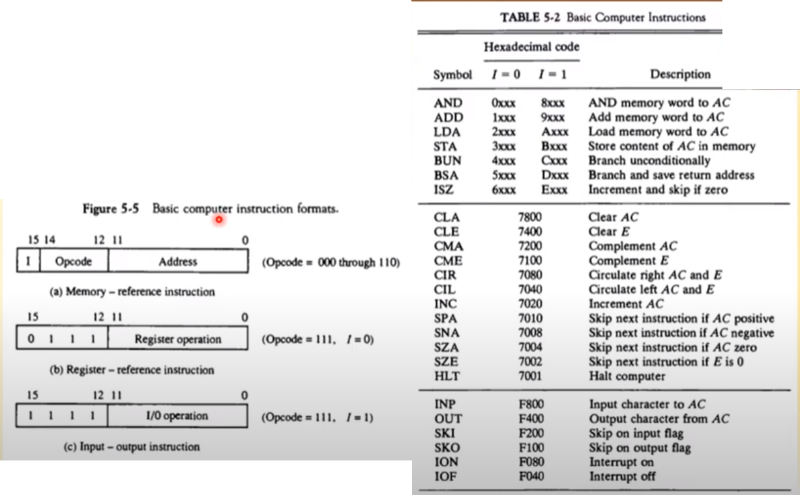

영상: [컴퓨터시스템구조 CSA-5 Part-1](https://youtu.be/uzgqj73wWGQ?list=PLc8fQ-m7b1hD4jqccMlfQpWgDVdalXFbH)

***📣 5장부터가 진짜 컴퓨터 구조다...! 여기서 말하는 컴퓨터는 CPU다. 컴공에서 제일 어려운 게 컴퓨터 구조, 운영체제, 프로그래밍 언어론 이라고 함 ^^***

[TOC]

## [제 5장 Part-1](https://youtu.be/uzgqj73wWGQ?list=PLc8fQ-m7b1hD4jqccMlfQpWgDVdalXFbH)

### 1. 기본 컴퓨터 (Basic Computer)

- DEC. Corp사의 중형 컴퓨터 PDP-11을 지칭
  - 이후 VAX-11등의 주요 minicomputer의 기본(70~80년대)
- 컴퓨터 구조 설계의 가장 기본적인 부분
- 현대의 CPU들에도 동일하게 적용되는 설계 구조, 비트가 늘어났을 뿐 CPU 구조는 동일함

### 2. 명령어 코드 (Instruction Codes)

#### 2.1. 용어 정리

- `컴퓨터 동작`
  - 레지스터(저장 장치) 내에 저장된 데이터에 대한 마이크로 연산의 시퀀스에 의하여 정의
  - 범용 컴퓨터 시스템에서는 다양한 마이크로 연산 시퀀스를 정의
- `명령어 코드`
  - 컴퓨터에게 어떤 특별한 동작을 수행할 것을 알리는 비트들의 집합
  - 연산 코드들로 구성(더하기 해라, 빼기해라를 0101로 구성한 것)
- `컴퓨터 명령어`
  - 컴퓨터에 대한 일련의 마이크로 연산을 기술
  - 이진 코드로 구성
  - 데이터와 함께 메모리에 저장
- `프로그램`
  - 사용자가 원하는 연산과 피연산자가 처리되는 순서를 기술한 컴퓨터 명령어의 집합
  - 개념적이며 추상적, 어디에 있든 컴퓨터 명령어의 집합을 통칭
  - 기계어로 작성됨(자바나 C 아님)
- `내장 프로그램`
  - 제어 신호에 의하여 명렁어의 이진 코드를 해석하여 실행
  - 명령어를 저장하여 실행하는 컴퓨터 구동 방식
  - 메인 메모리나 내장 메모리에 들어가 있는 프로그램

#### 2.2 저장(내장) 프로그램 구조

- 명령어 집합으로 구성
- 각 명령어는 `명령어 포맷`(Instruction format)에 따라서 정의
  - 이 포멧은 컴퓨터 CPU를 설계한 사람이 만드는 것
  - CPU 설계, 운영체제 설계, 프로그래밍 설계를 한명이 한다고 함
- 프로그램 실행부분에 따라서 메모리의 다른 부분(segment)에 저장
- 명령어 실행 결과는 AC에 저장

> 그림1 : 16비트로 구성됨. Opcode는 연산을 뭘할지, Address는 피연산자가 될 데이터의 주소가 들어있음. 이때, address 따라 갔을때 데이터가 바로 있으면 직접 주소, 아니면 `간접주소`(주소 따라 갔더니, 또 주소 있는거) -> 직접인지, 간접인지는 맨앞 I에 정의 됨
>
> 그림2 : 명령어가 들어가는 부분(Code Seg) , 데이터가 들어가는 부분(Data Seg), 임시 부분(Stack Seg) 이 나뉘어 있고, 이것들이 메인 메모리에 할당 됨. 하나의 세그먼트에 운영체제에서 공부한 페이지 or 블록 들이 들어가 있는 것. 아래에 AC에 연산 결과가 들어감. 4096*16 = 16비트가 4096(4K)개 있다.

**✅ 그림 2의 메모리에 대한 추가 설명**

- 4096*16 = 16비트가 4096(4K)
- address는 12 비트이고, 즉 2^12 = 4096이라 기본 컴퓨터의 메모리 크기가 저렇게 되었던 것!
- address의 비트수가 크면 메모리수가 더 커질 수 있음. 현대의 기본적인 인텔 CPU 가 4기가 램 기본인데 이게 32비트

#### 2.3 간접 주소 시스템

- I비트가 0이면 직접, 1이면 간접

- 대부분의 경우, 직접 주소를 사용하여 데이터 지정
- 필요한 경우, 간접 주소로 데이터 지정
- 간접 주소가 꼭 필요한 경우가 있음. 다양한 프로그래밍 언어들의 활용성을 높이기 위해서 간접 주소를 쓰고 있다.

> 그림 1이 16비트의 포맷이므로 그림 2의 **457** 이라는 숫자는 16진수이다. 4비트씩 끊어서 4/5/7 12비트로 구성. 
>
> (b) Opcode는 ADD, I가 0이면 직접 주소, 457번지로 가면 바로 데이터가 있고 그걸 더하면 됨
>
> (c) I가 1이므로 간접주소, 300번지에 가면 데이터가 아니라 또 다른 주소가 있고, 그 주소로 가야 Operand가 있음

## [제 5장 Part-2](https://youtu.be/m5Yw8TdBnmQ?list=PLc8fQ-m7b1hD4jqccMlfQpWgDVdalXFbH)

### 1. 컴퓨터 레지스터 (Computer Registers)

#### 1.1 기본 컴퓨터의 레지스터

- 기본 컴퓨터란?
  - DEC PDP-11 Mini Computer
  - 가상의 컴퓨터가 아닌 실제 제품
  - 80년대 주력 메인 프레임급
  - 최신의 CPU도 기보적으로 동일한 구조
- 기본 컴퓨터의 레지스터 종류
  - PC, AR 은 주소를 저장하는 레지스터라서 12비트
  - IR, TR, DR, AC : 16비트
  - CPU가 다른 주변장치로 데이터를 줄때 OUTR, 받을 때 INPR 사용. 8비트 사용

#### 1.2. 버스 시스템의 종류

- 내부 버스
  - CPU 내부 레지스터간 연결
- 외부 버스
  - CPU 내부 레지스터 - 메모리간 연결
- 입출력 버스
  - CPU <-> 주변장치(I/O) 연결

 

> 메인 보드에 깔린 검은선들이 버스

#### 1.3. 공통 버스 시스템

- 내부 버스를 통칭
- 내부 버스의 크기(Width; 한꺼번에 몇 비트의 데이터를 전송할 수 있는지)로 CPU 워드 크기 결정
  - 16bit 컴퓨터 - 내부 버스 / 레지스터 크기가 16bit 
  - 32bit 컴퓨터 - 내부 버스 / 레지스터 크기가 32bit 
- 전송 연결 통로
  - 레지스터 - 레지스터 데이터 전송 통로
  - 레지스터 - 메모리 데이터 전송 통로(예외적 표현)
  - 한 순간에는 하나의 전송 신호만이 버스에 존재 가능
    - 2개 이상의 신호 발생시에는 버스 충돌(Collision) 발생
    - 버스 제어기(정확한 타이밍과 MUX 제어 수행)
- `공통 버스 시스템`
  - 레지스터 출력은 버스의 MUX입력에 연결
  - 각 레지스터에 MUX 입력 번호 설정됨
  - 레지스터 입력은 버스에 직접 연결(LD로 제어)
  - S2, S1, S0에 의하여 레지스터 출력 결정(멀티플렉서)
  - 버스에 들어온 데이터는 모든 레지스터에게 신호가 들어감. 이중 로드(LD) 입력이 1인 레지스터 데이터를 받음
- 버스의 동작
  - DR <- AC, AC <- DR
  - M[AR] <- DR
  - AR <- PC

> 어떤 레지스터에서 데이터를 버스로 보낸 후, 다른 레지스터가 받을 때까지는 나머지 레지스터들이 버스에 데이터를 보내면 안되고 기다려야 함. 근데 버스안에서의 데이터 이동은 전기 신호라서 속도가 빛의 속도 * 2/3 라서 엄청 빠르니까 대기 시간 엄청 찰나임

### 2. 컴퓨터 명령어 (Computer Instructions)

- MRI 명령 : 메모리 레퍼런스 명령, 7가지 , 주소 비트를 참조해서 메인 메모리에 접근하는 명령
- RRI 명령 : 레지스터 레퍼런스 명령, 12가지, 레지스터 참조 명령, 레지스터 간의 명령 or 레지스터를 다루는 명령
- IO 명령 : 입출력 장치 명령, 6가지
- 명령어 포맷 

## [제 5장 Part-3](https://youtu.be/d5GtCwS6KsM?list=PLc8fQ-m7b1hD4jqccMlfQpWgDVdalXFbH)

### 1. 타이밍과 제어 (Timing and Control)

- 명령어 실행 타이밍 예
  - D3T4 : SC <- 0
  - 왼쪽 그림을 타이밍 다이어그램이라고 한다.

> D3 : 3*8 디코더를 사용해서 8비트 중에 한개만 1 나머지는 0인데, 여기서는 3번째 비트만 1
>
> T4 : 4비트 카운터로 0000~1111의 타이밍을 가질 수 있고, 이중에서 T4니까 4비트만 1, 나머지는 0
>
> 위 두개가 1일때 and 게이트로 들어와서 clear가 1이 되어 시간이 초기화 됨 0000으로

### 2. 명령어 사이클

- 명령어 사이클 단계
  1. `메모리에서 명령 가져오기(Fetch)` : 메모리(code seg)에 있는 명령어를 버스를 통해 IR로 가져오기
  2. `명령어 디코딩` : 명령어의 3비트의 Opcode가 무엇인지 판단하여 디코더의 한 비트를 1로 하는 것(명령어 포맷 참조)
  3. `유효 주소(Effective Address) 계산` : 주소 필드를 조회하여(직접주, 간접주소) 실제 Operand의 주소에 접근
  4. 명령어 실행

> T0 : PC를 참조해서 지금 가져와야되는 명령어 주소를 가져와서 AR 레지스터에 넣음 (S 010, LD AR)

- 제어장치
  - 위 그림이 제어장치
  - 기억장치, 레지스터, 게이트, 제어선들이 모여있는 장치
  - CPU 설계에 있어서 가장 중요한 부분
  - CPU 설계의 80% 비중을 차지함

## [제 5장 Part-4](https://youtu.be/0gRA-lHCuWM?list=PLc8fQ-m7b1hD4jqccMlfQpWgDVdalXFbH)

### 1. 명령어 사이클 (Instruction Cycle)

위에서 패치와 디코딩 이후에 유효주소를 찾고, 명령어 실행하는 부분에 대한 설명

#### 1.1 명령어의 종류 결정

12~14비트의 Opcode로 결정됨

- MRI 명령어 여부
- RRI 명령어 여부
- IO 명령 결정

> T0~T1까지 패치
>
> D7에서 분기되서 어떤 명령어인지에 따라 나뉘어짐
>
> MRI명령만 T4에서 실행됨

- 레지스터 참조 명령어의 종류와 동작

> 12비트 0~12가 이진으로 된 것으로 명령어의 종류 확인 가능(위 표 참조)

### 2. 메모리 참조 명령어 (Memory-Reference Instuctions)

#### 2.1. 메모리 참조 명령어의 종류와 동작

> MRI 명령어는 T4에서 실제 실행

> BSA는 프로그래밍 언어등에서 함수에 들어가면 들어가기 전에 있던 위치를 저장해 두는 용도(되돌아가야 되기 때문)
>
> - 20번지에서 명령어가 135로 점프해야 하는경우, 갔다와서 실행되어야 하는 라인인 21을 PC에 저장해둠, 이때 점프해서 이동한 주소는 비워두고 여기에 돌아갈 번지를 저장해두고, 그 아래(136) 부터 실제 서브 루틴이 있음. 이때 서브루틴이 끝나는 곳에는 무조건 서브루틴의 시작 지점으로 돌아가게 되고, 이때 간접주소를 사용하여 21로 이동
>
> - 요약 : 20 -> 135 -> 135에 21 저장 -> 136 -> 쭉쭉쭉 실행 -> 끝나는 곳에서 135 간접주소 만남 -> 135로 이동 -> 실제 주소인 21로 이동
>
> 반복문 실행하다가 DR이 0이면 종료하게 끔 함
>
> - 프로그래밍 언어로 0 -> 10 으로 하지만 기계어로 했을 때는 -10부터 시작해서 0일때 종료되게끔 함

#### 2.2. 제어 흐름

- T0 : PC가 가르키는 곳을 AR이 읽음
- T1 :  AR에 저장된 위치로 메모리를 참조해서 명령어를 가져옴
- T2 : 디코더로 명령어를 해석
- T3 : RRI 나 IO 명령 해석 & 실행
- T4 : MRI 명령 해석 & 실행

