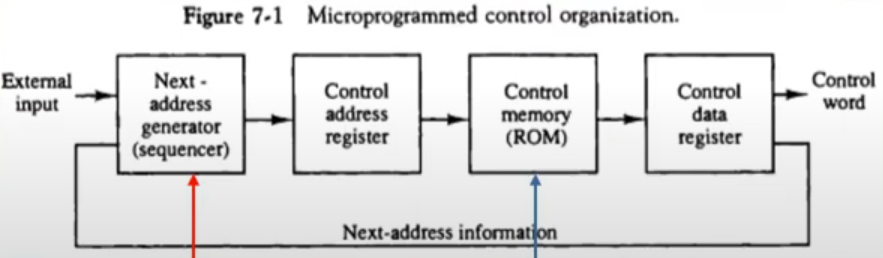
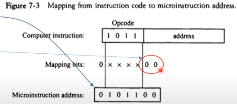
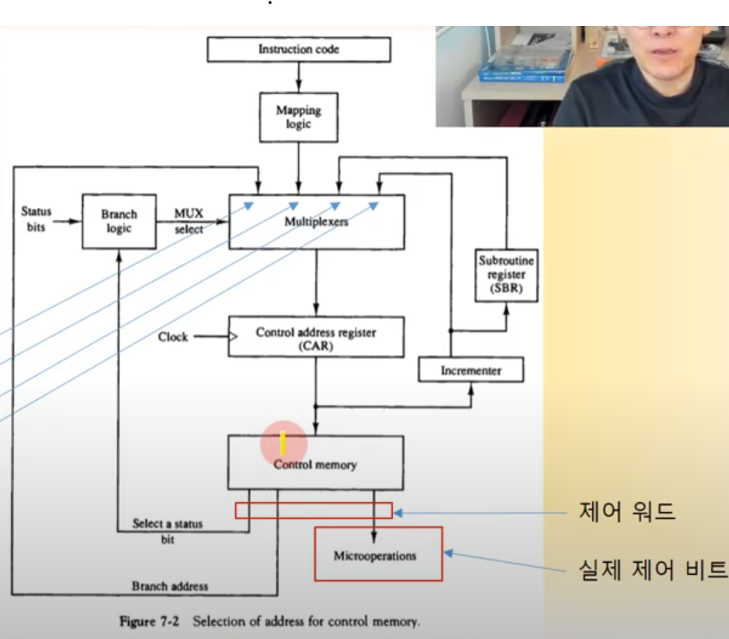
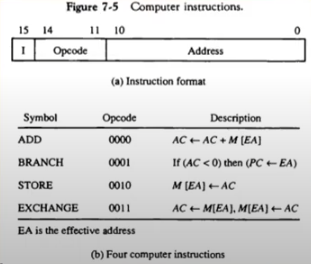
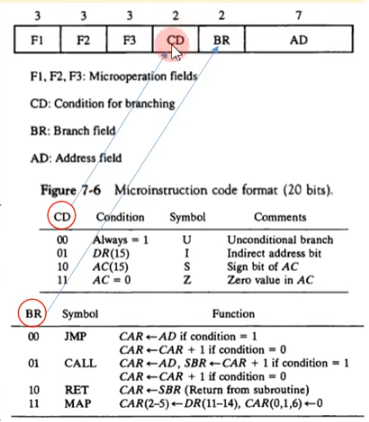
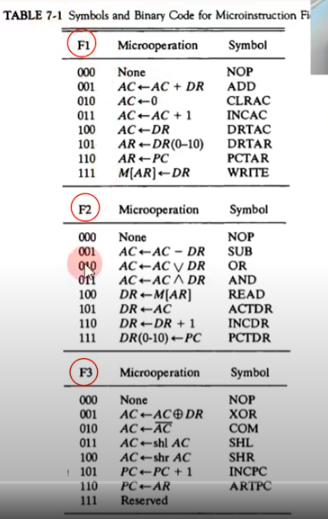
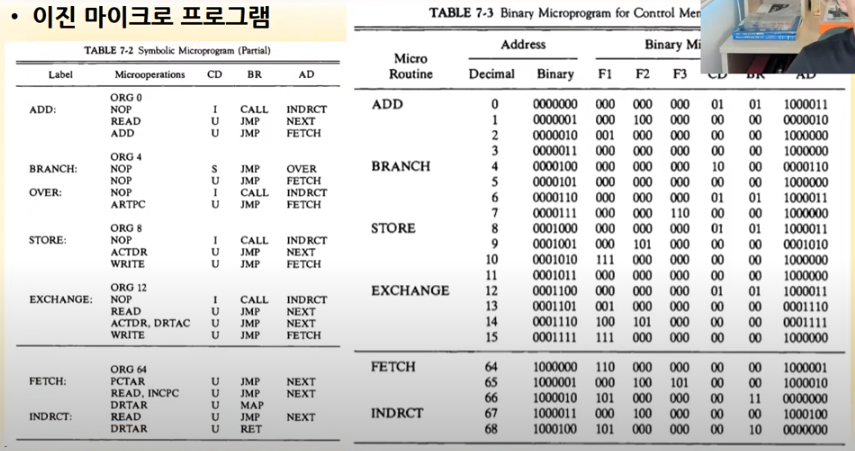
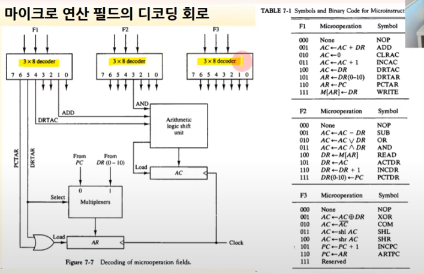
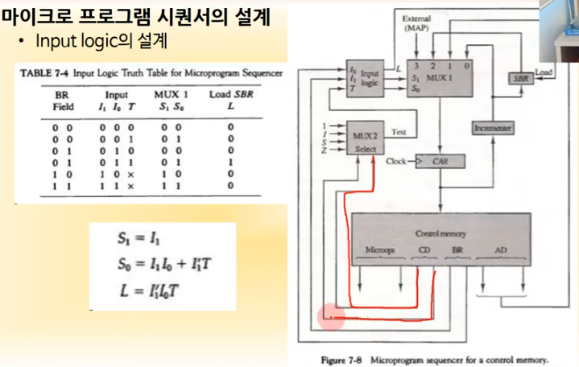

영상: [컴퓨터시스템구조 CSA-7 Part-1](https://youtu.be/KZfSlUhaj4A?list=PLc8fQ-m7b1hD4jqccMlfQpWgDVdalXFbH)

## [제 7장 Part-1](https://youtu.be/KZfSlUhaj4A?list=PLc8fQ-m7b1hD4jqccMlfQpWgDVdalXFbH)

### 제어 메모리 (Control Memory)

- 용어 정리

1. 하드와이어 제어 장치

   - 하드웨어 적으로 제어 장치를 설계
   - 일상적인 논리 회로를 사용하여 구현

2. 제어 워드(TC 혹은 Decoder 등을 제어하기 위해 사용하는 비트들의 모임)

   - 버스 구조 시스템에서 정보 전달 제어 비트 모임

   - 제어 워드에 의하여 마이크로 연산 수행
   - 컨트롤 메모리에 있음

3. 마이크로 프로그램
   - 명령을 수행하는 일련의 제어 워드의 집합
   - 별도의 기억 장치에 저장된 프로그램 형태

4. 마이크로 프로그램된 제어 장치
   - 마이크로프로그램을 사용하는 제어장치
   - **ROM에 저장하여 사용**
   - 시퀀서와 제어 메모리로 구성
   - sequencer : 다음에 시행해야할 제어 워드의 주소를 찾아내는 것

### 주소 시퀀싱 (Address Sequencing)

> ROM에서 도대체 어떤 주소로 이동해야 명령어를 시행할 수 있는가를 정해주는 단계

1. 초기 주소

   - 시스템 부트시 jump하는 주소
   - ROM BIOS 주소
   - 하드웨어적으로 미리 결정된 주소
     - 예) IBM PC : 0xFFFE0 (20bit x T) 
     - CPU의 프로그램 카운터가 이 주소로 먼저 이동한 후 명령어를 실행하기 시작한다.

2. 제어 메모리 주소 시퀀싱 단계

   - 명령어 fetch
   - 유효주소 (Effective Addr) 계산
   - 마이크로연산 수행을 위한 제어 워드 fetch (Control Memory에서 가져옴)
   - 명령어 실행

3. **제어 메모리의 주소 결정하는 방법(MUX에서  어떤 CAR을 가져올 것인지 정하는 방식)**

   - Branch by condition

   - Mapping from Opcode

   - Subroutine call/return

   - Increment

     

     1. 조건부 분기
        - 상태비트(U, I, S, Z)에 따른 분기

     2. 명령어의 매핑

        - OPCODE로부터 제어워드 주소 분기

        - 제어 메모리 크기(비트수)에 맞는 매핑 논리 사용

        - 명령어에 사용되는 제어 워드 수에 따라서 매핑

        - 매핑 비트의 결정

          - 제어메모리 크기: 128 -> 2^7 (7bit) 

          - 명령어가 가지는 제어워드 최대 크기 3인 경우

          - 2^1 < 3 < 2^2 이므로 2비트 간격으로 제어 메모리 배치

          - OPCODE가 4bit임으로 제어메모리 크기인 7bit에 맞추기 위해 0을 세 개 붙여줌(뒤에 2개 앞에 1개)

            

          

     3. 서브루틴
        - 동일한 제어 코드를 서브루틴화
        - Fetch 제어, 간접 주소 계산 등
        - SBR에 복귀 제어 메모리 주소 저장

## [제 7장 Part-2,3](https://youtu.be/54w8BYgB0IQ?list=PLc8fQ-m7b1hD4jqccMlfQpWgDVdalXFbH)

### 마이크로프로그램의 예 (Microprogram Example)

- 마이크로 프로그램 제어를 위한 하드웨어 구성

  - 128 x 20 제어 메모리 사용
    - 128개의 제어 워드 사용
    - 20bit의 제어 워드로 구성
  - Control memory 에 접근하기 위해서는 CAR을 줘야함
  - 

- 명령어

  - 여기서는 명령어가 총 15bit여서 Address가 11bit가 된다. 그렇기 때문에 AR도 11bit, Memory도 2^11(2048)로 되어 있다.
  - 

  

  - 명령어 형식 

    - 위에서 언급한 것처럼 20bit의 제어 워드로 구성되어 있음

    - 각 코드에서 어떤 것을 의미하는지 아래에 테이블로 나타나며 설계자가 정한 것임

    - F1, F2, F3 가 동시에 실행될 수 있기 때문에 되도록이면 동시에 실행할 수 없는 애들이 하나의 필드로 들어가도록 만드는 것이 좋다.

      (물론 설계자의 센스이며 꼭 그래야하는 것은 아니다.)

​		

- - 기호로 표시된 마이크로 명령어

    

    - 위의 명령어 형식표를 참고할 것
    - 왼쪽은 기호 오른쪽은 코드로 표시한 것임

    

    - Fetch, Indirect, ADD, BRANCH, OVER, STORE, EXCHANGE 루틴

    
    
    - 뒤에 0을 2개 붙였던 이유
      - 각 마이크로 프로그램마다 해야하는 마이크로 오퍼레이션의 수가 현재 최대 4개이기 때문에

### 제어 장치의 설계 (Design of Control Unit)

> 제어 워드를 만들었다고 해서 끝난 것이 아니다. 

- 마이크로 연산 필드의 디코딩 회로

  > 위에서 본 마이크로 연산은 Decoder로 만들어진다. 연결되지 않은 애를 연결해볼까 ? 

  

- Microoperation 중 CD와 BR로 왔을 때 Branch Logic은 어떻게 설계할 것인가 ?

  - Fig 7-6 그림의 CD와 BR은 Fig7-2의 그림에서 Branch Logic으로 이동한다고 설명한 바 있다.

  -  
  - I1과 I0는 CD, BR의 값이다.
  - T는 MUX2 에서 나오는 값이다.

  

- 하드 와이어 방식보다 마이크로 프로그램 방식이 더 선호되는 이유 ?

  - 비용적인 문제 

    - 하드 와이어 방식은 명령어 하나하나에 대해서 제어장치를 설계해야함 -

      => 명령어의 숫자가 늘어감에 따라 제어장치가 복잡해짐

      => 불량률이 높아짐 (불량품 폐기비용, 재설계비용 등)

      => 이에 반해 마이크로 프로그램 방식은 비트를 수정해주면 되기 때문에 간편함

