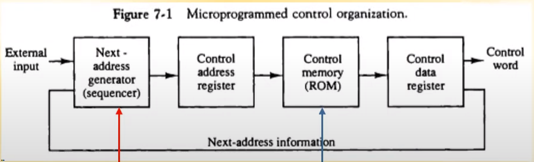
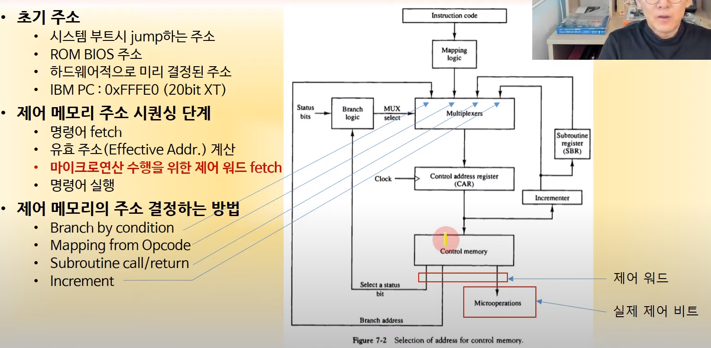
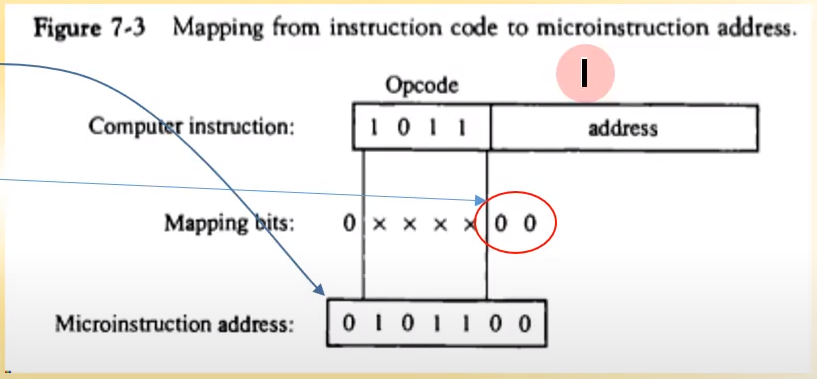
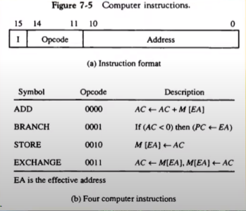
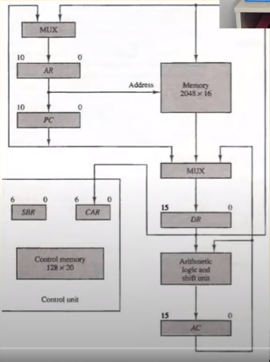
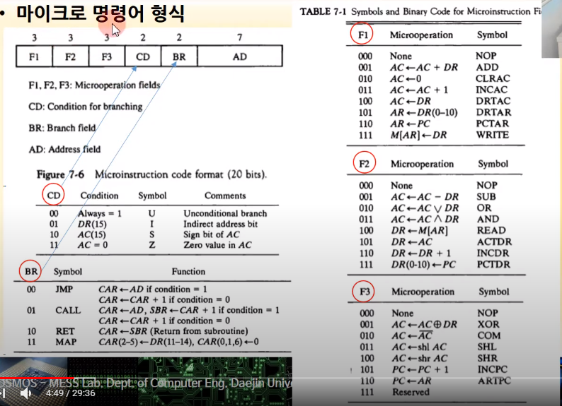
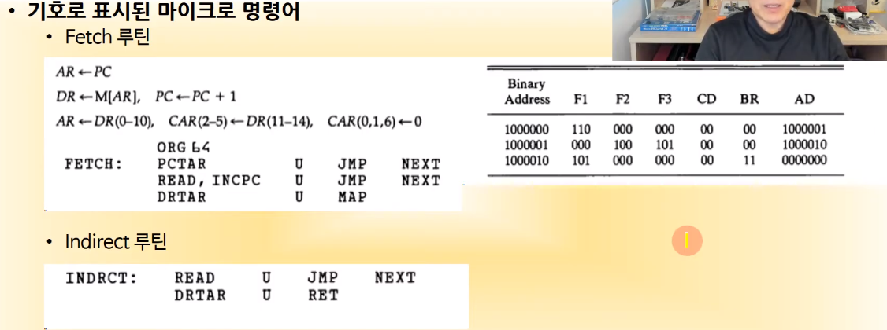
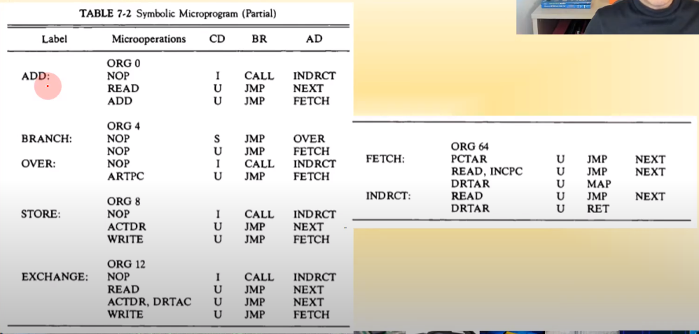
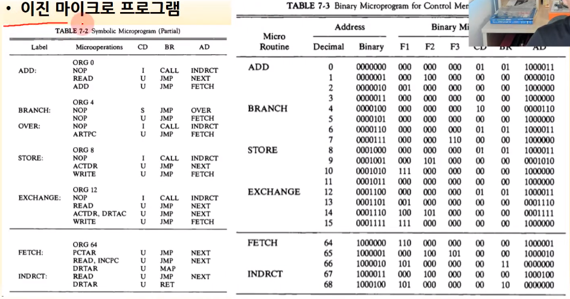
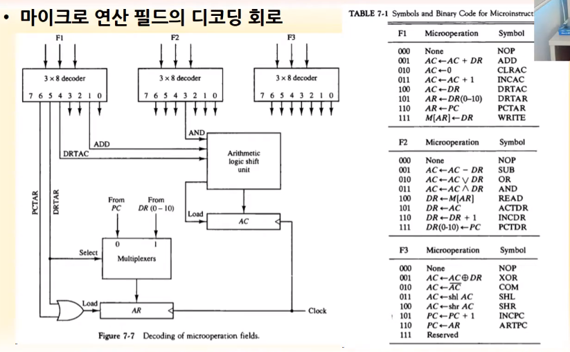

영상: [컴퓨터시스템구조 CSA-7 Part-1](https://youtu.be/KZfSlUhaj4A?list=PLc8fQ-m7b1hD4jqccMlfQpWgDVdalXFbH)

## [제 7장 Part-1](https://youtu.be/KZfSlUhaj4A?list=PLc8fQ-m7b1hD4jqccMlfQpWgDVdalXFbH)

### 제어 메모리 (Control Memory)

- 하드와이어 제어장치
  - 하드웨어적으로 제어 장치를 설계
  - 일상적은 논리 회로를 사용하여 구현
- 제어 워드
  - 버스구조 시스템에서 정보 전달 제어 비트 모임
  - 제어 워드에 의하여 마이크로 연산 수행
- 마이크로 프로그램
  - 명령을 수행하는 일련의 제어 워드의 집합
  - 별도의 기억장치에 저장된 프로그램 형태
- 마이크로프로그램된 제어 장치
  - 마이크로프로그램을 사용하는 제어장치
  - ROM에 저장하여 사용
  - 시퀀서(Sequencer)와 제어 메모리로 구성
  - 

### 주소 시퀀싱 (Address Sequencing)

- 초기 주소
  - 시스템 부트시 jump 하는 주소
  - ROM BIOS 주소 : 하드웨어가 처음 만들어질 때 설계 됨
  - 하드웨어적으로 미리 결정된 주소
  - IBM PC : 0xFFFE0 (20bit XT)
- 제어 메모리 주소 시퀀싱 단계
  - 명령어 fetch ; T0~T2
  - 유효 주소 (Effective Addr) 계산 ; T3
  - `마이크로 연산 수행을 위한 제어 워드 fetch` : T4
  - 명령어 실행 ; T4
- 제어 메모리의 주소 결정하는 방법
  - `Branch by condition` : 어떤 조건에 의해 참거짓에 따라 결정
  - `Mapping from Opcode` : add 명령이 0x00344~~ 번지이면 그 주소로
  - `Subroutine call/return` : 함수등을 실행하게 되었을때 함수 종료 후 돌아가는 것을 위한 것 SBR
  - `Increment` : 그냥 바로 +1 해서 다음 것 가리킴

- 조건부 분기

  - 상태비트(U,I,S,Z)에 따른 분기

- 명령어의 매핑

  - OPCODE로부터 제어워드 주소 분기

  - 제어 메모리 크기(비트수)에 맞는 매핑 논리 사용

  - 명령어에 사용되는 제어 워드수에 따라서 매핑

  - 매핑비트의 결정

    - 제어 메모리 크기 : 128 -> 2^7(7bit)
    - 명령어가 가지는 제어 워드 최대 크기 3인 경우
    - 2^1 < 3 < 2^2 이무로 2비트 간격으로 제어 메모리 배치

  - 

    > 1011 이라는 명령어 앞 뒤에 각각 0을 1,2개씩 삽입하여 마이크로 제어 주소를 정의한다. 각 명령어의 타이밍에 맞게 할당하는데, T0~T2는 patch이고, T3는 간접주소라 빼더라도 T4~7 가 있다. 이때 T4일떄를 0101100, T5일때의 제어비트를 0101101, T7과7은 각각 --10 ,--11 으로 4비트까지 표현 가능하다. 

- 서브루틴

  - 동일한 제어 코드(T0~T2 동작, 혹은 간접주소 찾는 동작)들의 서브루틴화
  - Fetch 제어, 간접주소 계산등
  - SBR에 복귀 제어 메모리 주소 저장

## [제 7장 Part-2,3](https://youtu.be/54w8BYgB0IQ?list=PLc8fQ-m7b1hD4jqccMlfQpWgDVdalXFbH)

### 마이크로프로그램의 예 (Microprogram Example)

- 마이크로 프로그램 제어를 위한 하드웨어 구성
  - 128 x 20 제어 메모리 사용
    - 128개의 제어 워드 사용
    - 20bit의 제어 워드로 구성
- 컴퓨터 명령어 형식
  - 마이크로 프로그래밍을 위한 명령어 형식

- 마이크로 명령어 형식

> 20 비트의 마이크로 명령어에 F1,F2,F3가 다 같이 있기 때문에 각각은 서로 동시에 수행해도 충돌이 없는 것으로 구성한다.

- 기호로 표시된 마이크로 명령어

>Fetch가 T0~T2, Indirect(간접 주소가 있는 경우) T3

> 각 명령어 마다 제어 메모리에서 수행할 명령이 최대 4줄이라서 00 2개 붙여서 4비트 만든게 딱 맞음. 4칸씩 띄워서 저장해두는 이유

- 마이크로 연산 필드의 디코딩 회로

> F1,2,3이 3비트라서 0~7까지 표현하므로 3*8디코더 사용; 디코더는 n비트를 -> 2^n개의 신호 중 한개만 1인거로 바꾸는 것
>
> 

### 제어 장치의 설계 (Design of Control Unit)

- 마이크로 프로그램 시퀀서의 설계

  - Input logic의 설계

  

### 왜 마이크로프로그램된 제어 장치 방법을 쓰는가? (하드와이어가 아니라)

1. 비용 절감
   - 하드와이어는 명령어 하나하나 마다 제어장치를 설계해서 복잡해지며, 실수할 가능성이 높고 비용이 높아짐
   - 마이크로 프로그램은 중간에 잘못 설계한 값이 있어도 그냥 이진 비트를 바꾸면 됨(어셈블리 코드에서 비트하나 바꾸면 됨)