영상: [컴퓨터시스템구조 CSA-9 Part-1](https://youtu.be/Ayf_s57RUSA?list=PLc8fQ-m7b1hD4jqccMlfQpWgDVdalXFbH)

## [제 9장 Part-1](https://youtu.be/Ayf_s57RUSA?list=PLc8fQ-m7b1hD4jqccMlfQpWgDVdalXFbH)

### 병렬처리 (Parallel Processing)

- 다중 기능 장치를 가지는 프로세서
  - 공통 프로세서 레지스터와 다중 연산 유닛
  - 동시에 2개 이상의 연산 처리
  - 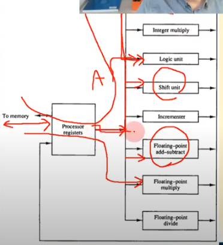
- 병렬처리의 종류(Flynn의 분류)
  - SISD(Single Instruction Single Datastream)
  - SIMD(Single Instruction Multiple Datastream)
    - 여러개의 프로세서 레지스터 (위의 그림 같은 것이 여러개 있는데 같은 동작을 수행함)
  - MISD(Multiple Instruction Single Datastream)
  - MIMD(Multiple Instruction Multiple Datastream)

### 파이프라인 (Pipelining)

- 다단계 데이터 처리 방식 혹은 동시 다중 데이터 처리 방식을 의미함

- 하나의 프로세서를 서로 다른 기능을 가진 세그먼트로 분할

- 각 세그먼트가 동시에 서로 다른 데이터 처리
  - Ai * Bi + Ci, i = 1, 2, 3..
  - R1 <- Ai, R2 <- Bi
  - R3 <- R1 * R2, R4 <- Ci
  - R5 <= R3 + R4
  - R1, R2를 곱하는 중에 R4를 가져올 수 있고 R3+R4를 더하는 중에 다음 A, B, C를 실행할 수 있다.
  - TABLE9-1에서 Clock Pulse Number가 같은 세그먼트들은 모두 동시에 수행되고 있는 것이다.
  - Clock Pulse Number가 3부터 7까지 모든 Segment가 사용되고 있는데 이것을 파이프라인이 꽉 찼다고 표현한다.
  - 본래라면 i가 7개이고 Segment가 3개이면 21 Clock Pulse가  필요한데 파이프라인을 사용하면 9 Clock Pulse로 해결할 수 있다.
  - 이 파이프라인은 현대 CPU의 코어가 파이프라인의 구조를 따르고 있다.
  - 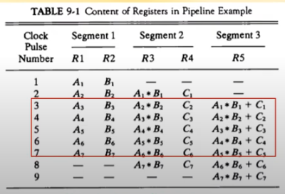
  - 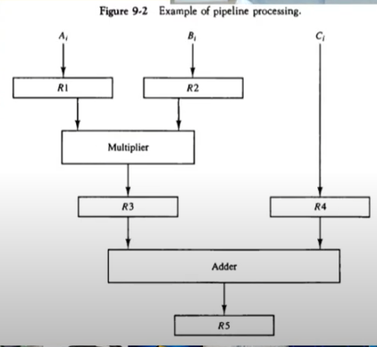
  
  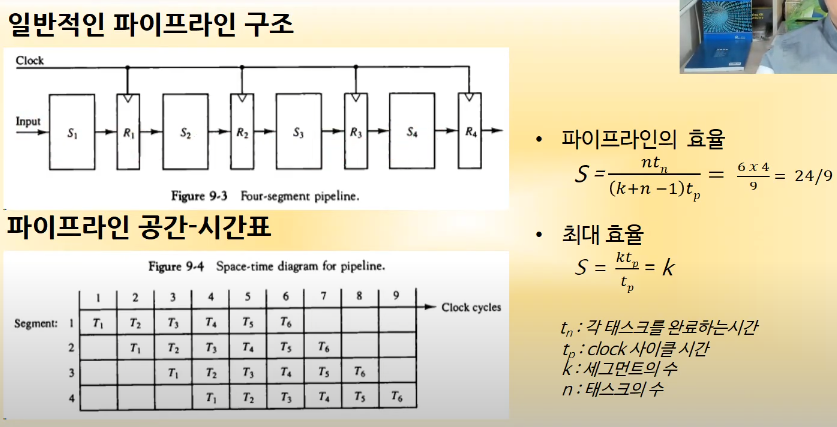
  
  - 빈 공간 때문에 최대효율은 낼 수 없지만 T가 많아져서 빈 공간이 적어질 수 록 K에 가까워진다.
  - 그렇기 때문에 한번에 for loop를 돌리는 것이 효율적이다.... ?
  - 이것을 조절하는 것은 컴파일러이다. 컴파일러를 코딩할 수 있게 되면 파이프라인 구조를 효율적으로 사용할 수 있는 코드를 잘 수 있다.
  
  

## [제 9장 Part-2](https://youtu.be/urbOizecd1Y?list=PLc8fQ-m7b1hD4jqccMlfQpWgDVdalXFbH)

### 산술 파이프라인 (Arithmetic Pipeline)

- 실수의 가산

  - X = A x 2^a
  - Y = B x 2^b

- 세그먼트별 연산 (아래 그림의 Segment별 동작이 순서대로)

  - 지수의 비교
  - 가수의 정렬
  - 가수의 연산
  - 결과의 정규화

- 정수의 연산은 2개의 세그먼트를 갖고 실수의 연산은 4개의 세그먼트를 갖기 때문에 실수의 연산이 더 빠르다.

  - (core i7 이상부터, 라즈베리파이 같이 간단한 구조인 경우에는 정수가 더 빠름 | CPU 구조에 따라 다르게 프로그래밍하는 것이 좋다.)

  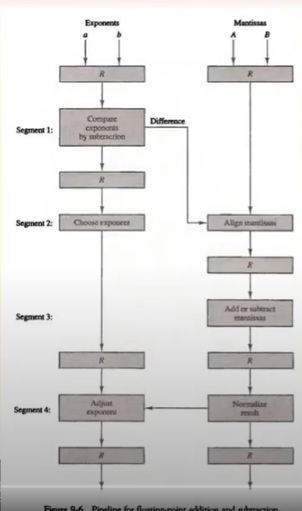

### 명령어 파이프라인 (Instruction Pipeline)

- 명령어가 실행을 어떤 순서로 하는지도 정할 수 있다.
- 명령 실행의 순차
  1. 메모리에서 명령어 fetch(Seg 1)
  2. 명령어 디코딩(Seg 2)
  3. 유효주소의 계산(Seg 2)
  4. 메모리에서 피연산자 fetch (Seg 3)
  5. 명령어 실행 (Seg 4)
  6. 연산 결과의 저장 (Seg 4)

- 4 세그먼트 CPU 파이프라인

  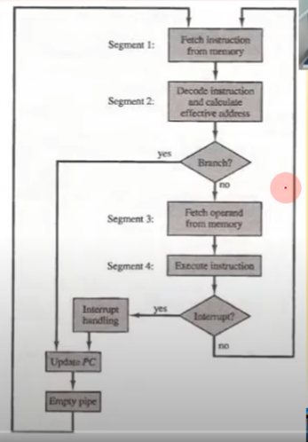

- 명령어 파이프라인의 4 세그먼트

  - FI(Fetch Instruction)
  - DA(Decode and Address)
  - FO(Fetch Operand)
  - EX(Execution)
  - 아래의 그림에서는 x축이 시간임
  - 3번 명령어가 Branch이기 때문에 DA(Decode가 되었을 때)가 됐을 때에는 먼저 Branch가 시행되고 JUMP된 곳의 명령어가 수행됨(Branch가 끝나야함)
  - 이것을 파이프라인이 깨졌다고 함 => 가급적이면 파이프라인이 깨지지 않도록 짜는 것이 좋다.(하지만 힘들다.)

  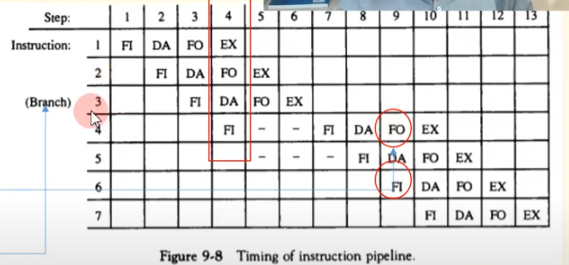

- 명령어 파이프라인의 지연

  - 원인

    - 자원 충돌 - 동일한 자원에 두 군데에서 접근하는 경우 (Step 9에서 FO, FI가 메모리에 동시에 접근해서 자원 충돌이 난다.)

      ​					=> 듀얼 버스로 해결 !

    - 데이터 의존성 - 그 전에 처리가 되어야 진행될 수 있는데 안끝났을 때 

      ​        				   (Step 5에서 Inst 2와 Inst 3이 두 가지가 의존성이 있어서 EX가 끝나야 FO할 수 있다.) 

    - 분기 곤란(Branch문은 여기에만 해당됨)

  - 자원 충돌, 데이터 의존성 요런 내용들은 대학원급..


### RISC 파이프라인 (RISC Pipeline)

- 3 세그먼트 명령어 파이프 라인
  - I : 명령어의  fetch
  - A : ALU 동작
  - E : 명령어의 실행
- 지연된 코드(아래의 그림처럼 중간에 No-operation을 넣는 것, 영어로는 delayed load)
  1. LOAD : R1 <= M[address 1]
  2. LOAD : R2 <= M[address 2]
  3. ADD : R3 <= R1 + R2
  4. STORE : M[address 3] <= R3

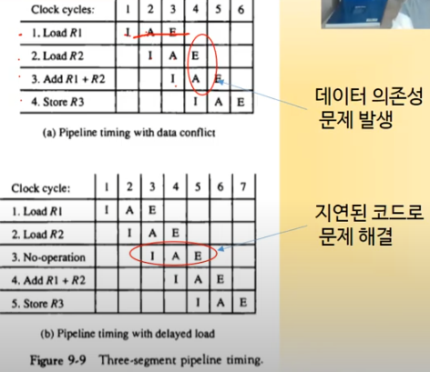

- 지연된 분기(No-operation을 끼워넣을 수 도 있지만 분기를 먼저하는 것이다. => 컴파일러가 해줌)
  - Load from memory to R1
  - Increment R2
  - Add R3 to R4
  - Subtract R5 from R6
  - Branch to address X
- 해결
  - 정교한 컴파일러 사용 => RISC 컴파일러의 특징
  - 실행순서 변경
  - 데이터 의존성 회피

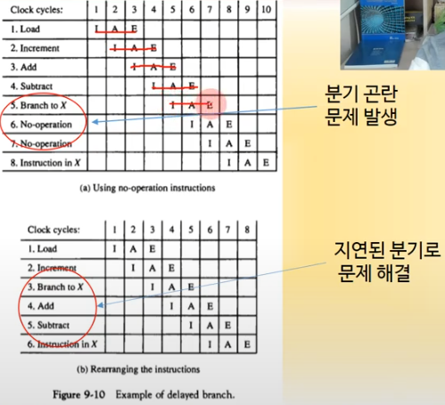

## [제 9장 Part-3](https://youtu.be/zGA4pvvya2I?list=PLc8fQ-m7b1hD4jqccMlfQpWgDVdalXFbH)

### 백터 처리 (Vector Processing)

- 행렬 데이터 처리

- 병렬 데이터 처리

- 벡터 처리가 중요한 분야

  - 장기 기상 예보
  - 석유 탐사
  - 지진 데이터 분석
  - 의학 검진, 분석
  - 기계 역학, 비행 시뮬레이션
  - 인공지능, 전문가 시스템
  - 유전자 분석
  - 2/3차원 이미지 처리

- 벡터 연산과 벡터 명령어

  - 포트 형태를 빌린 병렬처리 프로그래밍 코드

  - B(I) + A(I)를 C에 저장

  - ```
    DO 20I = 1, 100
    C(I) = B(I) + A(I)
    
    Initialize I = 0
    Read A(I)
    Read B(I)
    Store C(I) = A(I) + B(I)
    Increment I = I + 1
    If I <= 100 go to 20
    Continue
    
    위의 코드를 아래의 한줄로 프로그래밍 가능
    C(1:100) = A(1:100) + B(1:100)
    (source 1 == A, source 2 == B, destination == C / address에 해당하는 곳에 바로 각각 더해주는 것)
    ```

    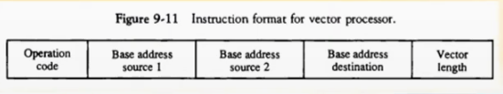

- 메모리 인터리빙(Interleaving)

  - 두 개 이상의 명령어가 동시에 메모리를 접근하는 경우 (자원 충돌이 일어날 수 있음)

  - 자원 충돌 문제를 해결하기 위해 **메모리를 여러 모듈로 분할 구성**

    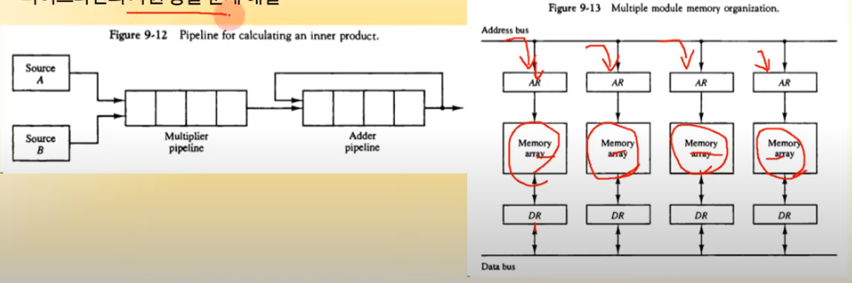

  - 현재 4개의 메모리가 있을 경우 Address를 모듈러 연산 해서 각각의 메모리에 넣어준다.

  

- 슈퍼 컴퓨터(Supercomputer)

  - 정의
    - 벡터 명령어 제공
    - 파이프라인된 부동 소수점산술연산 제공
    - 상업용 컴퓨터(팔지 않는 컴퓨터는 슈퍼컴퓨터가 아니다)
  - 성능 요소
    - 고속의 연산을 위한 설계
    - 고속 위주의 소재, 부품 사용
  - Flop(슈퍼컴퓨터의 성능을 비교하는 단위)
    - 초당 처리할 수 잇는 floating point 연산의 수
    - MFlop, Gflop 단위
  - 대표적인 슈퍼컴퓨터
    - CRAY-I, CRAY-II, CRAY X-MP
    - Fujitsu VP-200, VP-2600
    - 1위는 Fugaku => CPU 코어 수가 무려 7,299,072개(이게 되네...) 전력은 28,335kw(고리 원전 반 개분 전력)
  - 요즘의 추세는 클러스터 컴퓨터를 여러개 묶어서 클라우드 컴퓨팅으로 가는 추세여서 슈퍼 컴퓨터가 주된 연구분야는 아님

### 배열 프로세서 (Array Processors)

- 부가 배열 프로세서
  - Backend 프로세서 array 사용
    - 대량의 데이터 처리 전담
    - Local Memory에 데이터 저장
    - 트랜스퓨터라고도 지칭
  - Main 프로세서
    - 데이터 전송 프로그램 실행되고
    - 오른쪽의 Attached array processor와 Local Memory를 Input-output interface를 사용한 transputer(요즘에는 잘 안쓰임)

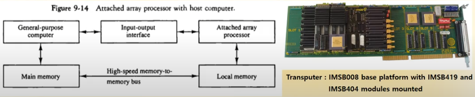

- SIMD 배열 프로세서
  - Main CPU, Main memory 에 다수의 PE 연결
  - PE(Processing Element)
    - 자체 프로세서와 local memory 포함
    - Array 프로세서 형태로 구현

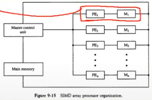

- ILLIAC-IV
  - 대표적인 초기 SIMD 배열 프로세서
  - 미국 일리노이 대학 연구실 개발
  - 초기형 SIMD 슈퍼컴퓨터급 성능

