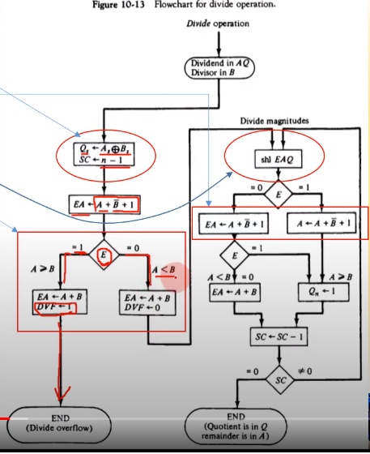

영상: [컴퓨터시스템구조 CSA10 Part-1](https://youtu.be/JEqQn9lMpDY?list=PLc8fQ-m7b1hD4jqccMlfQpWgDVdalXFbH)

## [제 10장 Part-1](https://youtu.be/JEqQn9lMpDY?list=PLc8fQ-m7b1hD4jqccMlfQpWgDVdalXFbH)

### 덧셈과 뺄셈 (Addition and Substraction)

#### 기본 컴퓨터의 데이터 형식

- 부호절대값으로 표시된 고정소수점 이진데이터(34: 0 0100010)
- 부호화된 2의 보수로 표현되는 고정소수점 이진데이터(-34: 1 0100010)
- 부동소수점 이진데이터(0.34*10^2: 0 0100010 00000010)
- 이진화된 십진수(BCD) 데이터(1264: 0001 0010 0110 1000)

#### 부호절대값 데이터를 이용한 덧셈과 뺄셈

- 컴퓨터 연산에서는 결과의 부호를 먼저 결정한 후, 데이터의 절대값을 계산한다.
- `A레지스터(ack) += B 레지스터` 이런식으로 연산

#### 하드웨어 알고리즘

- 덧셈 알고리즘
  - 부호가 같으면 오버플로우가 날 수 있어서 처리가 필요
- 뺄셈 알고리즘
  - 같은 부호를 빼면 더 작아지기 때문에 오버플로우가 안남
- 부호의 비교
  - Exclusive OR에 의하여 비교
    - 0: 동일부호
    - 1: 다른 부호
  - 오버플로우의 처리 필요
    - 같은 부호 연산 : yes -> 절대값이 더 커져서 비트가 더 필요할 수도 있기 때문, 캐리가 발생
    - 다른 부호 연산 : no
- 절대값의 비교
  - A < B, A > B인 경우의 처리

#### 부호가 있는 2의 보수 데이터를 이용한 덧셈과 뺄셈

- 하드웨어 구조

  - A -> AC register, B -> BR register

  

  - 뎃셈/뺄셈 알고리즘
    - 오버플로우의 조사 V <- Overflow

## [제 10장 Part-2](https://youtu.be/PCesRDdlbCU?list=PLc8fQ-m7b1hD4jqccMlfQpWgDVdalXFbH)

### 곱셈 알고리즘 (Multiplication Algorithm)

#### 곱셉의 원리

- 연속적인 시프트와 덧셈으로 구성
- 10진수 곱하는 것과 동일함

- Q : Multiplier를 담고있는 레지스터
- 23 * 19  = 23 을 19번 더한다.
- Q레지스터에 19가 들어있고, 한번씩 계속 더하면서 숫자가 하나씩 빠짐. 19,18,17,... 그래서 남는 자리에 23을 계속 더하면서 생기는 오버플로우를 담음
- B 레지스터 = 데이터 레지스터, E : 캐리를 넣음

#### 하드웨어 알고리즘

- 부호가 같으면 양수, 아니면 음수
- 한사이클 돌때마다 E, A, Q가 다 오른쪽으로 이동 

#### Booth의 곱셈 알고리즘

- 부호가 있는 2의 보수로 표현된 정수에 대한 곱셈 수행

- 승수값이 0인 경우 -> 시프트만 수행

- 2^k~2^M까지의 값이 1인 경우 -> 2^(k+1) - 2^m과 동등하게 취급

  - $$
    (14 : 001110) = 2^{(k+1)} - 2^m = 2^4 - 2^1 = 14
    $$

    

  - $$
    M * 14 = M * 2^4 - M*2^1
    $$

    

  - 피승수 M을 왼쪽으로 4번 이동한 값 - 1번 이동한 값

- 하드웨어 구성

  - Q(n+1) : 승수의 두 비트 비교 : 1이 연속적으로 나오는 구간의 시작~끝을 확인하기 위해 필요
    - 승수비트가 1인 경우
    - 승수비트가 0인 경우

  

- Booth의 곱셈 알고리즘 수행 예

  

  - 10 : 1이 쭉 나오다가 끝난거라서 빼줘야함
  - 01: 1이 등장한거라서 더해줘야됨
  - 00, 11 : 그냥 쭉쭉 쉬프트

#### 배열 승산기

- 어느정도 정해진 숫자의 범위가 있고, 재사용성은 됐고 그냥 빠른게 필요하다 할때는 아래처럼 무식하게 만드는 것도 가능
- 고속의 연산을 수행하는 컴퓨터는 이런식으로 갖고 있기도 함

## [제 10장 Part-3](https://youtu.be/uOPhmVrvrm4?list=PLc8fQ-m7b1hD4jqccMlfQpWgDVdalXFbH)

### 나눗셈 알고리즘 (Division Algorithm)

#### 이진 나눗셈

- 하드웨어는 곱셈과 동일

  - 한비트씩 시프트하면서 빼나가는 방식(10진법과 동일함)
  - Q에 몫을 넣고 뺄때마다 시프트하고 뒤에다 넣어줌

- 나눗셈 오버플로우의 처리

  - 자릿수가 안맞아서 한칸 더 땡겨야할때 오버플로우 발생
  - 10진법에서 160 / 17 한다고 하면 16/17이 안되니까 160/17로 하는것과 동일. 그러면 결국 16 -> 160 이되는게 2진법 상에서는 비트수가 늘어난거라 오버플로우 됨

- 나눗셈 처리

  

- 하드웨어 알고리즘

  - 부호의 비교
  - 뺄셈의 실행
  - 시트프 실행
  - 오버플로우 처리

  

### 부동 소수점 산술 연산 (Floating-Point Arthmetic Operations)

- 컴퓨터는 이진체계라서 r은 2
- A_s, B_s 는 부호 / A,B는 정수 / a,b는 소수를 의미. 소수를 저장할 레지스터가 따로 구성되어 있어서 일반 정수의 연산보다 레지스터가 더 많이 필요
- 지수가 0이면 그냥 정수 연산이라서 End
- `가수 위치 조정` : 지수가 0이 아니면, 대소비교해서 큰쪽의 비트로 맞춤
- `결과의 정규화` : 덧셈, 뺄셈하고 나서 정수부가 생긴 경우에는 자릿수를 높이거나 낮추는 정규화를 함.

- 곱셈 알고리즘
  - 0의 확인
  - 지수의 덧셈
  - 자수의 곱셈
  - 결과의 정규화
- 나눗셈 알고리즘
  - 0의 확인
  - 레지스터 초기화
  - 부호의 결정
  - 피젯수(나누어지는 수) 위치 조정
  - 지수의 뺄셈
  - 지수의 나눗셈
- 곱셈/나눗셈도 덧셈뺄셈과 비슷한 방법으로 됨
- bias : 음의 지수를 표현하기 위한 기준점
  - bias가 128이고 이걸 2^0이라고 하면, 결과값이 2^-3일때 b,a에 125로 저장됨

### 십진 산술 장치 (Decimal Arithmetic Unit)

- BCD 가산기

  

  - 10을 넘어가서 캐리값이 생김
  - 6을 더하면 오른쪽 결과가 된다고 함

- BCD 감산기

  

### 십진 산술 연산 (Decimal Arthmetic Operations)

- 덧셈과 뺄셈

  

  (a) Parallel

  - 624 + 879 => 1000 + 0110 / 0111 + 0010 / 1001 + 0100 2진화된 10진수로 표기한 후, 일의 자리부터 더함
  - 캐리가 생기면 하나 올려서 연산 
  - 각 자리수를 한꺼번에, 동시에 연산 가능
  - 빠른데 복잡함; 한번에 하는 대신 자릿수 만큼의 레지스터가 병렬로 연결되어 있어야 함 -> 비싸다

  (b) Serial

  - 자릿수를 나눠서 하나씩 연산
  - 캐리가 발생할때마다 루프

  (c) All Serial

  - 한 비트씩 연산해서 넣어주는 방식
  - 12비트면 12번 연산함
  - 느린데 쉬움 -> 싸다

- 곱셈과 나눗셈

  

  - BCD용 덧셈기를 쓴다. 감산, 가산 둘다 할 수 있는
  - 사실 BCD는 잘 안쓴다함. 컴터는 2진이 기본이니깐