영상: [컴퓨터시스템구조 CSA10 Part-1](https://youtu.be/JEqQn9lMpDY?list=PLc8fQ-m7b1hD4jqccMlfQpWgDVdalXFbH)

## [제 10장 Part-1](https://youtu.be/JEqQn9lMpDY?list=PLc8fQ-m7b1hD4jqccMlfQpWgDVdalXFbH)

### 덧셈과 뺄셈 (Addition and Substraction)

- 기본 컴퓨터의 데이터 형식 

  - 부호절대값으로 표시된 고정소수점 이진 데이터 (정수) : 34 = 0 0100010
  - 부호화된 2의 보수로 표현되는 고정소수점 이진 데이터 (음수의 경우 2의 보수 형태로 표시) : -34 = 1 1011110
  - 부동소수점 이진 데이터
  - 이진화된 십진수 (BCD) 데이터 : 1264 = 0001 0010 0110 0100

- 부호절대값 데이터를 이용한 덧셈과 뺄셈

  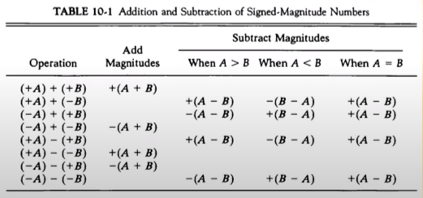

  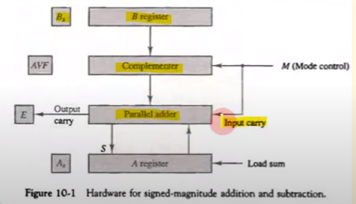

- 하드웨어 알고리즘

  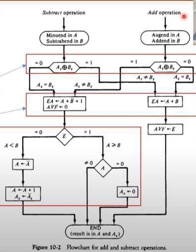

  - 덧셈 알고리즘 
    - 같은 부호간의 연산 시에 비트의 자릿수를 넘어가서 오버플로우가 생기는 문제에 대한 대책이 필요함
      - 오버플로우 발생시 오버플로우를 발생하는 플립플롭인 `AVF`에 E값을 넣음 
      - Output carry 발생 
    - 서로 부호가 다를 경우 오버플로우가 일어나지 않음
      - A + B의 2의 보수 (서로 부호가 다르면 결국 뺄셈이기 때문에)
      - 이 때 AVF의 값은 0
  - 뺄셈 알고리즘
    - 같은 부호일 때 : 오버플로우 발생하지 않음
      - A - B를 실행
      - E 플립플롭을 조사
        - 1일 경우  : 양수면 음수로, 음수면 양수로
        - 0일 경우 : 결과값 그대로 
  - 부호의 비교 
    - Exclusive OR에 의해 비교
      - 0 : 동일 부호
      - 1 : 다른 부호 
  - 절대값의 비교
    - A < B, A > B인 경우 처리 
  - 부호가 있는 2의 보수 데이터를 이용한 덧셈과 뺄셈
    - 하드웨어 구조 
      - A ➡ AC register, B ➡ BR register

## [제 10장 Part-2](https://youtu.be/PCesRDdlbCU?list=PLc8fQ-m7b1hD4jqccMlfQpWgDVdalXFbH)

### 곱셈 알고리즘 (Multiplication Algorithm)

- 곱셈의 원리

  - 연속적인 시프트와 덧셈으로 구성 

  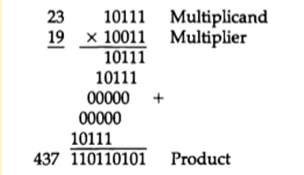

- 하드웨어 구성

  - A ➡ AC(계산값)
  - B ➡ 피승수
  - Q ➡ 승수
  - SC ➡ 시퀀스 카운터
  - As, Bs, Qs ➡ 부호 비트
  - EAQ ➡ 결과값

  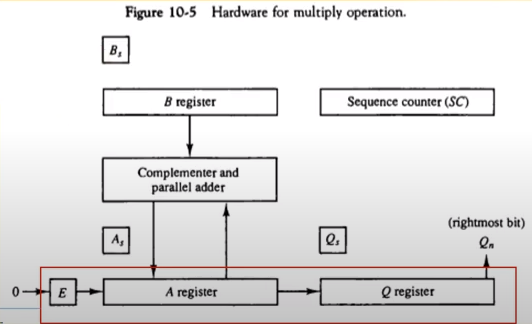

- Booth의 곱셈 알고리즘

  - 부호가 있는 2의 보수로 표현된 정수에 대한 곱셈 수행 
  - 승수값이 0인 경우 ➡ 시프트만 수행
  - 2 ** k ~ 2 ** m까지의 값이 1인 경우 ➡ 2 ** (k + 1) - 2 ** m과 동등하게 취급 
    - (14 : 001110) = 2 ** (k + 1) - 2 ** m = 2 ** 4 - 2 ** 1 = 14
    - 피승수 M을 왼쪽으로 4번 이동한 값 - 1번 이동한 값 

  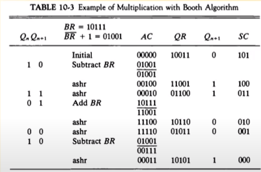

  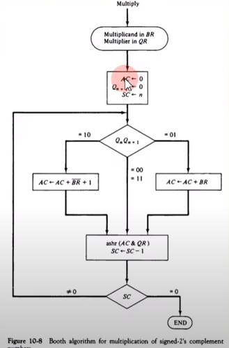

- 하드웨어 구성

  - 승수의 두 비트 비교

- 배열 승산기

  - 조합회로에 의한 논리곱 마이크로 연산 수행  (and 연산)
  - 2 x 2 배열 승산기

  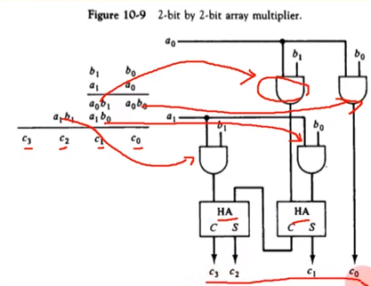

## [제 10장 Part-3](https://youtu.be/uOPhmVrvrm4?list=PLc8fQ-m7b1hD4jqccMlfQpWgDVdalXFbH)

### 나눗셈 알고리즘 (Division Algorithm)

- 이진 나눗셈

  - 하드웨어 곱셈과 동일
  - 나눗셈 오버플로우의 처리
    - 175 / 3 연산을 한다고 가정할 때, 처음에 3 / 1을 할 수 있는지 살펴 본다
    - 할 수 없으므로 3 / 17을 하는데 한 비트로 두개의 비트를 나누게 되기 때문에 오버플로우 발생

- 나눗셈의 처리

  - AQ값에서 B값을 계속 빼나가는 방식

  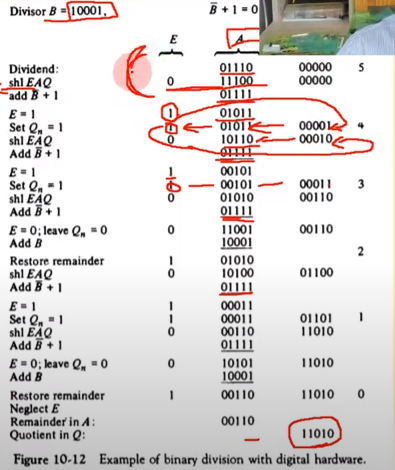

- 하드웨어 알고리즘

  - 부호의 비교
  - 뺄셈의 실행
  - 시프트 실행
  - 오버플로우 처리

  

### 부동 소수점 산술 연산 (Floating-Point Arthmetic Operations)

- 숫자의 표현
  $$
  M \times r^n
  $$

  - r : Radix

- 레지스터 구성

  - 부동소수점을 위한 레지스터 : 정수부분의 레지스터 + 소수 부분의 레지스터

  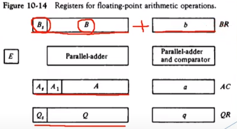

- 덧셈/뺄셈 알고리즘

  1. 0인지 여부 조사
  2. 가수의 위치 조정
  3. 가수의 덧셈/뺄셈
  4. 결과의 정규화

- 곱셈 알고리즘

  1. 0의 확인
  2. 지수의 덧셈
  3. 가수의 곱셈
  4. 결과의 정규화

- 나눗셈 알고리즘

  1. 0의 확인
  2. 레지스터 초기화
  3. 부호의 결정
  4. 피젯수 위치 조정
  5. 지수의 뺄셈
  6. 가수의 나눗셈 

### 십진 산술 장치 (Decimal Arithmetic Unit)

- BCD 가산기 

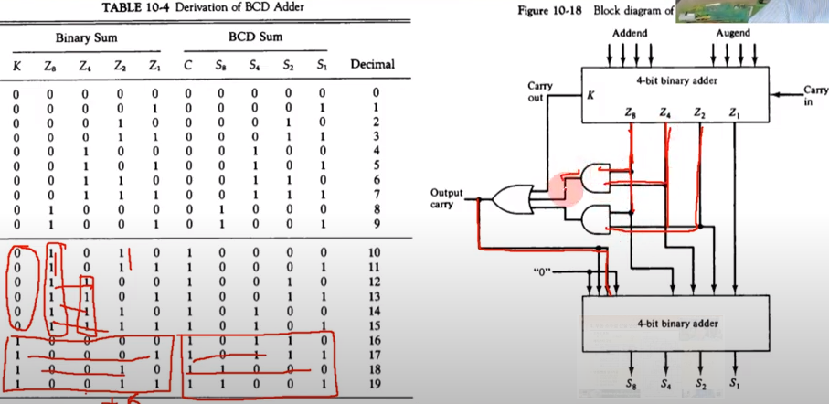

- BCD 감산기

  - M 비트에 의한 연산 전환
  - BCD 9의 보수 회로 구현
  - 4개의 입력으로 4개의 출력을 만드는 조합회로

- 덧셈과 뺄셈

  - 3가지 십진 연산 장치

    - Parallel decimal addition (하드웨어는 가장 복잡하지만 가장 빠르고 가격도 높음)

    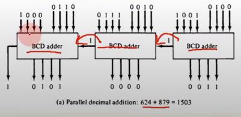

    - digital-serial, bit-parallel decimal addition (각각의 BCD 값을 자릿수 별로 하나씩 연산)

      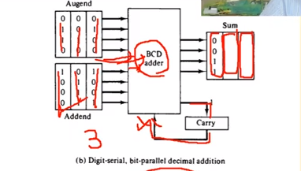

    - serial decimal addition (한 비트씩 각자 연산해서 sum으로 넣고 캐리 연산 반복)

      - 느리고 간편한 방식

      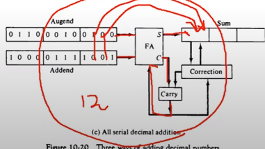

### 십진 산술 연산 (Decimal Arthmetic Operations)

- 곱셈과 나눗셈

  - 하드웨어 구성 
    - 앞의 곱셈 나눗셈 알고리즘과의 차이점 : 감산도 할 수 있는 BCD 장치 사용
    - 이외의 방법과 구성은 기본적으로 동일 

  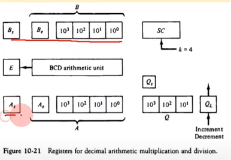

  - 곱셈 알고리즘
  - 나눗셈 알고리즘