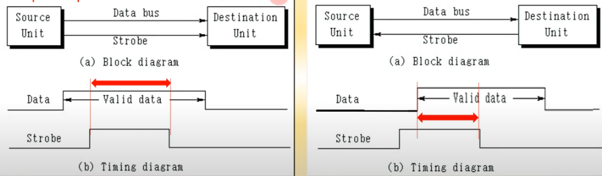

영상: [컴퓨터시스템구조 CSA-11 Part-1](https://youtu.be/3bTJLI4Vwac?list=PLc8fQ-m7b1hD4jqccMlfQpWgDVdalXFbH)

## [제 11장 Part-1](https://youtu.be/3bTJLI4Vwac?list=PLc8fQ-m7b1hD4jqccMlfQpWgDVdalXFbH)

### 주변장치 (Peripheral Devices)

- 컴퓨터와의 연결 방식
  - 온라인 장치 / 오프라인 장치
- 주변 장치의 종류
  - 입력장치
    - 키보드, 마우스, 디지타이저, 마이크 등
  - 출력장치
    - 모니터, 프린터, 스피커 등
  - 입출력장치
    - 저장장치(CPU를 기준으로 보내면 출력 받으면 입력), LCD 터치스크린 등
- 인터페이스

- 컴퓨터와의 데이터 통신 방식
  - ASCII 문자: Alphanumeric & 제어 문자

### 입출력 인터페이스 (Input-Output Interface)

- 기능(아래의 그림처럼 I/O 장치마다 각각 갖고 있다.)
  - CPU와 I/O장치의 차이점 해결(속도 차이)
  - 동작방식 차이에 따른 데이터 신호값 변환(TTL <- -> RS-232-C)
  - 전송 속도 동기화
  - 데이터 코드 형식과 메모리 워드 형식 간 변환(ASCII를 안쓸 수 도 있으니까)
  - 주변장치들 간의 동작 순서와 순위 중재 및 조정
- I/O 버스와 인터페이스 모듈
  - 입출력 버스
  - 인터페이스가 실행하는 I/O 커맨드(3개의 I/O bus를 조작하여 사용함)
    - 제어 커맨드 - 주변장치 활성화, 동작 정의
    - 테스트 커맨드 - 상태 확인(디바이스의 종류, 기종 등등의 정보를 확인)
    - 데이터 출력 커맨드 - 데이터의 출력 전송
    - 데이터 입력 커맨드 - 데이터의 입력 전송
- I/O 대 메모리 버스
  - 메모리와 I/O가 각자 다른 버스 사용
    - CPU와 IOP를 별도로 가지는 시스템에 사용
  - 메모리와 I/O가 공통의 버스, 개별 제어 라인 사용
  - 메모리와 I/O가 공통의 버스와 제어 라인 사용

- 격리형 I/O
  - 별도의 입출력 명령 사용
  - 인터페이스 레지스터 주소 사용
  - 명령어에 레지스터 주소 지정
  - ​                                                  

- Memory Mapped I/O(요즘 쓰는 방식)
  - 메모리 주소를 인터페이스 레지스터까지 확장
  - 메모리와 입출력 공간 구별 없음
  - 특정 메모리 주소 영역에 입출력 장치 주소 overlay
  - 특정 입출력 명령어 필요없음(MemoryRead() = I/ODeviceRead())
  - C언어에서 File을 읽어올 때(포인터 사용)도 Memory를 사용할 수 있는 이유가 바로 이것 때문이다.

- I/O 인터페이스 예
  - 입출력 버스 버퍼(Bus Buffer, 그림 좌상단)
    - 호스트와의 양방향 데이터 전송
    - 입출력 속도를 결정(bps)
  - 제어장치(Control Unit, 그림 좌중단)
    - 입출력 인터페이스 선택(CS)
    - 포트 레지스터 선택(A, B)
    - 데이터 입력/출력 제어(RD/WR)
  - 포트 레지스터(Port Register, 빨간 박스)
    - 2개의 디바이스 연결 제어
    - 제어 레지스터
    - 상태 레지스터
  - 내부 버스(Internal Bus, 가운데 한 줄)
    - 버스 버퍼와 포트 레지스터 연결

## [제 11장 Part-2](https://youtu.be/S4Lv2i25Jhk?list=PLc8fQ-m7b1hD4jqccMlfQpWgDVdalXFbH)

### 비동기 데이터 전송 (Asynchronous Transfer)

- 스트로보(Strobe) 제어
  - Strobe와 Data bus가 함께 켜져 있을 때 내가 목적지라고 인식하여 데이터를 받을 수 있다.
  - 왼쪽 - Source Initiate | 오른쪽 - Destination Initiate
  - 오른쪽 그림은 Destination이 Data를 받을 수 있다고 Strobe 신호를 보냈을 때 둘 다 켜져있다고 생각할 수 있다는 것을 의미한다.
  - 여기서 Data bus는 여러개의 선이 있는 것이다.
  - **문제점** - Strobe만 끊어지거나 간섭이 되면 먹통이 되어버린다.
  - 

- 핸드셰이킹 제어
  - 스트로보 제어의 문제점을 해결한 제어 프로토콜
  - Data accepted 혹은 Ready for data 신호를 받아서 받았는지 확인해주는 것
  - 이 과정들은 모두 한 bit마다 진행된다. 요새는 1Gbps도 있음 (1초당 1,000,000,000bps 1초에 10억번 핸드셰이킹 한다.)

- 비동기 직렬 전송

  - TTL 전송(요즘엔 특별한 경우를 제외하고는 TTL을 쓴다.)
    - 0V, 5V 신호로 데이터 전송
    - 시작 비트 1, 데이터 비트 8, 정지 비트 2, 총 11비트 단위로 8비트 데이터 전송
    - 데이터 신호(비트)의 간격 = 1/전송 속도
    - 핸드 셰이킹으로 제어한다.
  - 전송 규칙
    1. 데이터가 전송되지않을 때에는 항상 1 신호(5V) 유지
    2. 문자 전송의 시작은 시작 비트 0으로 표시
    3. 시작 비트 뒤로 8개의 데이터 비트 표시
    4. 마지막 비트 후 2비트 이상의 1 신호 유지

  

- 비동기 통신 인터페이스
  - UART(Universal Asynchronous Receiver Transmitter)
  - TTL로 Transmit data (bit)를 통해 내보내고 받을 때도 bit를 받아서 Receiver register에 담아놨다가 8개가 되면 Bus buffers로 보낸다.
  - 
  - FIFO 버퍼(위의 그림 오른쪽 네모)
    - 병렬적으로 데이터를 전송한다.

### 전송 모드 (Modes of Transfer)

- 입출력 전송 모드의 종류
  - 프로그램된 I/O
    - 입출력 명령에 의하여 동작
    - 프로세서 레지스터와 주변장치 간 데이터 전송 수행
    - 레지스터와 메모리간 데이터 전송 수행
    - 주변 장치의 플래그에 기반한 입출력 수행
  - 인터럽트에 의한 I/O
    - 인터럽트에 의하여 입출력 수행
    - 입출력이 준비되면 프로세서에 인터럽트 요구 수행
    - 인터럽트 처리 후 본래 프로그램 계속 수행
  - 직접 메모리 접근(DMA: Direct Memory Access)
    - 데이터를 메모리 버스를 통하여 전송
    - DMA를 수행하는 전용 하드웨어(DMA Controller) 사용
    - 사이클 스틸링에 의한 버스 효율화
    - CPU가 I/O 로직에 상관하지 ㅇ낳음
  - 프로그램된 I/O의 순차
    1. 플래그 비트 검사
    2. 상태 레지스터 확인
    3. 데이터 레지스터 접근(버스 버퍼 혹은 Port Register)

​                                              

## [제 11장 Part-3](https://youtu.be/RFBVNAMVqfw?list=PLc8fQ-m7b1hD4jqccMlfQpWgDVdalXFbH)

### 우선순위 인터럽트 (Priority Interrupt)

- 인터럽트 우선 순위
  - 동시에 발생된 인터럽트의 우선순위 결정
  - 하드웨어 또는 소프트웨어적으로 결정

- 데이지체인(Daisy Chain) 우선순위 인터럽트
  - 우선순위에 따라서 인터럽트 처리 프로그램의 벡터 주소(VAD)를 CPU로 전달
  - CPU에  INT신호를 보내고 CPU가 가능하다면 INTACK를 보내준다.
  - 만약 Device 1과 Device 3이 동시에 INT신호를 보냈다면 둘이 P1이 되고 
  - INTACK을 받았을 때 구조상 앞에 있는 Device 1의 VAD 1을 CPU로 보낸다.
  - Device 1의 동작이 끝나면 INTACK을 다음 Device로 보내게 된다. 

- 병렬 우선순위 인터럽트
  - 우선순위 인코더 사용
  - 우선순위에 따른 VAD 생성
  - CPU에 인터럽트 전달
  - Mask 레지스터 사용(AND 게이트로 연결되어 둘다 1일 때만 1로 작동하도록 한다. )
  - 각 외부장치의 Interrupt를 Encoder를 사용해서 각자 맞춰준다. 이 때 각 주소는 미리 정해놓는다.
  - 아래의 그림에서 I0, I1, I2, I3에서 위의 것이 1이 켜지면 그 아래는 모두 멈춘다.

​                                               

- 인터럽트 사이클
  - 인터럽트 시작
    - IEN <- 1, IST <- 1
  - IVT : VAD의 집합
  - 인터럽트 사이클의 마이크로 연산(스택 구조임)
    - SP <- SP + 1
    - M[SP] <- PC
    - INSTACK <- 1
    - PC <= VAD
    - IEN <= 0
    - Go to the Fetch Cycle

- 인터럽트 동작
  - 초기 동작
    1. 보다 낮은 단계의 mask 레지스터 비트를 0으로 set
    2. IST <= 0
    3. 프로세서 레지스터 비용(PSW) 저장
    4. IEN <= 1
    5. 인터럽트 서비스 프로그램 계속 실행
  - 최종 동작
    1. IEN <= 0
    2. PSW의 내용을 CPU에 복귀
    3. 인터럽트에 관계된 레지스터 비트 클리어
    4. 보다 낮은 순위의 mask 비트를 1로 set
    5. 복귀 주소를 PC에 저장
    6. IEN <= 1
  - 인터럽트 동작의 기게어 프로그램 분석
    - 초기동작/최종동작 부분으로 인터럽트 루틴 구분 가능
    - BIOS에서 각 인터럽트 서비스 루틴 추출에 활용

### 직접 메모리 접근 (Direct Memory Access)

- DMA 전송 구조

  - DMA를 지원하는 CPU

  -  

  - DMA 제어기

  -  

    

- 사이클 스틸링(Cycle Stealing)
  - Memory + memory + memory + ...,
  - Memory + DMA + memory + DMA
  - CPU에서 Memory Bus를 안쓰는 타이밍에 DMA가 Memory Bus를 끼어들어서 쓰는 것

- DMA 전송

  - 전송 초기화 실행
  - 메모리 버스와 입출력 버스간 연결 (1~4)
  - 메모리 버스로 직접 데이터 전송
  - 완료 후 전송 종료 인터럽트 전송

  

- DMA 전송 초기화

  - 데이터 전송 메모리 주소 전송
    - Address register
  - 전송할 데이터 워드 수 전송
    - Word Count Register
  - 읽기/쓰기 신호 결정
    - R/W

  - DMA 전송 시작 신호 전송

## [제 11장 Part-4](https://youtu.be/ek1iqvhlsEs?list=PLc8fQ-m7b1hD4jqccMlfQpWgDVdalXFbH)

### 입출력 프로세서 (Input-Output Processor)

- 입출력 프로세서(IOP)의 역할
  - 입출력 장치와의 직접적인 통신을 전담(CPU에 버스로 연결되는 것이 아니라 IOP를 통해 연결됨)
  - 채널(Channel)로 호칭
  - CPU급의 DMA 제어기
  - 요즘엔 칩셋(IOP와 Bus Controller를 합친 것 / USB, 오디오 장치 등 다양한 외부 장치를 한번에 관리하는 것)

 

### 직렬 통신(Serial Communication)

- 문자 지향 프로토콜(Character Oriented Protocol)
  - 모두 8비트임(패리티 비트가 앞에 있음)
  - SYN를 이용해서 Hand Shake 방식으로 사용함
  - SOH(Start of Header)
  - STX(Start of Text)
  - ETX(End of Text)
  - BCC(에러 컨트롤 하는 코드)

- 비트 지향 프로토콜(Bit Oriented Protocol)
  - 비문자 데이터 전송용 Format
  - Control Field에 따라서 여러 데이터 형태 결정

