# 제 11장 입출력 구조

## 1. 주변 장치

- 컴퓨터와의 연결 장치

  온라인 장치 / 오프라인 장치

- 주변 장치의 종류

  - 입력장치

    키보드, 마우스...

  - 출력 장치

    모니터, 프린터, 스피커...

  - 입출력 장치

    저장 장치, TV-인코더..

- 인터페이스

- 컴퓨터와의 데이터 통신 방식

  - ASCII문자

## 2. 입출력 인터페이스

- 입출력 인터페이스의 기능
  - CPU와 I/O 장치의 차이점 해결 -> I/O가 상대적으로 매우 느리다.
  - 동작 방식 차이에 따른 데이터 신호값 변환
  - 전송 속도 동기화
  - 데이터 코드 형식과 메모리 워드 형식 간 변환
  - 주변장치들 간의 동작 순서와 순위 중재 및 조정
- I/O 버스와 인터페이스 모듈
  - 입출력 버스
  - 인터페이스가 실행하는 I/O 커맨드
    - 제어 커맨드 : 주변장치 활성화, 동작 정의
    - 테스트 커맨드 : 상태 확인
    - 데이터 출력 커맨드 : 데이터의 출력 전송
    - 데이터 입력 커맨드 : 데이터의 입력 전송
- I/O 대 메모리 버스
  - 메모리와 I/O가 각자 다른 버스 사용
    - CPU와 IOP를 별도로 가지는 시스템에 사용
    - 메모리와 I/O가 공통의 버스, 개별 제어 라인 사용
    - 메모리와 I/O가 공통의 버스와 제어 라인 사용

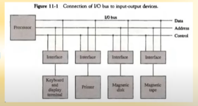

- 격리형 I/O
  - 별도의 입출력 명령 사용
  - 인터페이스 레지스터 주소 사용
  - 명령어에 레지스터 주소 지정
- Memory Mapped I/O
  - 메모리 주소를 인터페이스 레지스터까지 확장
  - 메모리와 입출력 공간 구별 없음
  - 특정 메모리 주소 영역에 입출력 장치 주소 overlay
  - 특정 입출력 명령어 필요없음
- I/O 인터페이스 예시
  - 입출력 버스 버퍼
    - 호스트와의 양방향 데이터 전송
    - 입출력 속도를 결정
  - 제어 장치
    - 입출력 인터페이스 선택
    - 포트 레지스터 선택
    - 데이터 입력/출력 제어
  - 포트 레지스터
    - 2개의 디바이스 연결 제어
    - 제어 레지스터
    - 상태 레지스터
  - 내부 버스
    - 버스 버퍼와 포트 레지스터 연결

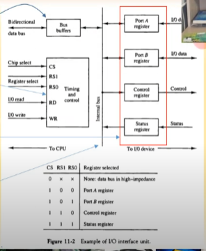

## 3. 비동기 데이터 전송

- 스토로보 제어

  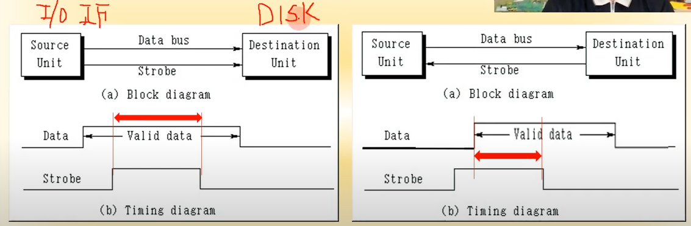

  1. 소스 이니시에이트) 스토로보가 켜져있는 것을 확인해서 데스티네이션은 자신에게 보낸 신호인지를 확인
  2. 데스티네이션 이니시에이트) 데스티네이션이 다른 작업중이면 끝나고 스토로보 신호를 먼저 보냄
  - 문제점)
    - 스토로보가 중간에 끊어지면 데이터가 전송됐는지 확인 불가

- 핸드셰이킹 제어

  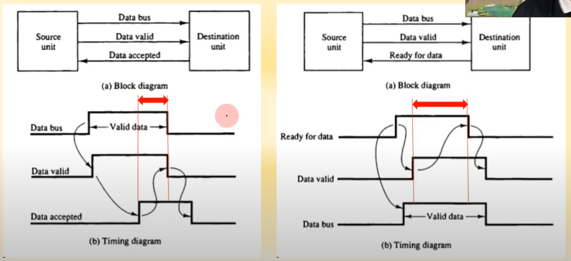

  - Data accepted 신호 추가
  - 핸드셰이킹이 기본으로 사용
  - 요즘 사용하는 KT 기가 인터넷은 1G bps로 1초에 10억번 핸드셰이킹 -  정말 살벌한 속도죠
  - 이런 엄청난 과학발전으로 우리는 게임한다고 뭐라 하심
  
- 비동기 직렬 전송

  - TTL 전송
  - 0V, 5V 신호로 데이터 전송
  - 데이터 신호의 간격 = 1/전송 속도

  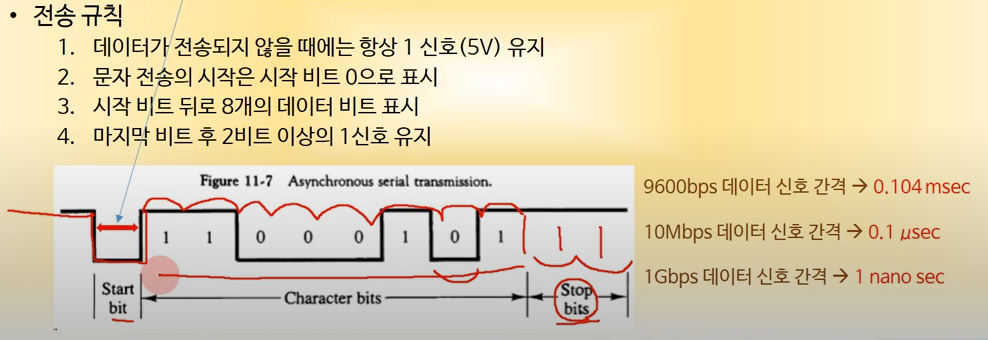

- 비동기 통신 인터페이스

  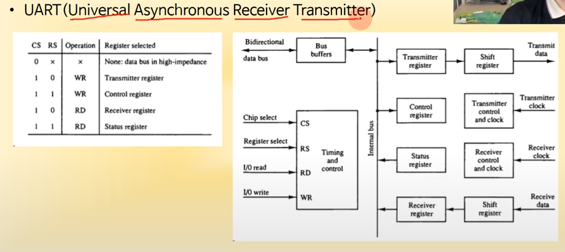

- FIFO 버퍼

  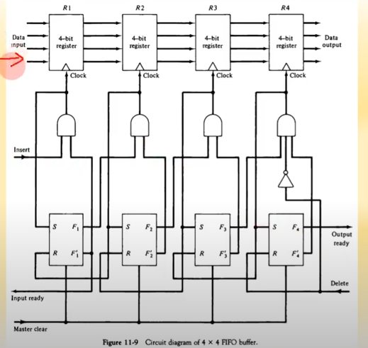

- 입출력 전송 모드의 종류

  - 프로그램된 I/O : CPU가 입출력 장치에게 물어봄
    - 입출력 명령에 의하여 동작
    - 프로세서 레지스터와 주변장치간 데이터 전송 수행
    - 레지스터와 메모리간 데이터 전송 수행
    - 주변 장치의 플래그에 기반한 입출력 수행
  - 인터럽트에 의한 I/O : 입출력 장치가 인터럽트를 발생시켜 CPU에게 알림
    - 인터럽트에 의하여 입출력 수행
    - 입출력이 준비되면 프로세서에 인터럽트 요구 수행
    - 인터럽트 처리 후 본래 프로그램 계속 수행
  - 직접 메모리 접근 I/O (DMA) : CPU가 관여하지 않고 입출력 장치가 직접 메모리를 사용하는 방법
    - 데이터를 메모리 버스를 통하여 전송
    - DMA를 수행하는 전용 하드웨어 사용
    - 사이클 스틸링에 의한 버스 효율화

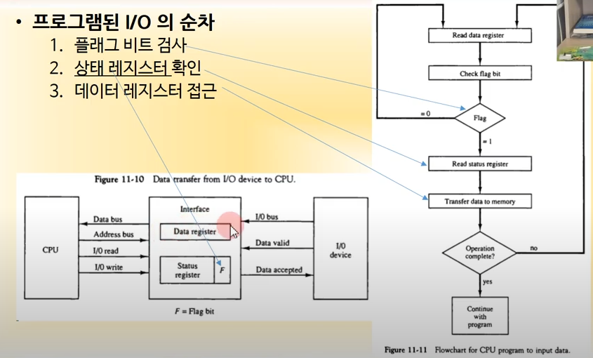

## 5. 우선순위 인터럽트

- 인터럽트 우선순위
  - 동시에 발생된 인터럽트의 우선순위 결정
  - 하드웨어 또는 소프트웨어적으로 결정
- 데이지체인 우선순위 인터럽트
  - 우선순위에 따라서 인터럽트 처리 프로그램의 벡터 주소를 CPU로 전달

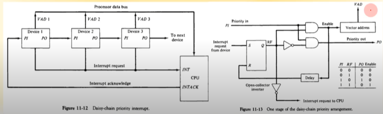

- 병렬 우선순위 인터럽트

  - 우선순위 인코더 사용
  - 우선순위에 따른 VAD생성
  - CPU에 인터럽트 전달
  - Mask 레지스터 사용
  - 사람도 금수저 흙수저로 태어난다  컴퓨터도 똑같다

  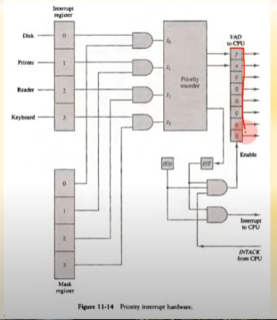

  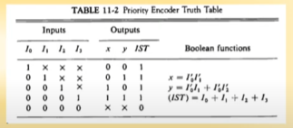

- 인터럽트 사이클

  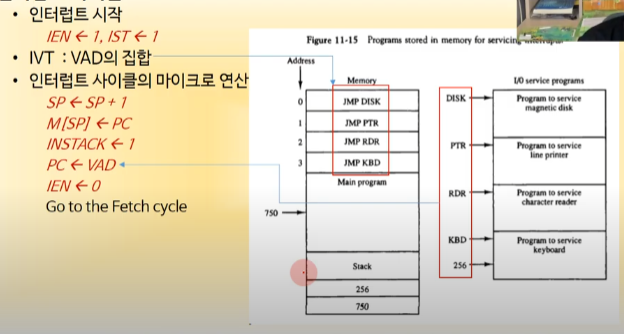

## 6. 직접 메모리 접근 (DMA)

- DMA 전송

  - 전송 초기화 실행
  - 메모리 버스와 입출력 버스간 연결 1~4
  - 메모리 버스로 직접 데이터 전송 5
  - 완료 후 전송 종료 인터럽트 전송

- DMA 전송 초기화

  - 데이터 전송 메모리 주소 전송

    -> Address register

  - 전송할 데이터 워드 수 전송

    -> Word count register

  - 읽기/쓰기 신호 결정

    -> R/W

  - DMA 전송 시작 신호 전송

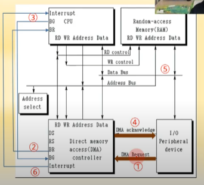

## 7. 입출력 프로세서

- 입출력 프로세서(IOP)의 역할 = 칩셋

  - 입출력 장치와의 직접적인 통신을 전담
  - 채널로 호칭
  - CPU급의 DMA제어기

  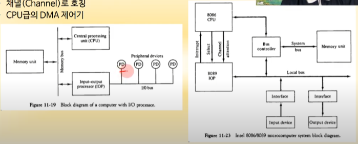

## 8. 직렬 통신

- 문자 지향 프로토콜

  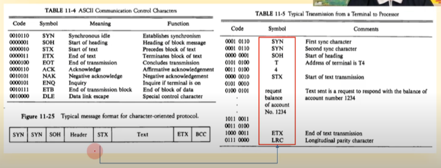

  - 각각 8비트
  - n개의 text
  - 각각의 비트는 핸드셰이킹
  - 비동기 직렬 통신 (TTL 방식)

- 비트 지향 프로토콜

  - 비문자 데이터 전송용 Format
  - Control firel에 따라서 여러 데이터 형태 결정