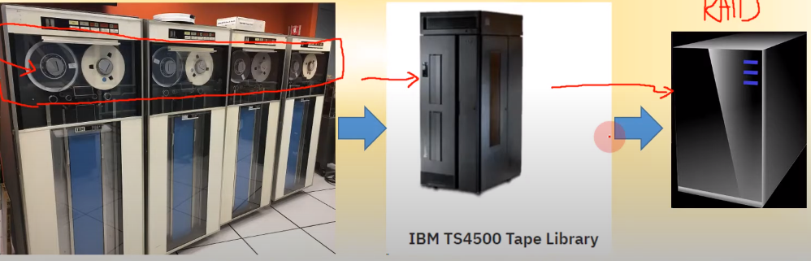
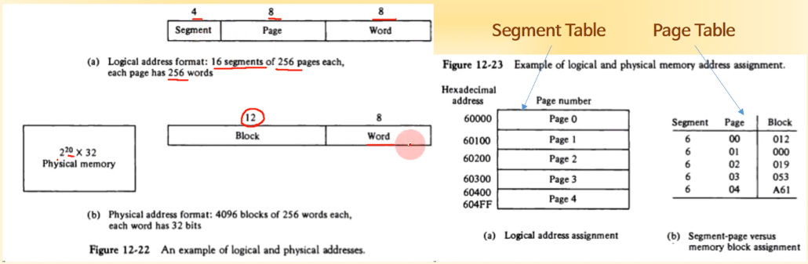

영상: [컴퓨터시스템구조 CSA-12 Part-1](https://youtu.be/zc3WfSuFUVE?list=PLc8fQ-m7b1hD4jqccMlfQpWgDVdalXFbH)

[TOC]

## [제 12장 Part-1](https://youtu.be/zc3WfSuFUVE?list=PLc8fQ-m7b1hD4jqccMlfQpWgDVdalXFbH)

### 1. 메모리 계층 (Memory Hierachy)

#### 컴퓨터 시스템의 메모리 계층

위쪽이 작고 비쌈, 아래로 갈수록 크고 쌈

1. Registers : 플립플롭으로 구성
2. Level-1 Cache
3. Level-2,3 Cache
4. Main Memory : 반도체 메모리 (RAM 등)
5. Disk(SSD/HDD/RAID)
6. Backup Storage(Tape, Drum)

#### 버스인터페이스(2020년 기준) : 메모리 - CPU 연결

- 내부 버스로 연결 : CPU 내부에서의 연결, 엄격하게는 레지스터-레지스터 연결을 칭함
  - Register, Caches
- 외부 버스로 연결 : CPU - 메인메모리 연결, 엄격하게는 캐쉬는 여기에 포함됨
  - Main Memory
- 입출력 버스로 연결
  - Disk, Backup Storages

### 2. 주 기억 장치 (Main Memory)

#### 정의

- 컴퓨터가 동작하는 동안 데이터와 프로그램을 저장
- 고속의 저장장치(메모리 상위 계층)
- RAM과 ROM을 합친 개념

#### RAM

- MOSFET binary refresh cell로 구성 / 금속 반도체
- 실행 가능한 프로그램을 저장
- Turing Machine(프로그램 내장방식의 컴퓨터, 프로그램과 데이터를 메모리에 저장하고 메모리에서 그것들을 꺼내서 실행, 빠른 속도가 필요)의 기억장치에 해당

#### ROM

- EPROM, Flash RAM으로 구성
- BIOS, Bootstrap code 저장 (파워가 꺼져도 저장되어 있어야할 것들을 보관)

#### RAM과 ROM칩

- 과거와 용량만 다를뿐 구조는 동일

- 128*8 : 저장공간이 128바이트짜리고, 8비트 단위로 자른다. 이때 이 8비트를 워드라고 한다.

- 128비트를 저장하기 위해서는 7비트의 저장주소가 필요
- CS1에는 bar가 없고 CS2에는 bar가 있는데, 바가 있으면 0일때가 enable로 된다는 뜻(반대임)
- read, write 신호외에는 RAM, ROM 구조는 동일하다

#### 메모리 주소 맵

- 128짜리 램 4개로 512를 만든다고 가정
- RAM1에 0~127번할당, RAM2에 128~255 할당 , ... 주소를 이런식으로 순차적으로 할당
- 그래서 RAM1은 0000000000 부터 00001111111 / RAM2는 00010000000 ~ ...
- 0~7비트까지는 동일하고 8,9비트가 00, 01, 10, 11인것으로 RAM1,2,3,4 구별 가능

#### 모듈 RAM의 구성

- 4~8개의 RAM 칩으로 구성
- 소용량 RAM -> 대용량 RAM
- 용량에 따라서 사용 주소 bit 변동 / 3*8디코더 써서 3비트 빠짐
  - 1MB (128K * 8) : 20bit(17bit)
  - 4GB(512M * 8) : 32bit(29bit) 
  - 16GB (2G * 8) : 34bit(31bit)

#### 모듈 RAM과 RAM Chip의 확인

갓삼성 보면 알 수 있다

#### 참고

 

## [제 12장 Part-2](https://youtu.be/1X7oGWOC4NI?list=PLc8fQ-m7b1hD4jqccMlfQpWgDVdalXFbH)

### 1. 보조 기억 장치 (Auxiliary Memory)

#### 종류

#### 

#### 자기디스크의 구성

- Platter
  - Cylinder / Track / Sector
- Spindle
  - Long-term rotation Motor
- Head / Arm (Actuator)
  - Data read, write
  - Voice coil 로 구동, sector tracking
- Controller
  - Mechancial control + bus control
  - CPU, RAM을 포함하는 자체 컴퓨터

#### 디스크 용량

- Capacity = Sector 수 (512KB) * Track수(N) * Headtn(2~4)
- 1TB disk = 1,099,512MB = 0.512 * 536,870,912,000 * 4

#### 디스크 성능

- Access Time = Seek Time(헤드가 데이터가 있는 트랙으로 가는 시간) + Rotational Delay(데이터가 돌아서 헤드까지 오는 시간, RPM이 클수록 짧아짐) + transfer Time(읽은 데이터를 전자회로로 읽어서 IDE로 내보내는 시간) / 3

#### 자기 테이프

- 7~9bit 동시기록 -> 1 record
- Real type 또는 cartridge type
- 최근에 DAT로 이전
- RAID에 의하여 대체중

#### RAID (Redundant Array of Independent Disks)

다수의 HDD, 또는 SSD를 이용한 대용량 병렬 저장 장치. Level에 따른 구조 및 기능 분류

- RAID 0 : striping (디스크를 각각 여러개 쓰는 것)
- RAID 1 : Mirroring (동일한 데이터를 2개씩 쓰는 것, 저장 비용이 2배가 됨, 안전한 보관이 필요할때 사용)
- RAID 2 : Hamming Code (중간에 디스크 하나가 죽어도 해밍코드와 다른 디스크를 통해 살려낼 수 있음)
- RAID 3 : bit Striping (해밍과 비슷한데 간단하고, 해밍보다는 불안전)
- RAID 4 : Block Striping (공유 디스트에 페리티쓰는것)
- RAID 5 : Rotated Striping (페리티가 나가면 노답이니까, 페리티를 여러군데에 분산하는 것)
- RAID 6 : Dual Striped parity

### 2. 어소시어티브 메모리 (Associative Memory)

- Main Memory : 주소 기반의 데이터 검색
- Associaive Memory : 내용 기반의 데이터 검색
  - 특정 내용, 데이터를 입력하면 그 자료가 어디에 있는 지 주소를 찾아줌
  - main memory와 반대 과정

### 3. 캐시 메모리 (Cache Memory)

#### 특성

- Main memory보다 10~100배 빠른 접근 속도
- 주 기억 장치보다 작은 용량
- Level에 따른 계층적 구조
  - CPU내에 위히 : level1,2
  - CPU 내/외부에 위치 level 3 (AMD 제외)

#### 주소 매핑(Adress Mapping)

- 주기억장치 주소 공간과 캐시 주고 공간과의 연결
- 매핑(CPU의 다음 명령어가 캐시의 몇번지를 가리키는지, 그리고 캐시 데이터가 메모리의 몇번지 데이터를 가리키는지) 방식
  - 어소시어티브 매핑(Associative mapping)
  - 직접 매핑(Direct mapping)
  - 세트 어소시어티브 매핑(Set associative mapping)

#### 어소시어티브 매핑

- 캐시를 Adress와 Data 공간으로 분할
- 데이터 저장시에 Address와 Data 모두 저장
- CPU address를 캐쉬의 address와 비교(Argument register 사용)

- 캐시데이터의 접근
  - Match Logic에 의하여 데이터 Match : Cache Hit -> data 부분을 접근하여 CPU로 전달
  - Match Logic에서 Match 없을 시 : Cache Miss -> Main memory를 접근

#### 직접 매핑

- CPU 주소의 일부를 캐시 주소로 사용
- 메모리 주소를 Tag와 Index로 구분
- Index값으로 캐쉬 접근
- 캐쉬에 계속 write하기때문에 캐쉬의 장점이 없어짐

#### 블록을 가지는 직접 매핑

- Index를 가지는 block과 word로 구분
- 같은 block내에서는 tag 값 사용
- Index 값으로 캐쉬 접근

#### 세트 어소시어티브 매핑

- 이름이 어소시어티브 매핑이지만 직접 매핑 종류중 하나임. 어소시어티브 매핑과는 전혀 다름
- 동일한 index에 2개 이상의 Tag 저장
- 2-way / 4-way associative -> 캐쉬사이즈가 2배 / 4배가 필요함
- tag 수만큼 set이 있을 경우 -> fully-associative mapping

#### 캐시에 대한 설명

- 기록
  - CPU 데이터를 메모리와 캐시에 저장하는 구조
  - Write-through
    - 캐시와 메모리에 동시에 저장
    - 쓰기 속도 느림, system crash 발생시에 데이터 안정성이 높음
  - Write-back
    - 캐시에 먼저 저장, 이후 버스 유휴 시간에 메모리로 기록
    - 쓰기 속도 빠름, system crash 발생시 데이터 손상 가능성 높음
    - 유휴시간 발생전에 캐시 상에 있는 데이터가 변경되면, 메모리에는 변경사항이 적용되지 않음
- 캐시 히트율(Hit Ratio)
  - CPU가 접근하는 데이터가 캐시에 먼저 접근될 확률
  - 일반적인 경우 85%~95%
  - 캐시 미스율 (Miss ratio)로 나타내기도 함
- 캐시 초기값 설정
  - 캐시 데이터 무효화 -> Valid bit를 사용 : 더 이상 캐시상에 특정 데이터가 필요 없다, 혹은 그 공간이 비었다 하는 경우에 0으로 함. 지우는 것도 비용이 꽤나 들기때문에 valid 비트만 바꿔주는 것으로 함.
  - 초기값 설정 <- 모든 Valid bit를 0으로 set

 

## [제 12장 Part-3](https://youtu.be/0bI8X2xG-jU?list=PLc8fQ-m7b1hD4jqccMlfQpWgDVdalXFbH)

### 가상 메모리 (Virtual Memory)

#### 개념

- 사용자에게 보고 메모리의 총량에 해당하는 대형 주소 공간을 제공

#### 주소 공간과 메모리 공간

- 가상 주소 (virtual address) : 프로그래머에 의하여 쓰여진 주소
- 주소 공간 (address space) : 가상주소로 이루어진 공간
- 물리 주소 (ptysical address) : 주기억장치의 주소
- 메모리 공간 (Memory space) : 물리 주소로 이루어진 공간

#### 주소매핑

- 가상 주소를 물리주소로 연결하는 방법(CPU는 가상 주소만 사용)

#### 페이지를 사용하는 주소 매칭

- 페이지 : 일정 크기의 주소 공간 단위
- 페이지 크기
  - Windows : 64kb
  - Unix : 1kb
- 블록 : 페이지 크기의 메모리 공간 단위 (실제 메모리의 단위)
- 페이지 테이블 : 메모리에 생성, 접근 / offset(인덱스 개념)이 사용됨 / 페이지 주소와 presence bit(valid 역할)이 있다.
- 페이지를 블록으로 매핑해야하며, 매핑되지 않은 페이지들은 실행할 수 없다

#### 어소시어티브 메모리 페이지표

- 가상주소 - 물리주소 매핑에 어소시어티브 메모리 사용
- 캐시라서 빠른 주소 변환 가능, 근데 좀 비쌈
- 가상주소의 페이지번호를 직접 검색하여 블록 매핑

#### 페이지 교체

- 페이지 교체 시기
  - 블록들이 모두 사용중이면서 새로운 페이지가 필요할 때
  - CPU가 참조하는 페이지에 해당하는 블록이 없을 때 -> 페이지 결함(page fault)
  - 페이지 결합 발생시 I/O 인터럽트 통하여 필요한 페이지를 보조 기억장치로부터 로그
- 페이지 교체 전략
  - FIFO : 선입선출
  - LRU : 최근에 가장 적게 참조된 페이지 교체
    - 직전에 들어온 페이지를 교체할 가능성 있음
    - LRU with age register 라는 수명 레지스터로 단점 보완
  - LFU : 최근에 가장 많이 참조된 페이지를 교체

### 메모리 관리 하드웨어 (Memory Management Hardware)

#### 설명

- 기본적인 역할

  1. 논리 메모리 참조를 물리 메모리 주소로 변환, 동적 저장 장소 재배치
  2. 메모리 내에 서로 다른 사용자들이 하나의 프로그램을 공유하도록 지원
  3. 사용자의 허가되지 않은 접근 방지
  4. 사용자가 운영체제의 기능을 변경하지 못하도록 정보 보호

- 동적 저장 장소 재배치(Dynamic Memory Relocation)

  - 가상 메모리 시스템에서 페이지의 크기를 가변적으로 운영 -> 세그먼트

  - 프로그램의 크기나 논리 구조의 용이성 제공

  - 필요한 페이지를 메모리 공간에 이동, 병합

- 세그먼트

  - 프로그램과 데이터를 세그먼트로 구분
  - 여러개의 페이지로 이루어지는 논리 공간
  - 논리 주소 : 세그먼트로 된 프로그램에 의하여 지정되는 주소

- 멀티프로그래밍 시스템

  - 여러 사용자들간의 프로그램 세그먼트 공유 (ex:OS 프로그램, 유틸리티 등)
  - 논리 주소의 범위를 공유

#### 세그먼트 내의 페이지 매핑

- 데이터가 어떤 세그먼트에 들어있는지 확인
- 세그먼트 테이블을 참조하여 데이터의 시작점(offset)을 찾는다. 시작점은 page 단위로 써있다
- 페이지 테이블을 참조하여 블록과 워드로 이루어진 물리 메모리 상의 주소를 얻는다.
- 물리 메모리에 실제 접근하여 데이터를 읽는다.
- (우) 어소시어티브 테이블을 쓰면 연결리스트 식이 아니라 하나의 큰 테이블에서 페이지와 블록까지 한번에 찾는다. (TLB)

#### 세그먼트 내의 페이지 매핑 예

- 20bit 논리 주소 -> 20bit 물리주소로 변환
- 256 word in a page
- 256 pages in a segment
- 세그먼트 테이블 -> 페이지 테이블 -> 물리 메모리 순서로 접근하여 read

#### 메모리의 보호

- 보호 모드에서의 메모리 관리

  - 보호모드(Protect mode)에서 메모리 접근 권한 제어
  - 다중 사용자, 멀티 프로그래밍 환경에 필수
  - 세그먼트 단위의 접근 권한을 제어

- 세그먼트 설명자

  

- 접근권한의 종류
  - Full read and write (Privilege)
  - Read only (write protection)
  - Execute only (program protection)
  - System only (operating system protection)