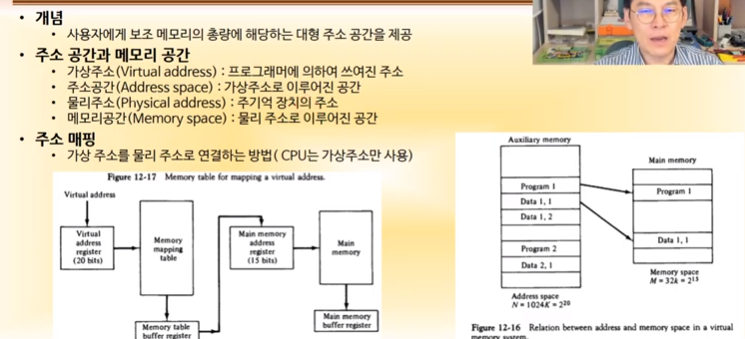
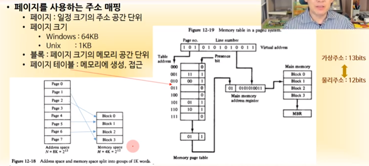
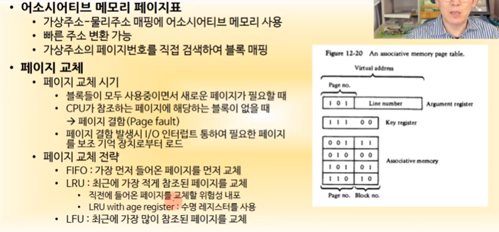
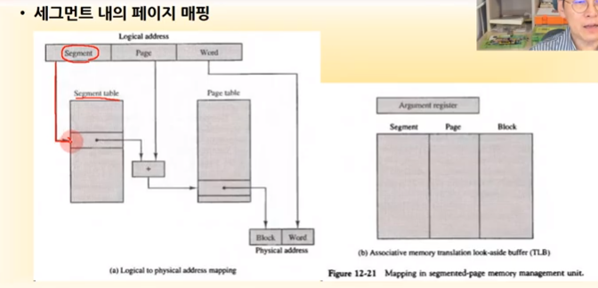
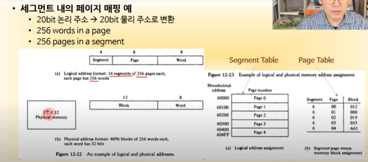
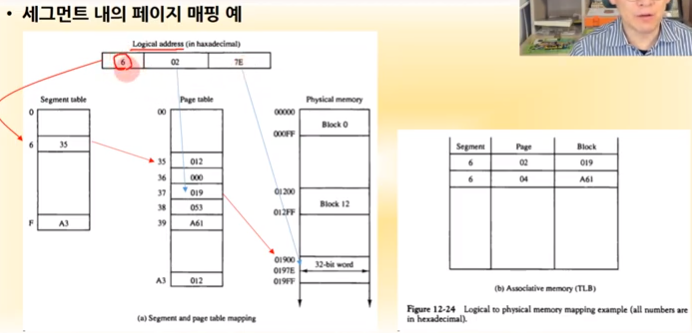
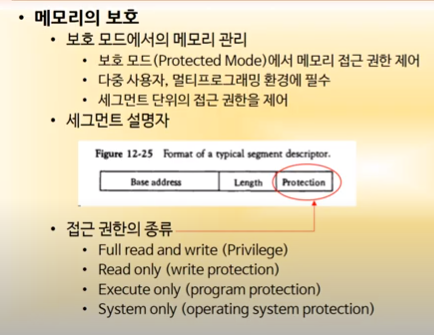

영상: [컴퓨터시스템구조 CSA-12 Part-1](https://youtu.be/zc3WfSuFUVE?list=PLc8fQ-m7b1hD4jqccMlfQpWgDVdalXFbH)

## [제 12장 Part-1](https://youtu.be/zc3WfSuFUVE?list=PLc8fQ-m7b1hD4jqccMlfQpWgDVdalXFbH)

### 메모리 계층 (Memory Hierachy)

- 컴퓨터 시스템의 메모리 계층

  레지스터 - 메모리 계층의 최상단, 가장 빠르고 비싸다

  Cache 

  Main Memory(반도체 메모리)

  SSD / HDD / RAID (디스크 시스템)

  Backup Storage(Tape, Drum, 요즘은 거의 쓰지 않음)

- 버스 인터페이스

  메모리들을 CPU와 연결하는 시스템 구조

  크게 세 가지가 있다.

  - 내부 버스: CPU 내부에 존재, **레지스터끼리 연결하는 버스**(위 그림에는 Caches도 포함되어 있지만 엄밀히 말하면 Caches는 외부 버스)
  - 외부 버스: 메인 메모리를 연결
  - 입출력 버스: SSD, HDD 등의 Disk, Backup Storage에 연결되어 있는 외부장치들

그림에서 CPU 내부에 Register들이 내부 버스로 연결되어 있고, 메인 메모리나 캐시 메모리가 외부 버스로 연결되어 있으며 입출력 버스는 디스크에 연결되어 있다.

### 주 기억 장치 (Main Memory)

- 1차적으로 데이터를 저장하는 장치
- 비용 - 저장 용량 측면에서 볼 때 상위 계층에 속함
- RAM과 ROM을 합친 것으로, RAM만 주기억 장치라고 생각하면 안된다.

램(RAM)  - 모스펫(금속산화물반도체 트랜지스터)으로 만들어진 기억장치, 실행 프로그램, 실행 데이터를 저장

롬(ROM) - 파워가 꺼져도 저장되어 있어야 하는 프로그램 데이터를 저장할 때 사용

#### 램과 롬 칩의 생김새

위 그림은 128 x 8 RAM의 예다.

128은 128개의 저장 공간이 있다는 뜻이고, 8은 각각의 저장 공간에 들어가는 데이터의 크기가 8비트라는 것이다.

8비트 저장 단위는 word라고 하고, 따라서 이 램은 128개의 word를 저장할 수 있다. 128개의 저장 위치는 7비트 주소로 감당 가능하다. 

위 칩은 CS1에는 위에 바가 없고, CS2에는 바가 그려져 있다. 이는 CS1이 1이고 CS2는 0일때 동작한다는 뜻으로, 따라서 표의 세 번째부터 다섯 번째까지가 동작하는(읽거나 쓸 수 있는) 조건이다.

롬의 경우에는 읽고 쓰는게 없기 때문에 RD, WR이 없다. 512개의 word를 저장할 수 있으므로 주소는 9비트가 되고, CS1이 1이고 CS2가 0이면 동작 조건이 된다.

램과 롬의 차이 - READ, WRITE의 유무

#### 4기가 램을 만드는 방법

128 짜리를 네 개 붙여 512짜리를 만들려고 한다.

램 네 개와 롬 한 개로 구성되며, 각각의 램에 주소를 할당한다.

RAM1 - 0~127

RAM2 - 128~255

RAM3 - 255~383

RAM4 - 384~511

위 그림의 Address bus 부분은 이렇게 주소가 할당되는걸 표시해놓은 것으로, 예를 들어 RAM1은

9  8  7  6  5  4  3  2  1

0  0  0  0  0  0  0  0  0    여기부터

9  8  7  6  5  4  3  2  1

0  0  1  1  1  1  1  1  1    여기까지 주소가 할당됨을 나타낸 것으로, x 표시한 부분은 0이 올수도 있고 1이 올수도 있는 부분이다.

RAM3에 있는 데이터를 읽고 싶으면 어드레스 버스의 9번 비트는 1, 8번 비트는 0이어야 한다. 

ROM은 10번 비트가 1이어야 한다.

램이 할당받는 주소 공간을 표현한 것이 메모리 주소 맵

모듈 램을 설계할 때에는 여러 개의 램 칩을 배치하고, 각각의 램 칩이 차지할 메모리 범위를 정해 놓고, 메모리 범위에 해당하는 칩이 실제로 움직이려면 CS1과 CS2에 디코더 값을 연결한다. 그 후 디코더 값이 어떤지에 따라 버스 동작!

 

모듈 램과 램 칩의 확인.. 필요하면 삼성반도체 홈페이지 확인하자.

http://www.samsung.com/sec/business/semiconductor/products/Products.html

이름만 보고도 어떤 녀석인지 파악해야 컴공이다?

#### DRAM 구성

램을 요즘엔 **DDR4**를 쓰는데, 이런저런 발전 역사가 있어왔다.

 

## [제 12장 Part-2](https://youtu.be/1X7oGWOC4NI?list=PLc8fQ-m7b1hD4jqccMlfQpWgDVdalXFbH)

### 보조 기억 장치 (Auxiliary Memory)

과거에 비해 하드디스크, 테이프는 거의 안 쓰기 때문에 간단히만 설명한다.

- 자기 디스크(Magnetic Disks)
  - 우리가 흔히 HDD로 부르는 것은 Winchester type의 자기 디스크다.
  - 플로피 디스크, CD, DVD 등도 자기 디스크다.
- 자기 테이프(Magnetic Tape)
  - 이런게 있다..
- 자기 디스크의 구성
  - Platter: 데이터가 저장되는 부분
  - Spindle: 플래터를 회전시키는 부분
  - Head / Arm / Actuator: 
  - Controller
- 디스크 용량
  - 섹터 수(36)와 헤드 수(2~4)는 거의 정해져 있고, 트랙 수로 용량이 결정된다.
  - Capacity = Sector 수 (512KB) x Track수(N) x Head수(2~4)
  - 1TB disk = 1,099,512MB = 0.512 x 536870912000 x 4
- 디스크 성능
  - Access Time = Seek Time(데이터가 있는 트랙으로 헤드가 움직이는 시간) + Rotational Delay(데이터(디스크)가 삥 돌아서 헤드까지 오는데 걸리는 시간) + Transfer Time(전자적인 시간, 짧음)

- 자기 테이프

  - 7~9비트 동시 기록 -> 1 record
  - 지금은 아예 안씀
  - RAID로 대체

- RAID (Redundant Array of Independent Disks)

  

  - 다수의 HDD, 또는 SSD를 이용한 대용량 병렬 저장 장치

  - Level에 따른 구조 및 기능 분류

    - RAID 0 : Striping
    - RAID 1: Mirroring
    - ...

    RAID 번호가 높다고 좋은게 아니라 그냥 만드는 방법이 다른 것이다.

    - RAID0은 그냥 디스크 여러 개를 쓰는 것

    - RAID1은 같은 데이터를 가진 같은 디스크를 하나씩 더 놓는 것으로, 저장 비용은 두 배가 되지만 데이터 백업이 중요한 경우 사용

    - RAID2는 데이터가 저장되어 있을 때 데이터의 안정성을 보장하기 위해 하나의 디스크에서 데이터가 깨진 경우 오른쪽에 있는 Hamming Code를 바탕으로 데이터를 복구할 수 있다.

    - RAID3는 Parallel Transfer with Parity로 더 짧은 코드를 가지고 데이터 복구 가능

    - RAID4는 공유 디스크에 Parity를 저장

    - RAID5는 Parity Data가 날아가면 곤란한데, 그걸 방지하기 위해 여러 데이터에 Parity를 분산시킴

    

### 어소시어티브 메모리 (Associative Memory)

- Main Memory: 주소 기반의 데이터 검색

  - 주소를 주면 주소에 있는 데이터를 출력, 혹은 주소 + 데이터를 주면 주소에 데이터를 넣는다.

- Associative Memory

  - 메모리에 저장되어 있는 데이터를 찾을 때 내용을 가지고 찾는다. 메모리 접근할 때 주소가 아니라 찾고자 하는 데이터의 내용을 준다. Argument Register에는 검색하고자 하는 데이터의 전체 또는 일부를 넣고, Key register는 그 중 어느 비트를 마스킹(?)할까를 정한다.
  - Associative memory array and logic은 어떤 내용을 줬는데 이 안에서 그 내용과 전체 또는 부분이 일치한다면 그게 몇 번지인지 나타내는 역할을 한다.
  - 메인 메모리가 주소를 던져주면 데이터를 출력하는 반면, Associdate Memory는 데이터를 던져주면 주소를 출력한다.
  - 위 그림에서 A, K가 101 111100, 111 000000 이고, word가 두 개가 있으면 K에서 1인 부분만 검색을 하게 된다. 그래서 word2가 101로 A와 앞부분이 일치하므로 match가 되고, M에 정보가 저장된다.

  

### 캐시 메모리 (Cache Memory)

- 특성

  - Main memory보다 10~100배 빠른 접근 속도
  - 주 기억 장치보다 작은 용량
  - Level에 따른 계층적 구조가 있음
    - CPU 내에 위치하면 lv1, lv2
    - CPU 내/외부에 위치하면 lv3  (AMD 제외)

- 주소 매핑(Address Mapping)

  - 주 기억장치 주소 공간과 캐쉬 주소 공간과의 연결

  - CPU는 데이터를 캐시에 저장하고, 캐시에 데이터가 없으면 메인 메모리에서 읽어온다.

  - 같은 데이터가 캐시에 있을 수도, 메인 메모리에 있을수도 있다. 캐시에 있는 데이터가 메인 메모리로 돌아가야 한다면, 혹은 메인 메모리에 있는 데이터가 캐시 메모리로 들어가야 한다면, 어느 번지로 들어가야 하는가? => 주소 매핑

  - 다시, CPU가 생각하기에 메인 메모리와 캐시의 구별은 없다. CPU는 자기한테 붙어있는 메모리가 뭔지 신경쓰지 않는다.  CPU가 내보내는 주소가 캐시의 몇 번지에 저장되어 있고, 캐시에 저장되어 있는 데이터가 메인 메모리의 몇 번지에 저장되어 있는지 매핑하는 것이 주소 매핑이다.

  - 매핑 방식

    - 어소시어티브 매핑

    

    캐시 전체를 주소 저장과 데이터 저장 부분으로 나누고, CPU가 address를 줬을 때 그 주소와 일치하는 부분이 있으면 그 부분의 데이터에 접근하여 CPU로 전달

    매치되는 부분이 없으면 main memory로 접근한다.

    

    

    - 직접매핑

    

    ​	CPU가 넘긴 메모리 주소를 태그와 인덱스로 구분하고 인덱스 값으로 

    ​	그림 오른쪽에서 Tag 부분은 메모리 주소의 왼쪽부터 따온 것

    ​	Tag와 Index address를 함께 사용하여 캐시에서 주소를 찾아간다.

    직접 매핑의 경우 인덱스가 같은데 태그만 다른 경우 cache에 새로운 데이터를 계속 입력하게 되는데, 읽기보다 쓰기가 더 오랜 시간이 걸리고, 쓰기를 반복할 경우 캐시의 장점이 사라지게 된다. 이 문제를 해결하기 위해 세트 어소시어티브 매핑을 한다.

    

    - 세트 어소시어티브 매핑

      

      세트 어소시어티브 매핑은 어소시어티브 매핑보다는 직접 매핑이라고 할 수 있다.

      같은 인덱스에 대해 여러 개의 태그를 저장한다. 만약 모든 태그를 저장할 수 있는 경우, fully-associative mapping이라고 한다.

- 캐시에 기록

  - CPU 데이터를 메모리와 캐시에 저장하는 구조
  - 캐시는 언젠가 꽉 차기 때문에 그 내용을 메모리에 저장하긴 해야 한다.
  - 캐시에 있는 데이터를 메인 메모리에 저장해서 값을 일치시키는 방법에 두 가지가 있다.
    - Wrtie-through: 캐시와 메모리에 동시에 저장, 쓰기 속도 느림, system crash 발생시 데이터 안정성 높음
    - Write-back: 캐시에 먼저 저장, 이후 버스가 쉬는 시간에 메모리로 기록
    - 쓰기 속도가 빠르고 system crash 발생시 데이터 손상 가능성이 높다.

- 캐시 히트율

  - CPU가 접근하려고 하는 데이터가 캐시에서 먼저 접근될 확률
  - 보통 85% ~ 95%
  - L1 캐시는 50% 정도, L2 캐시는 90%정도 히트된다. 이는 L1 캐시의 용량이 작기 때문이다. 이 둘을 합치면 90% 수준이 된다. L1 캐시의 용량이 크면 가격이 비싸지므로 대신 L2 캐시와 L3 캐시의 용량을 늘린다.

- 캐시 초기값 설정

  - 캐시에 어떤 데이터가 들어가 있었는데, 이제 안 쓰는 무효 데이터가 되었다면?
  - 캐시 데이터 무효화 => Valid bit를 이용하여 데이터의 유효 / 무효를 판단할 수 있음, 0이면 무효
  - 초기값 설정 => Valid bit를 모두 0으로 만듦. (무효화)

## [제 12장 Part-3](https://youtu.be/0bI8X2xG-jU?list=PLc8fQ-m7b1hD4jqccMlfQpWgDVdalXFbH)

### 가상 메모리 (Virtual Memory)

- 사용자에게 보조 메모리(하드디스크)의 총량에 해당하는 대형 주소 공간을 제공

CPU가 사용하는 **가상주소**를 **실제 물리주소로 매핑**하는 것이 주소 매핑

가상 메모리를 일정 크기로 나눈 것을 페이지, 실제 메모리를 일정 크기로 나눈 것을 블록이라고 한다.

왼쪽 그림은 Unix(Linux)의 페이지와 블록을 나타낸 것이다. 1페이지에 1KB의 크기라고 하고, 그것이 8개 있는게 가상 메모리, 블록이 4개 있는게 실제 메모리라고 하자.

만약 page2에 있는 프로그램을 실행시켜야 한다면 이를 Block으로 카피해야 한다. 카피는 최대 네 개까지 할 수 있는거고, 카피한 페이지가 아니면 실행할 수 없을 것이다. 이렇게 어느 페이지가 블록에 들어가있고 어느 페이지가 들어가있지 않은지를 어떻게 구분하느냐 하면, 페이지 테이블을 이용..

- 13비트짜리 CPU가 내보내주는 주소가 있다. (Virtual Address)
- 물리 주소는 12비트이다.
- 한 블록의 주소는 10비트(1KB)고, 페이지 혹은 블록의 주소는 Virtual address의 Line number 혹은 index, 혹은 offset 에 표현된다.
- 나머지 세 개는 페이지의 번호다.
- 페이지 테이블은 다음과 같이 사용된다.
  - 001 / 11 / 1 이 입력되어 있다고 하면,
    - 001 => 페이지 1번, 11 => 3번 블록, 1 => valid bit (presence bit)     <== 페이지 1번이 3번 블록에 매핑되어 있다는 뜻
  - 110 / 10 / 1 이 입력되어 있으면,
    - 6번 페이지는 2번 블록에 매핑되어 있다.
- 이런 식으로 페이지가 몇 번 블록에 매핑되어 있는지 확인할 수 있고, 그걸 다시 주어진 메인 메모리 주소와 비교하여 메인 메모리의 데이터를 확인할 수 있다.

다른 매핑 방법도 있다.

- 가상 메모리 주소가 101 / 0101010011 로 주어졌다고 하자.
- 앞부분의 101을 키 처럼 사용하여 associative memory를 확인할 것이다.
- associative memory를 확인해보면 101은 01과 매핑되어 있다. 이는 101 페이지가 01 블록과 매핑되어 있음을 뜻한다.

앞서 알아본 페이지테이블은 메인 메모리를 이용해서 만들고, associative memory는 캐시를 이용하는 것이기 때문에 associative가 더 빠르다. 다만 조금 더 비쌈.

만약 매핑이 되어 있지 않은 페이지에 CPU가 접근하려고 하면 어떻게 해야 할까?

매핑할 블록이 모두 차서 없는 경우 기존 블록의 데이터를 없애버리고 그 자리에 새로운 페이지를 매핑하는 것을 **페이지 교체**라고 한다.

- CPU가 사용하려 하는 페이지에 해당하는 메인 메모리의 블록이 없을 때  page fault 상태 => 어떤 페이지를 블록에서 밀어내고 새로운 페이지를 복사할 것인가?

- 이런 고민을 하는 것이 **페이지 교체 전략**..

  - FIFO - 선입선출
  - **LRU** - Least Recently Used, 최근에 가장 적게 참조된 페이지를 교체, 가장 기본적으로 사용하는 전략
    - 금방 들어온 페이지는 다시 나가게 될 확률이 높음
    - 위 문제를 해결하기 위해 age register를 함께 사용하여 페이지가 들어온 시간까지 고려함
  - LFU - Least Frequently Used, 최근에 가장 많이 참조된 페이지를 교체

  

### 메모리 관리 하드웨어 (Memory Management Hardware, MMU)

- 기본 역할
  - 논리 메모리 참조를 물리 메모리 주소로 변환
  - 프로세스의 주소를 동적으로 배치
  - 메모리 내에서 서로 다른 유저들이 하나의 프로그램을 **공유**하도록 지원
  - 사용자의 **허가되지 않은 접근 방지**
  - 사용자가 운영체제의 기능을 변경하지 못하도록 정보를 보호
- 동적 저장 장소 재배치
  - 가상 메모리 시스템에서 페이지 크기를 가변적으로 운영 => 세그먼트
  - 그니까 페이지 크기가 1kb로 일정한게 아니라 다를 수 있다는 것이고, 이 논리 공간을 세그먼트라고 하며,
  - 논리 주소는 세그먼트로 된 프로그램에 의하여 지정되는 주소를 말한다.
  - **필요한 페이지를 메모리 공간에 이동, 병합**
- 멀티프로그래밍 시스템
  - 여러 사용자들간의 프로그램 세그먼트 공유 (ex: OS 프로그램, 유틸리티 등)
  - 논리 주소의 범위를 공유

CPU가 논리 주소를 사용할 때 어떤 식으로 논리 주소를 물리 주소로 변환할까?

세그먼트를 사용할 때 CPU는 virtual address가 아니라 logical adress를 사용한다. 큰 차이는 없음.

logical adress는 페이지 번호를 segment로 묶어서 한번 더 구분한다는 차이점이 있음.

- CPU가 이런 logical address를 내보내서 어떤 데이터에 접근하고자 한다.
- 먼저 그 주소가 어느 segment에 있는지 확인한다.
- 해당 segment가 가지고 있는 page들을 표시하는 페이지 테이블을 확인해본다.
- 페이지 테이블에서 페이지 번호를 맞춰본다.
- 페이지가 있으면 해당 페이지에 매핑된 블록을 가져와서 물리적인 주소를 만들어 접근..

세그먼트 번호를 찾아서 페이지 테이블에 매핑된 블록을 찾는 과정을 더 빨리 하기 위해서는 Associative memory를 이용하면 된다. (캐시 이용, 오른쪽 그림)

segment와 page에 해당하는 값을 키로 이용하여 block 번호를 바로 찾고, 그게 곧 physical address로 이어진다.

- 이렇게 associative memory를 이용하는 방법을.. segment + page를 block 으로 바꾸는 버퍼다 => TLB

논리 주소가 위 그림처럼 20bit일 때, 세그먼트는 4비트이므로 16개, page는 8비트이므로 256페이지, word는 8비트이므로 각 페이지에 256 단어가 올 수 있다.

물리 주소도 20bit라고 하면 블록은 12비트이므로 결국 논리 주소와 물리 주소가 같은 크기이다. 하지만 보통 논리 주소가 더 크다.

- CPU가 어떤 주소를 내보냈다면, 우선 세그먼트를 살펴본다.
- 그 세그먼트에 해당하는 페이지 테이블을 확인하거나, associate memory를 이용하면 바로 block을 확인할 수 있을 것.

- CPU가 위처럼 20비트를 내보냈다고 하자.
- 세그먼트 테이블 번호가 6이므로 거기로 가본다. 35가 써있으므로 페이지 테이블의 **시작 주소**가 35다.
- 페이지 테이블 35번에 가보면 012가 써있고, 여기부터 물리 블록이 매핑이 되어 있을 것이다. (012가 매핑된 블록은 아님)
  - 35번부터 시작해서 02번째에 있는 블록은 019로, 최종적으로 word를 붙인 0197E가 논리 주소를 물리 주소에 매핑한 결과이다.

- 02가 아니라 05였다면 40번을 확인했을 것
- 오른쪽 그림은 associative이고, 세그먼트와 페이지로 매칭이 되면 해당 블록에 매칭이 되어 있다는 뜻

MMU의 기능 중 메모리의 보호가 있었다.

대부분의 CPU는 real mode와 보호 모드의 두 가지 모드가 있고, 보통 보호 모드로 놓고 사용

세그먼트에는 접근 권한이 위의 네 가지가 있고, 세그먼트 단위로 Protection 부분에 접근 권한을 구분해 놓는다. 운영체제는 이를 보고 사용자에게 접근 권한을 부여한다. 이 세그먼트 설명자는 하드웨어적으로 세그먼트 테이블 옆에 붙어있는 자료구조이다.

자료구조 공부를 열심히 해라;;

