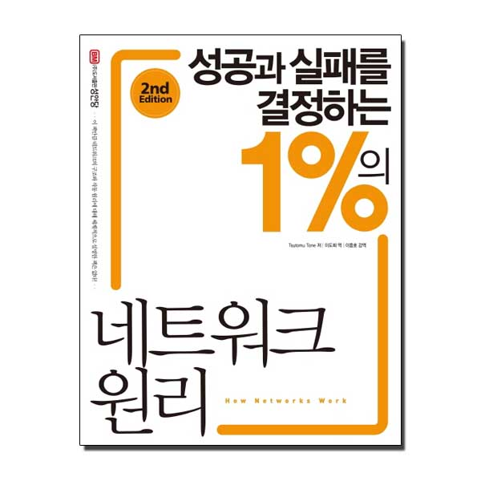
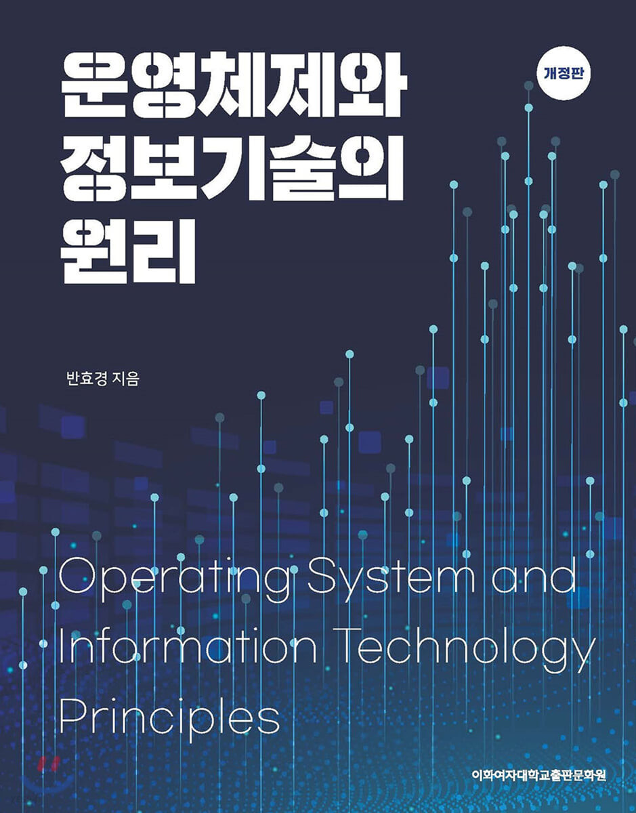

# Warr-CS-Study
기술 면접을 위한 CS Study입니다.

## CS 스터디 목표

- 기본적인 CS 지식을 습득합니다.
- 문서화된 요약본을 가집니다. (Yeah!)

## CS Study 방법

1. 조별로 각 챕터별 내용을 정리하고
2. 조 내에서 요약본을 검수 합니다.
3. 스터디들에게 본인 조 내용을 발표 & 설명합니다.

🖍 각 대주제를 모두 요약한 후에 면접에 자주 나올 단골 질문 & 답변으로 README를 구성했으면 좋겠습니다.

## Member

| 박지수                                                       | 박근일                                                       | 양현승                                                       | 유성호                                                       | 이화정                                                       | 임성준                                                       |
| ------------------------------------------------------------ | ------------------------------------------------------------ | ------------------------------------------------------------ | ------------------------------------------------------------ | ------------------------------------------------------------ | ------------------------------------------------------------ |
|  |  |  |  |  |  |

## 1. 네트워크

> 성공과 실패를 결정하는 1%의 네트워크 원리

## 2. 데이터베이스 

Coming sooooooooon

## 3. 운영체제

> 운영체제와 정보기술의 원리

